# Ticket 01–07 原型基准 UI 发布审查

Date: 2026-09-01  
Mode: Combined UX and accessibility audit  
Status: `audit complete; prototype parity not approved`  
Scope: Ticket 01–07 customer-facing UI  
Design authority: Confirmed Deal Control high-fidelity prototype, Version 1.0

## 这份报告取代什么

此前只针对 Ticket 07 的 `ticket-07-ui-audit.md` 不再作为结论依据。本报告重新覆盖 Ticket 01–07，并只使用本次真实浏览器审查中捕获的截图与观察。

## 审查范围与方法

审查目标是 Individual Banker 能否按已确认原型完成公开入口、认证/购买、Deal 建立、受保护 Source intake 和后续 Web/template source 入口。浏览器目标为当前开发环境 `https://dev-banking.aptoren.com`，截图来自本轮 Chrome 真实浏览器运行；原型页面覆盖以 `prototypes/deal-control-high-fidelity/page-coverage.md` 和 `prototype-brief.md` 为准。

本轮检查了：

- 页面能否到达、标题和主要内容是否可见；
- 原型规定的主要 CTA、步骤、状态、恢复路径和对象边界是否出现；
- 空、加载、未授权、缺失路由和表单初始状态是否诚实可解释；
- 英文基线、表单标签、状态表达和窄屏行为的可见风险。

未在浏览器中发送 Magic Link、提交付款、创建 Deal、运行 Paid Preflight 或上传文件；这些动作会产生外部或开发环境状态变化，需要在单独的受控验收中执行。

## 原型对照矩阵

| Ticket | 原型主流程/页面 | 本轮浏览器证据 | 判定 |
|---|---|---|---|
| 01 | `WF-ACC-01 Account Access Gateway`、`WF-ACT-01 Deals`、`WF-OVR-01 Overview` | Account Access 可见；Deal Workspace 可见；Overview 只显示标题并留白 | 部分符合 |
| 02 | `WF-PUB-02 Project Northstar proof`、`WF-ACC-01` 的公开回链 | 9 个 checkpoint、合成边界和记录版 walkthrough 可见；交互页长期显示 Loading | 部分符合 |
| 03 | `WF-PUB-04 Pricing`、`WF-PUB-05 Qualification`、`WF-CHK-01/02 Checkout` | Pricing/Qualification/Order 可见；Terms/Payment/Confirmation 深链停在 Loading | 部分符合 |
| 04 | `WF-JOB-01 Durable Job` | Job Detail 标题和返回链接可见；状态长期停在 Loading durable Job | 部分符合 |
| 05 | `WF-SET-01 Create Deal / Setup`、`WF-PRE-01 Paid Preflight`、`WF-GDE-01 Guide` | Create Deal 与 Preflight 初始页可见；Setup/Guide 长期停在 Loading | 部分符合 |
| 06 | `WF-SRC-01 Add Source`、Sources workspace | Sources 和 Add Source 可见，具备基础安全说明和 Ready 状态 | 部分符合 |
| 07 | `WF-SRC-01/02`、`WF-TPL-01 Templates / Compatibility` | Sources 复用基础空状态；Templates 预期路由为通用 404 | 不符合 |

## 逐步证据

### 1. Ticket 01 — Account Access / Deal Workspace / Overview

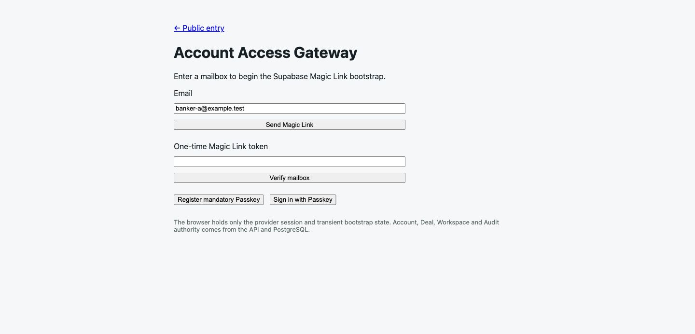

Account Access 的邮箱、Magic Link token、Passkey 注册/登录入口和说明文字均可见，且页面明确说明 Account/Deal/Workspace/Audit 权威来自 API 和 PostgreSQL。视觉上仍接近浏览器默认表单，没有原型中完整的 Gateway 状态卡、恢复分支和工作台导航。

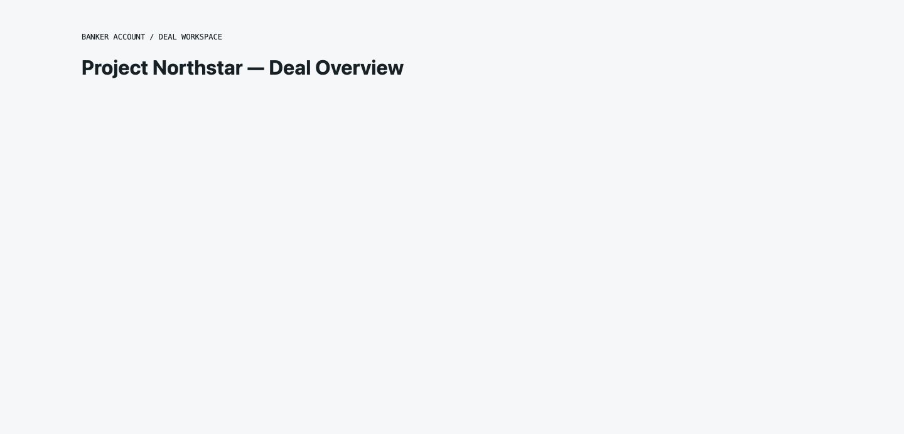

直接打开受保护 Overview 后只剩 `Project Northstar — Deal Overview` 标题和大片空白，没有登录/Passkey 要求、401 恢复或“回到 Account Access”的可见解释。这个状态不能作为原型要求的安全恢复状态。

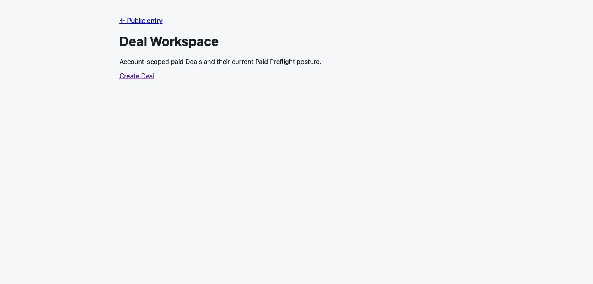

Deal Workspace 仅显示说明和 `Create Deal` 入口，没有原型中 Deals collection 的搜索、容量、状态和 Deal 行。

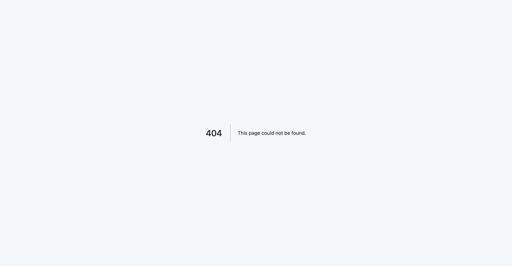

原型指定的 `/app/deals` Deals collection 在开发环境直接返回通用 `404`；`/account-access/email-sent`、`/account-access/verify-email`、`/account-access/passkey/register`、`/account-access/passkey/sign-in`、`/account-access/recovery`、`/account-access/session-expired` 和 `/account-access/denied` 也逐一返回 `404`，因此 Account Access 不能被判定为“完整状态覆盖”。

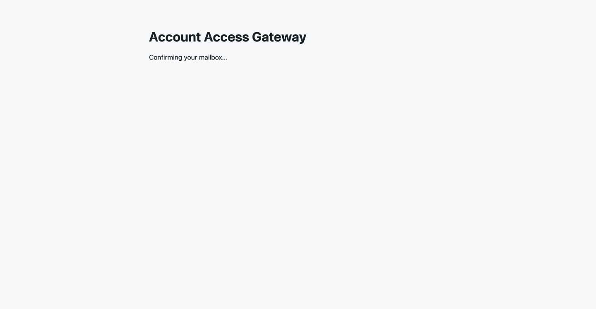

`/auth/callback` 只显示 `Confirming your mailbox…`，没有 session 缺失、验证失败、重新开始或回到 Gateway 的产品内恢复动作。

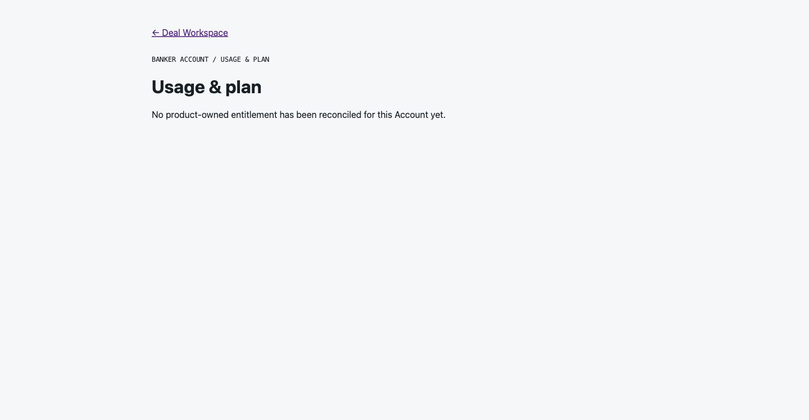

`/app/account/usage-plan` 能表达“尚未 reconcile entitlement”的空状态，但仍是单列文字和大片留白；原型要求容量、账期、取消后果及账户工作台上下文。其 `/cancellation` 子路由本轮同样返回 `404`。

**健康度：部分符合。** 公开入口存在；受保护入口的空白/未授权表达和工作台结构不足。

### 2. Ticket 02 — Project Northstar proof

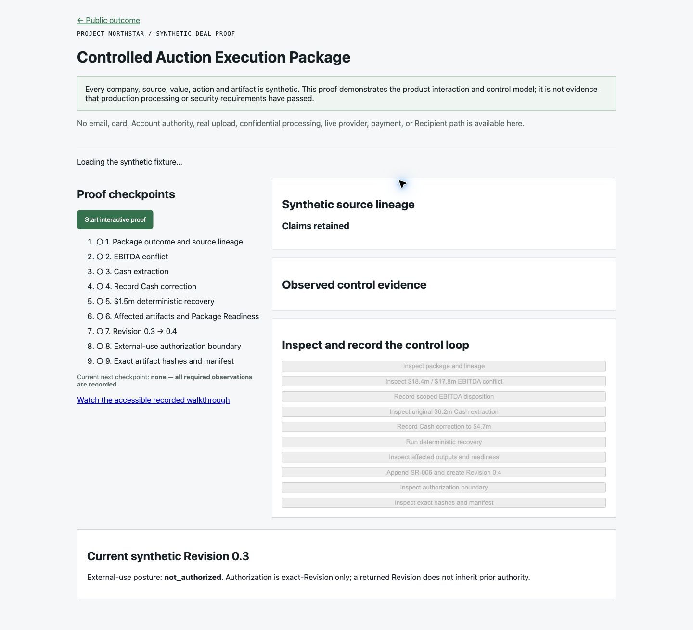

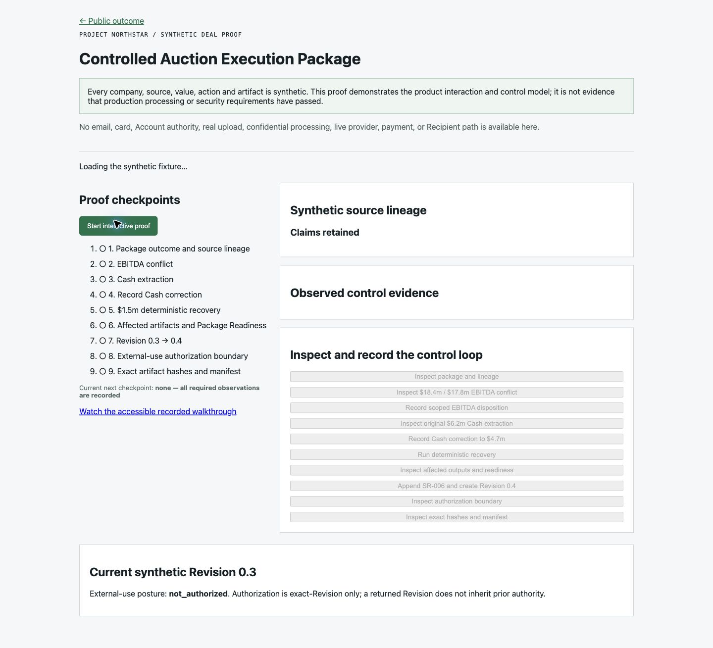

公开 proof 页面明确标记所有数据为 synthetic，并列出 9 个 checkpoint、Revision 0.3 和 `not_authorized` 边界；这是本轮最接近原型目标的页面。问题是 `Loading the synthetic fixture...` 在等待后仍然存在，检查动作保持 disabled；点击 `Start interactive proof` 后截图无状态变化。页面因此无法证明交互闭环已从浏览器完成。

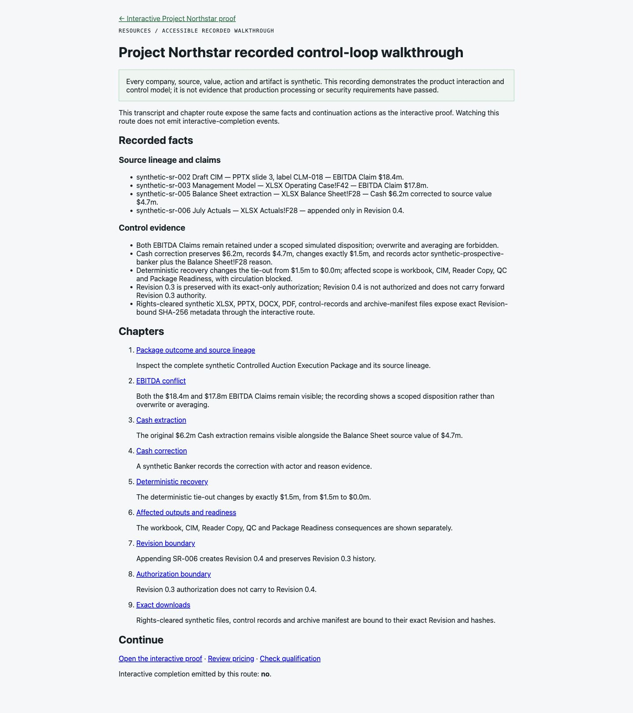

记录版 walkthrough 的实际截图见下方 Ticket 02 补充证据；它提供长文本、章节锚点和“本路由不产生交互完成”的声明，适合作为可访问替代，但不是交互 proof 的替代完成证据。

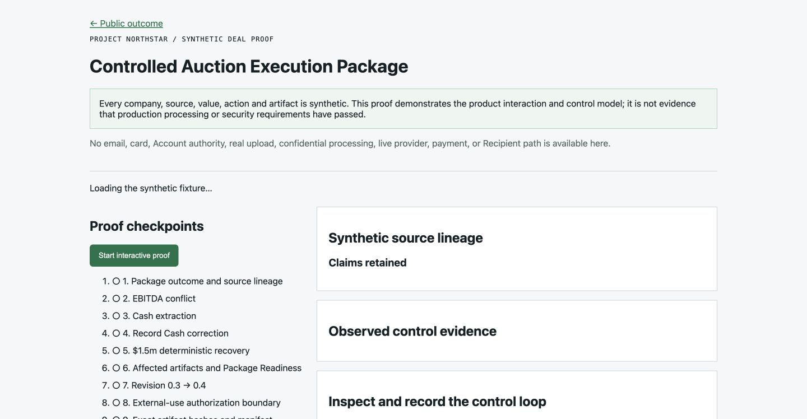

直接打开 `/project-northstar/package-outcome` 会进入同一份 proof 壳层并再次停在 `Loading the synthetic fixture…`；动态状态路由存在，但没有把状态摘要、当前检查点和下一动作变成稳定可操作的状态页。

**健康度：部分符合。** 信息边界和记录版替代路径好；交互状态卡在 Loading，无法完成原型的可恢复操作链。

### 3. Ticket 03 — Qualification / Checkout

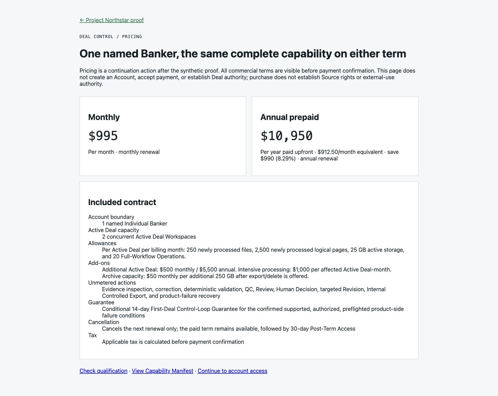

上图为 Pricing，显示月付 `$995`、年付 `$10,950`、容量和取消/保证说明。Checkout Order 另见下图；它能显示账期、包含容量、add-on preview 和付款前金额，商业边界清楚。

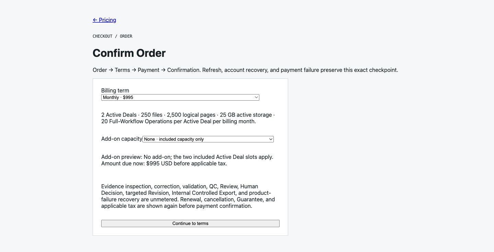

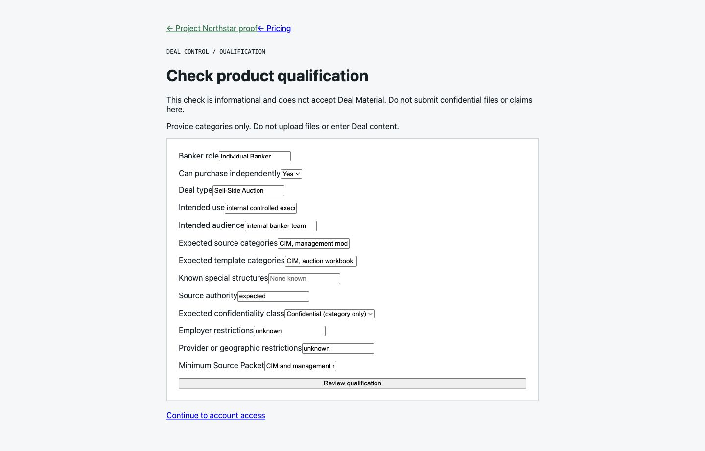

Qualification 的字段集中在一个窄面板中，多个 label 与 input 紧贴，长值被截断；顶部回链 `Project Northstar proof` 与 `Pricing` 视觉上相互挤压。页面的“不接受 Deal Material”提示是正确的，但表单层级和错误恢复不符合高保真工作台质量。

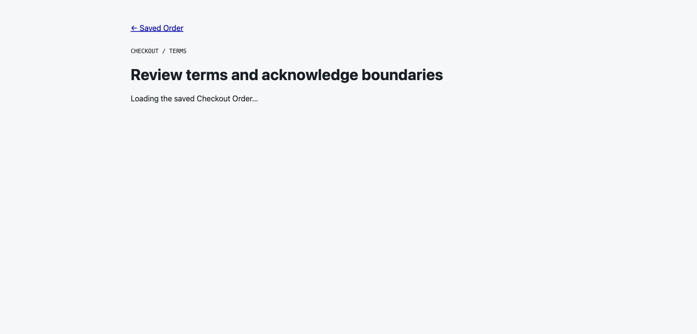

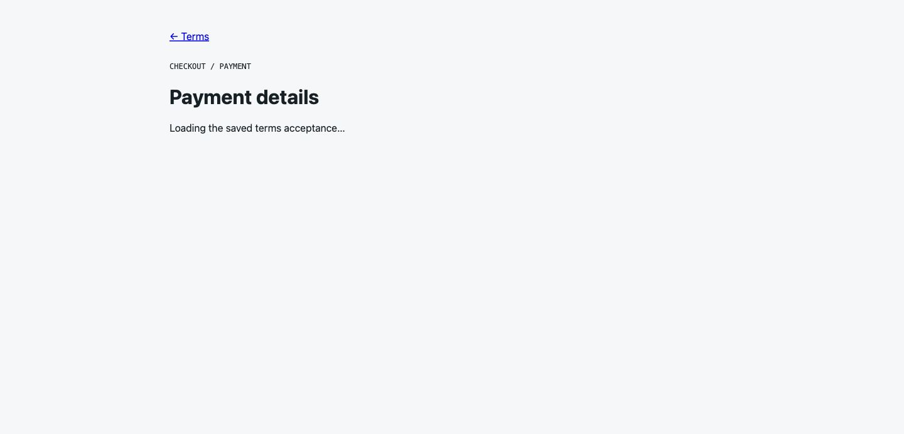

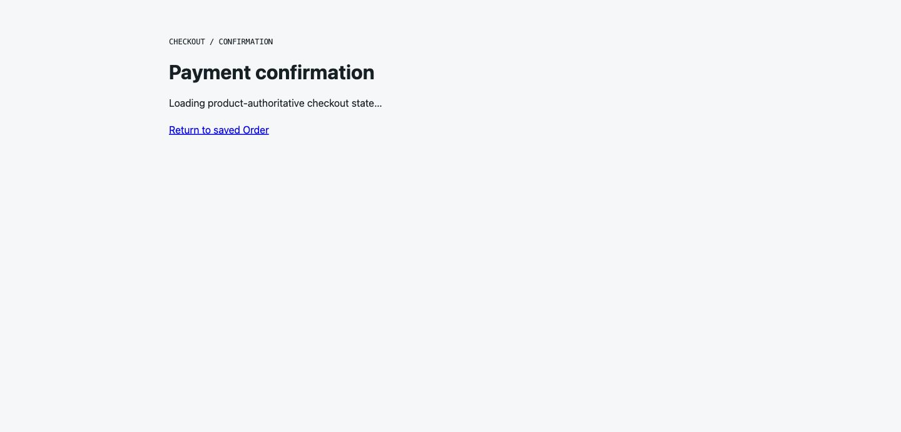

Terms、Payment、Confirmation 的深链均显示“Loading saved …”或“Loading product-authoritative checkout state…”并长期不进入表单或结果，也没有清晰的恢复/重新开始动作。Order 的初始 UI 可审查，但完整 Checkout 流程无法在当前浏览器会话完成。

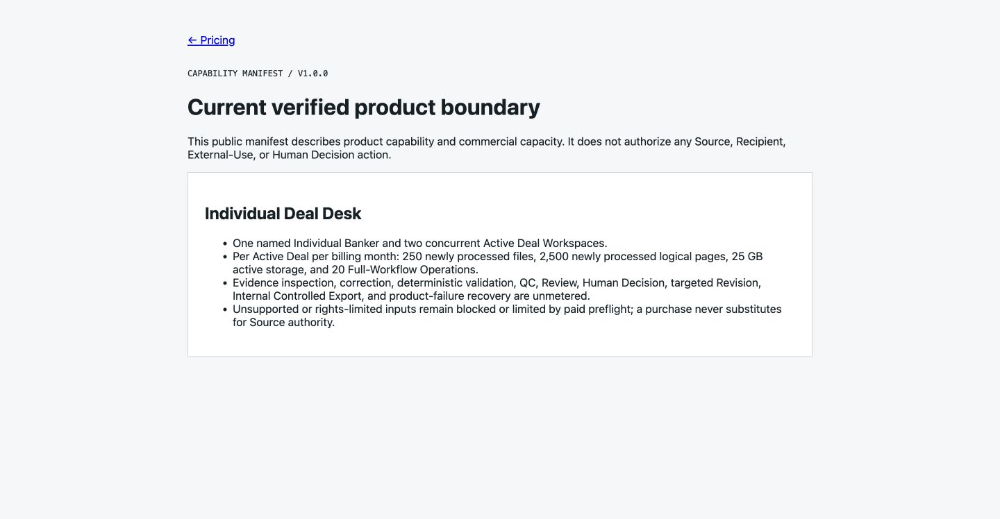

Capability Manifest 的内容边界正确，但仍采用一块宽白板和默认列表，缺少原型要求的能力分组、限制/阻断标识、版本上下文和回到购买/账户任务的工作台层级。

原型要求的 `/checkout/recovery` 直接返回通用 `404`，付款中断没有安全恢复入口。

**健康度：部分符合。** 价格、资格和 Order 信息可见；Checkout 的持久化恢复和确认态不可验证。

### 4. Ticket 04 — Durable Job

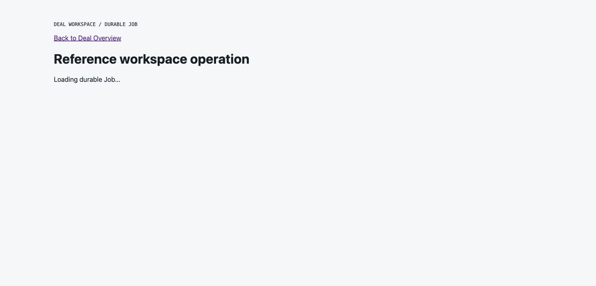

Job Detail 有明确的 `Reference workspace operation` 标题和 `Back to Deal Overview`，但在等待后仍显示 `Loading durable Job...`。原型要求的 job state、checkpoint、heartbeat、scope、result、retry/cancel 控件均未出现。

**健康度：部分符合。** 路由和安全返回入口存在；权威状态呈现不可验证且加载状态无超时/错误恢复。

### 5. Ticket 05 — Create Deal / Setup / Preflight / Guide

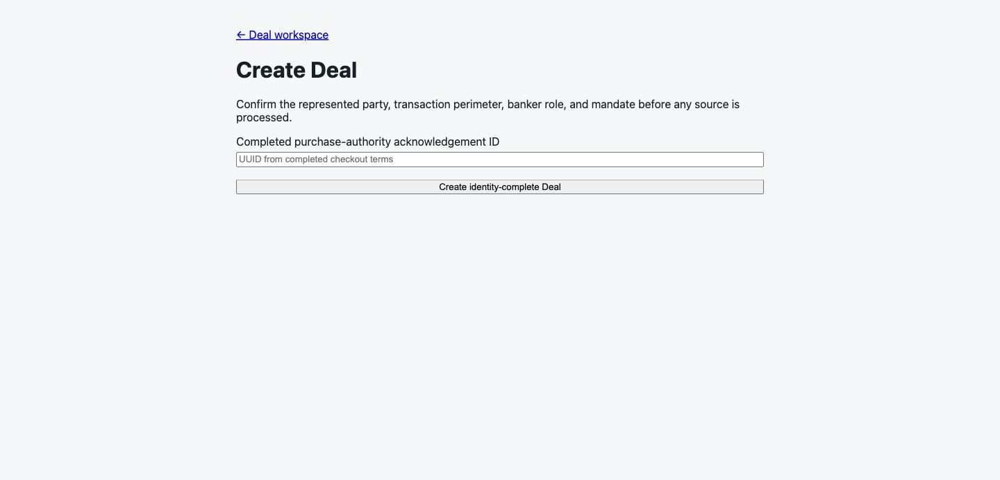

Create Deal 的 purchase-authority acknowledgement 字段和 identity-complete CTA 可见，且文案说明在处理 Source 前确认边界；但页面仍是单列默认表单，缺少原型的身份摘要、阶段提示和恢复上下文。

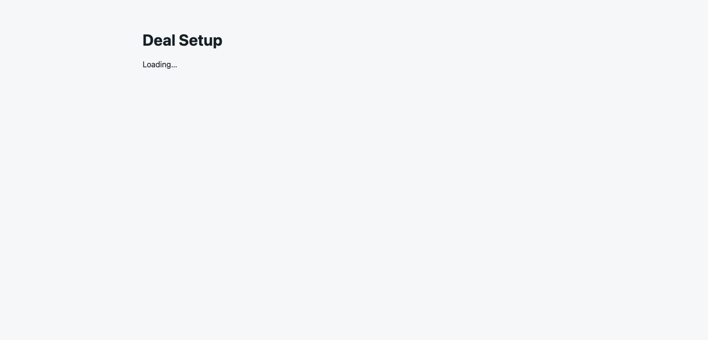

Setup 深链只有 `Deal Setup / Loading...`，没有原型要求的 5 步设置、保存/恢复或控制边界。

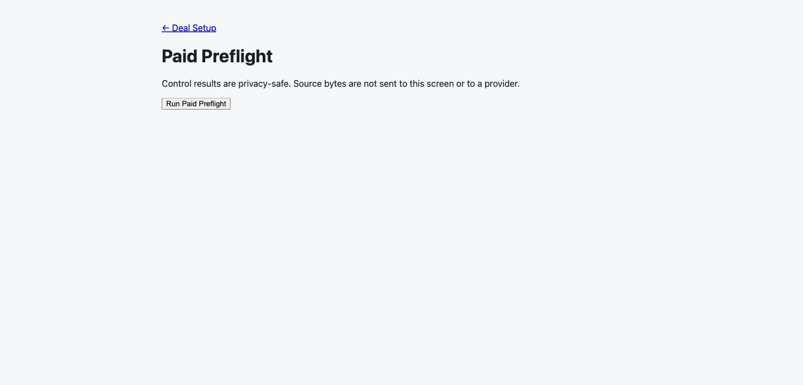

Paid Preflight 初始页显示隐私安全说明和 `Run Paid Preflight`，这是正确的单一主动作；但本轮没有点击，因为该动作会创建/变更开发环境状态。`pass`、`limited-proceed`、`blocked`、`waiting-for-user` 四种结果及恢复路径因此仍未验证。

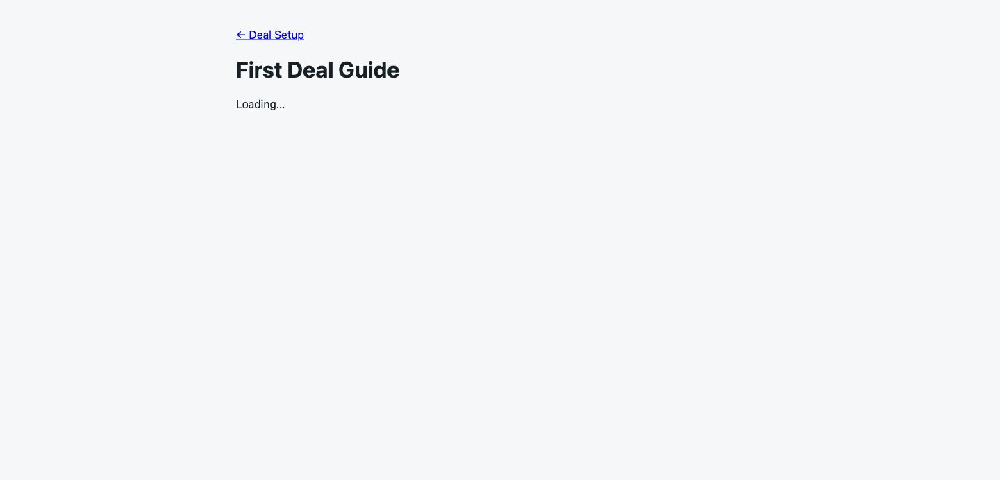

First Deal Guide 深链长期停在 `Loading...`，没有原型要求的 5 个对象任务和首个闭环回链。

**健康度：部分符合。** Create Deal 和 Preflight 起点可见；Setup/Guide 的恢复和结果状态缺失。

### 6. Ticket 06 — Sources / Add Source

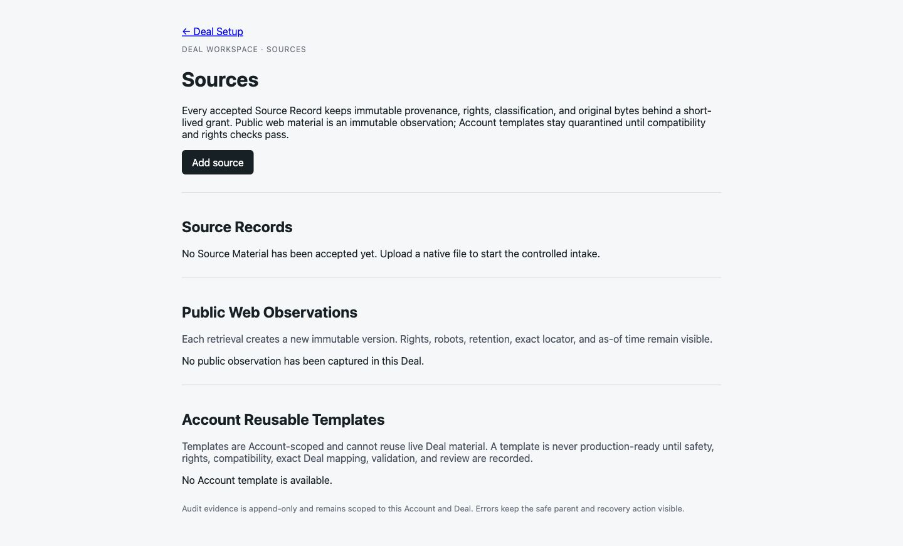

Sources 页面正确区分 Source Records、Public Web Observations 和 Account Reusable Templates，并显示 rights/quarantine/audit 说明。问题是只有一个 `Add source` 动作，原型要求的 workspace shell、上下文下一动作和三类 source 的独立入口没有呈现。

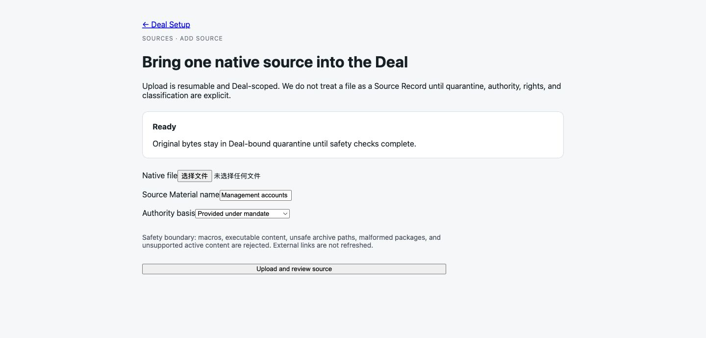

Add Source 的 Ready 卡、Native file、Source Material name、Authority basis 和安全边界说明可见。它仍是一个表单，跳过原型定义的“选择 → 分类/权利 → 解析审查 → Source Packet”四阶段；文件控件显示浏览器中文原生文案，错误反馈也依赖浏览器原生校验。

**健康度：部分符合。** 基础受保护上传入口和安全文案存在；原型交互阶段和可访问错误恢复不足。

### 7. Ticket 07 — Web Evidence / Templates

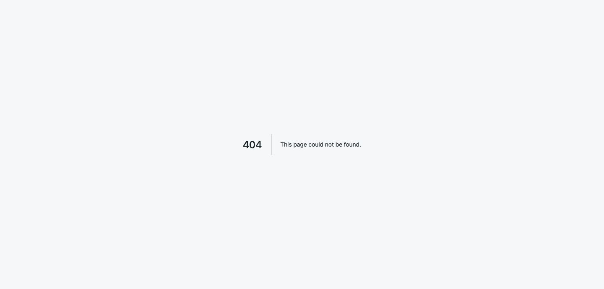

确认原型把 `WF-TPL-01 Templates / Compatibility` 标记为完整页面，包含模板版本、格式、限制、兼容性和受控使用动作；当前预期路径直接返回通用 Next.js `404`，没有回到 Sources 的恢复链接。这是发布阻塞项。

Sources 的实际截图见 Ticket 06；它只显示 Web/template 的说明和空状态，没有 Public Web capture 或 Account-template intake 的 section-level CTA。因此 Ticket 07 不能仅凭 API 或表结构判定 UI 完成。

**健康度：不符合。** Templates 路由缺失，且 Web/template 入口动作缺失。

## 跨票据优势

- 页面文案持续强调 synthetic、rights、quarantine、not authorized 和不把购买当作 Source/外部授权，这些信任边界符合原型精神。
- 公开 Project Northstar 页面和 recorded walkthrough 提供了清晰的合成数据声明、精确数值和章节化阅读路径。
- 多数页面保留真实返回链接，未把动作伪装成已完成。
- Sources/Add Source 的基础安全说明和 Ready 状态比空白占位更容易被用户理解。

## 主要 UX 风险

1. **P0 — 原型页面缺失。** Ticket 07 Templates / Compatibility 直接 404，无法进入已确认的模板兼容性工作流。
2. **P1 — 受保护页面出现“标题 + 空白/Loading”而不是可恢复状态。** Ticket 01 Overview、Ticket 04 Job、Ticket 05 Setup/Guide、Ticket 03 Terms/Payment/Confirmation 均存在该模式。
3. **P1 — Ticket 06/07 的 Sources 只暴露文件上传。** Public Web capture 与 Account-template intake 没有可发现的入口。
4. **P1 — Add Source 不符合四阶段原型。** 解析审查、rights checklist、Source Packet handoff 和失败恢复均不可见。
5. **P1 — Ticket 02 交互 proof 在 Loading 状态停滞。** Start 按钮点击后没有可观察状态变化，无法完成真实浏览器闭环。
6. **P2 — 视觉系统一致性不足。** 默认 input/select/button、窄表单、回链拥挤和缺少工作台导航，与 `tech-utility` 的确认原型差距明显。

## 可访问性风险

- Qualification 等页面的 label/input 间距和长值截断会增加放大、键盘和低视力用户的理解成本。
- Add Source 的原生文件控件在英文界面中显示中文浏览器文案；缺少稳定的显式 `id/for` 绑定和产品内错误摘要。
- Loading 状态没有明确的超时、失败或下一步公告；无法确认屏幕阅读器是否能获知状态变化。
- 受保护页面没有清晰的未授权/重新验证恢复动作；标题加空白会被误解为数据为空或页面已完成。
- 本轮未能完成完整键盘遍历、屏幕阅读器公告、对比度测量和真实 1024px/小于 1024px 重排验证；不能宣称 WCAG 合规。

## 证据限制

- 当前 Chrome 没有可用于 InvestmentBanking 的已认证 Banker 会话；Supabase 管理后台登录不等于产品会话。
- 未发送 Magic Link、未调用 Passkey、未提交付款、未创建 Deal、未运行 Paid Preflight、未上传文件；这些状态不能从本轮截图推断为通过。
- 交互 proof 页面使用 Project Northstar 合成数据；它证明 UI/控制模型表达，不证明生产处理、安全或 provider 能力。
- 浏览器结构化 DOM 读取在本轮连接中不稳定，因此部分观察基于稳定截图和安全的导航/坐标交互；键盘/屏幕阅读器证据仍需独立运行。
- 截图验证的是当前开发环境视图，不能证明 Supabase RLS、存储隔离、生产恢复或供应商配置。

## 可复核记录

- 本轮真实浏览器截图共 27 张，均已保存到本报告旁的 `ticket-01-07-ui-audit/`；Markdown 图片引用检查为 27/27，无缺失文件。
- `git diff --check` 通过。
- 已确认旧的 `docs/implementation/ticket-07-ui-audit.md` 及其截图目录不存在；Ticket 07 的功能证据文档和 tracker 已明确指向本统一审查，但没有改写其“开发环境功能 resolved”结论。
- 整改前基线轮次没有修改 `apps/web` UI 代码、API、数据库或部署；当时的整改方案已在本次确认后的实施轮次执行，详见文末“整改后复核”。

## 建议修复顺序

1. 先实现 Ticket 07 的 Templates / Compatibility 路由和回链；这是 P0 页面覆盖缺口。
2. 在 Sources 中为 Public Web capture 和 Account-template intake 增加独立 CTA，并显示作用域、rights 和阻断状态。
3. 将 Add Source 改为原型四阶段，补齐 stepper、rights/分类摘要、parse review、Source Packet handoff 和可恢复失败态。
4. 统一所有受保护页面的 401/403/加载超时呈现：明确“需要重新验证/无法读取/返回安全父页面”，禁止标题后留白。
5. 重建 Qualification/Checkout 的字段层级和显式 label 关联；将错误、金额和恢复动作做成英文产品内状态。
6. 重新执行完整浏览器验收：认证 Banker session、Ticket 01–07 关键 CTA、桌面 1440/1280、1024–1279 overlay、<1024 受限检查、键盘和屏幕阅读器状态公告。

## 整改方案：以高保真原型为完成目标

以下不是“美化清单”，而是把当前页面重建为原型定义的可检查、可恢复工作台。每个工作包都必须同时满足视觉 token、对象语义、状态和真实路由四个维度；只把颜色或圆角换掉而不补页面/状态，不算完成。

| 优先级 | 工作包与建议代码落点 | 覆盖 Ticket / 路由 | 原型目标 | 完成证据 |
|---|---|---|---|---|
| P0 | 建立共享 token 与基础控件：新增 `apps/web/app/globals.css`，在 `apps/web/app/layout.tsx` 引入；新增 `apps/web/components/deal-control/{PageShell,PageHeader,Field,StatusBadge,StatePanel,PrimaryAction}.tsx` | 01–07 全部页面 | `tech-utility`：冷白背景/白工作面、细边框、系统无衬线、等宽数字；间距 4/8/12/16/24/32/48；控件 6px、面板 8px；唯一绿色 primary；状态色只做小面积 badge/border 并配文字 | 1440×900 与 1280×800 截图中不再出现浏览器默认控件；token lint/样式审查证明页面不再散落 inline 色值 |
| P0 | 补齐真实路由和安全缺失态：`apps/web/app/app/deals/page.tsx`、`apps/web/app/checkout/recovery/page.tsx`、Account Access 状态页目录、`apps/web/app/app/account/usage-plan/cancellation/page.tsx`；为动态页面加 `loading.tsx`、`error.tsx` 或等价 `StatePanel` | 01、03、05、07 | 原型中标记完整的 Deals collection、Checkout Recovery、Magic Link/Passkey/recovery/denied/expired、Usage cancellation 不再 404；未授权、缺失、超时、失败、可恢复动作都有明确文本和返回目标 | 每个路由直接访问 200；错误注入后出现 `role=alert` + 唯一恢复 CTA；无“标题 + 空白” |
| P0 | 重建共享工作台壳：新增 `apps/web/components/deal-control/WorkspaceShell.tsx`、`AccountShell.tsx`、`Inspector.tsx`；收敛 `apps/web/app/app/page.tsx`、`apps/web/app/app/deals/[deal_id]/overview/page.tsx` | 01、04–07 | ≥1280px 左侧九域导航/中央工作区/右侧 Inspector 并列；1024–1279px 导航与 Inspector 可开关 overlay；<1024px 只保留检查/恢复并明确回桌面完成高风险动作 | 三个断点截图；无整页横向滚动；键盘可到达导航、面包屑和 Inspector 控制 |
| P1 | Account Access 与购买链状态机：重构 `apps/web/app/account-access/page.tsx`、`apps/web/app/auth/callback/page.tsx` 及 `apps/web/app/checkout/{order,terms,payment,confirmation}/*` | 01、03 | Gateway、邮箱已发送、验证、Passkey 注册/登录、受限恢复、过期/拒绝、Order → Terms → Payment → Confirmation 每一步都有当前步骤、对象摘要、持久化恢复和单一主动作；金额/条款/Entitlement/Receipt 分组呈现 | 在受控 Banker session 中逐步刷新仍可恢复；每一步有 loading/empty/error/success 截图和回链；金额与条款与 API 一致 |
| P1 | Ticket 02 proof 状态组件：重构 `apps/web/app/project-northstar/ProofClient.tsx`，抽出 `CheckpointList`、`LineagePanel`、`ControlEvidence`、`RevisionBoundary` | 02 | 9 个 checkpoint 显示完成/当前/下一步；Start、observe、command、下载和完成态可见变化；Loading 超时转错误/重试；记录版是可访问替代而非伪完成 | 一次真实浏览器 session 完成 9 步；点击 Start 后状态变化；刷新后恢复；截图同时保留 synthetic marker 与 `not_authorized` |
| P1 | Ticket 03 表单与恢复：重构 `apps/web/app/qualification/page.tsx`、`apps/web/app/checkout/order/page.tsx` 等页面，新增显式 `id/for`、错误摘要、金额/账期 summary、回退/重试动作 | 03 | 字段层级、输入/错误/确认态符合工作台密度；Recovery 不泄露 payload；付款未完成时清楚显示下一安全动作 | 键盘 Tab 顺序与可见焦点通过；错误被 `role=alert` 宣布；长 ID/金额不截断；不提交真实付款也能验证 mock/error 状态 |
| P1 | Ticket 04 Job 状态：重构 `apps/web/app/app/deals/project-northstar/actions/jobs/[job_id]/page.tsx`，新增 `DurableJobStatus` | 04 | 显示 Job identity、scope、阶段、checkpoint、heartbeat、失败原因、resumable/cancel/retry 的边界；无可靠 ETA 时不显示伪百分比 | Loading 在超时后转可解释 error；失败/可恢复/完成三态截图；SSE/刷新后状态一致 |
| P1 | Ticket 05 Setup / Preflight / Guide：重构 `apps/web/app/app/deals/new/page.tsx`、`setup/page.tsx`、`controls/preflight/page.tsx`、`guide/page.tsx` | 05 | 5 步 Setup、identity/stage/rights/confidentiality/output ceiling 摘要；Preflight 的 `pass`/`limited-proceed`/`blocked`/`waiting-for-user` 独立表达；Guide 回链首个闭环 | 四种 Preflight 状态各有恢复动作；Setup/Guide 刷新可恢复；Create/Run 动词明确结果和副作用 |
| P1 | Ticket 06 Source intake：新增 `SourceIntakeStepper`、`SourcePacketHandoff`，重构 `apps/web/app/app/deals/[deal_id]/sources/page.tsx` 和 `sources/add/page.tsx` | 06 | 选择 → 分类/权利 → 解析审查 → Source Packet 四阶段；文件、Web、模板三类入口分开；rights/quarantine/错误/重试和 provenance 始终可见 | 每阶段有状态和下一动作；文件名/哈希/locator 可读；错误不用浏览器原生文案；上传高风险动作在桌面/受控 session 验证 |
| P0/P1 | Ticket 07 Web Evidence + Templates：在 Sources 下新增 Web capture/template intake CTA；新增 `apps/web/app/app/deals/[deal_id]/execution-package/templates/page.tsx` 及必要的 Web observation 页面 | 07 | Templates / Compatibility 显示模板版本、格式、限制、兼容性和受控选择；Web capture 显示 URL 校验、抓取状态、digest/locator、quarantine 和来源边界；Account template 与 Public Web 分区隔离 | `/execution-package/templates` 不再 404；Sources 有两个独立入口；成功/blocked/rights-limited/timeout 状态带恢复动作；不能把 API/表存在当作 UI 完成 |
| P2 | 视觉与内容收口：移除生产页面散落的 `style={{...}}`，统一英文 V1 文案、表格/长 ID 溢出、44px target、focus ring、状态图标与文字 | 01–07 全部页面 | 页面看起来像原型中的专业 Deal Desk，而不是裸 HTML 表单；没有大圆角、渐变、阴影洗屏或挤压式导航 | 逐页截图 overlay 对照原型；对比度/焦点/语义检查记录；文案与 route/page-coverage 一一对应 |

### 整改实施顺序

1. **P0-A：先补 token、Shell、StatePanel 和缺失路由。** 在没有共享视觉语法与可恢复状态之前，逐页调色会反复返工；`/app/deals`、`/checkout/recovery`、Account 状态路由和 Ticket 07 Templates 先解除 404 阻塞。
2. **P0-B：补 Ticket 07 的 Web/template 入口与四阶段 Source intake。** 这一步同时解决当前最严重的页面覆盖缺口和 Sources 只有“上传文件”一个动作的问题。
3. **P1-A：重做 Account/Checkout/Setup/Job 的 loading、error、success、blocked 和恢复。** 所有受保护页必须在无 session、API 超时、对象缺失时仍给出可理解的下一步。
4. **P1-B：按 02 → 03 → 04 → 05 → 06 → 07 的主流程逐页套入共享组件，并以原型 frame 对照截图。** 每完成一页即在 1440/1280/1024/<1024 四个策略档复核，不把多页问题积到最后。
5. **P2：做英文 V1 文案、键盘/焦点、长内容与表格密度收口。** 该步骤不能替代 P0/P1 的路由和状态实现。

### 原型级验收门槛

- `page-coverage.md` 中属于 Ticket 01–07 的每个入口都有真实生产路由；直接访问不返回通用 404，缺失对象也有产品内恢复页。
- 每个路由至少有可审查的 loading、empty、error、success 或 blocked 状态；状态变化由真实 CTA/刷新可观察，不能永久停留在 Loading。
- 所有页面只使用共享 token/组件；主动作、状态、对象 identity、Revision、locator、阻断原因和下一动作与原型层级一致。
- ≥1280px 为完整工作台；1024–1279px 使用 overlay；<1024px 只提供检查/恢复并把上传、Material Decision、External authorization 等高风险动作引回桌面；无整页横向滚动。
- 键盘遍历、可见焦点、显式 label/错误关联、`role=status`/`role=alert`、非颜色状态表达和至少 44px 触控目标均有浏览器证据。该清单不是完整 WCAG 合规声明。
- 认证 Banker session 下，Ticket 01–07 关键 CTA、刷新恢复、受控失败注入和回链均有截图/命令证据；合成 proof、mock payment 或本地 adapter 不能冒充生产/provider 证据。

## 总结判定

Ticket 01–07 的基础页面大多可通过真实浏览器打开，但按已确认原型进行的发布前 UI 审查未通过。Ticket 02 的公开记录版是最完整的可访问替代；Ticket 07 的 Templates 缺失和多处受保护页面的永久 Loading/空白是当前最重要的发布阻塞。此前 Ticket 07-only UI 结果已废弃，不应继续用于发布结论。

## 2026-09-01 整改后复核

以上内容保留为整改前的真实浏览器基线；本节记录用户确认“按 deal-control-high-fidelity 原型完成 Ticket 01–07 全部页面整改”后的本地复核结果，并覆盖/取代其中的 UI 阻塞结论。

### 已完成的本地 UI 整改

- 以 `tech-utility` 为基础建立共享 token、状态面板、状态徽标、页面头、Public/Account/Workspace/Recipient shell、九域导航与右侧 Context Inspector、表格/集合、对象详情、审查动作、Readiness、Package、History 等页面 archetype；九个 Deal 工作域都可从 Workspace 导航到达。
- Ticket 07 的 Web Evidence、Account Reusable Templates、Templates / Compatibility 入口和来源边界已在 Sources/Execution Package 页面可见；缺失对象不再落到通用 404，而是进入带回链的安全状态。
- Protected 页面统一提供可解释的 loading、unavailable、critical、warning 和 recovery action；Checkout Order → Terms → Payment → Confirmation/Recovery 增加持久化步骤指示器。
- Create Deal / Setup 现在按原型提供五步 Deal identity → Business stage → Controlled purpose → Default restrictions → Confirm setup；First Deal Guide 展示五个正式对象任务并回链到 canonical work area。
- Project Northstar 在合成 fixture/API 不可用时明确显示 synthetic fixture unavailable 与 recorded walkthrough 回退，不再停在无期限 Loading；Overview、Guide、Job、Sources、Checkout 等受保护页同样不隐藏失败原因。

### 复核证据

- `npm run web:build`：通过；`git diff --check`：通过。
- 在本地 Next 开发边界使用全新 Chrome tab 做真实导航：Ticket 01–07 页面覆盖矩阵 46 条路由全部返回可见标题、无 404/Next.js Error/Application error、无 console error/warning；另对 Checkout 五页、Create Deal、Setup、Guide、Overview、Project Northstar 做 10 条关键工作流回归，均有明确页面状态。
- 交互复核：Create Deal 五步 Continue/Back 与必填 purchase-authority acknowledgement 校验可见；Action Center 搜索、对象详情 tab、Control Review、删除 typed phrase 的启用/提交均已验证；Guide 五个任务和 Checkout stepper 均在 DOM 中可检查。
- 当前后端代理 `127.0.0.1:3001` 未启动时，页面请求会显示产品内恢复状态；这证明失败态与回链表达，不证明 Supabase、RLS、支付、上传、Provider 或生产 Banker session。

### 仍需单独完成的生产级验收

本地 UI 整改不等于生产 resolved。仍需认证 Banker session 下的 Magic Link/Passkey、真实 Checkout/Entitlement、Deal 创建、Paid Preflight、Web 抓取、模板上传与 quarantine、跨 Account RLS、1024/移动策略断点、完整键盘/屏幕阅读器/对比度测量及 Provider/部署回滚验收；本报告不作 WCAG 合规或生产能力声明。

## 2026-09-02 开发环境部署与真实 HTTPS 复核

本次整改从当前工作树打包并发布到开发 VPS 的独立 release：
`/opt/investmentbanking/releases/20260902-ui-remediation-dev-v1`。`/opt/investmentbanking/current` 已原子切换到该目录；此前的 `20260901-ticket07-dev-v1` 与 `20260901-ticket06-dev-v1` 目录均保留，未执行删除或回滚清理。API/Web/Nginx systemd 服务均为 `active`，`nginx -t` 通过。此次只有 Web/UI 和随 release 携带的既有 API 源码重新发布，没有运行数据库迁移，也没有变更 Supabase。

### HTTPS 与服务边界

- `http://dev-banking.aptoren.com/` 返回 `301`，`Location: https://dev-banking.aptoren.com/`；HTTPS 根页面和 CSS 静态资源均返回 `200`。
- 75 条 Ticket 01–07 页面/动态页面 URL 组成的远端矩阵全部返回 `200`，每条均有可见 `<h1>`；无 HTTP 404 或缺失页面（矩阵文件：`/tmp/remote-https-route-matrix.tsv`）。其中包含 Sources 的 `file`、`web`、`template` 三种 Add Source 模式、Templates / Compatibility、五页 Checkout、Account 状态页、九域 Deal 工作区及对象/审查/生命周期深链。
- `GET https://dev-banking.aptoren.com/api/v1/session` 返回预期的 `401 application/problem+json`，正文是 `authentication_required` / `Authenticate to continue.`。这证明未认证边界，不等同于 Banker 会话或 Supabase/RLS 验收。

### 真实浏览器复核

使用已连接 Chrome 的真实浏览器在 `https://dev-banking.aptoren.com` 进行安全、只读导航：

- Public 首页渲染 `Controlled Sell-Side Auction Workspace`，视觉上加载导航、CTA、synthetic 边界声明和 footer；该页 console error/warning 为 0。
- Action Center 渲染九域工作台、右侧 `Context inspector`、`Project Northstar synthetic demo data`、Action 表格和状态徽标；输入 `JOB-0098` 后表格收敛为对应的 `Recoverable` 行，证明远端筛选交互生效。
- Sources 页面渲染 `Source Records`、`Add native source`、`Capture public web`、`Intake account template`、quarantine/rights 文案和产品内 `The source collection is not available.` 恢复态；该页 console error/warning 为 0。
- 1440px 桌面截图显示左侧 Work areas、中央工作区和右侧 Inspector 同屏；390×844 临时视口截图显示移动策略下的状态栏与工作区导航。视口复核结束后已恢复默认尺寸。

Chrome 的动态受保护页面 DOM 快照接口在本次连接中多次超时，因此没有把截图/坐标交互扩大为完整语义 DOM、键盘、屏幕阅读器或 WCAG 证明。远端未使用真实 Magic Link、Passkey、付款、Deal 创建、上传、外部授权或删除动作；Supabase 管理后台登录也不构成产品 Banker session。以上是开发环境部署健康、未认证恢复态和远端 UI 视觉/交互证据，不是生产完成声明。
