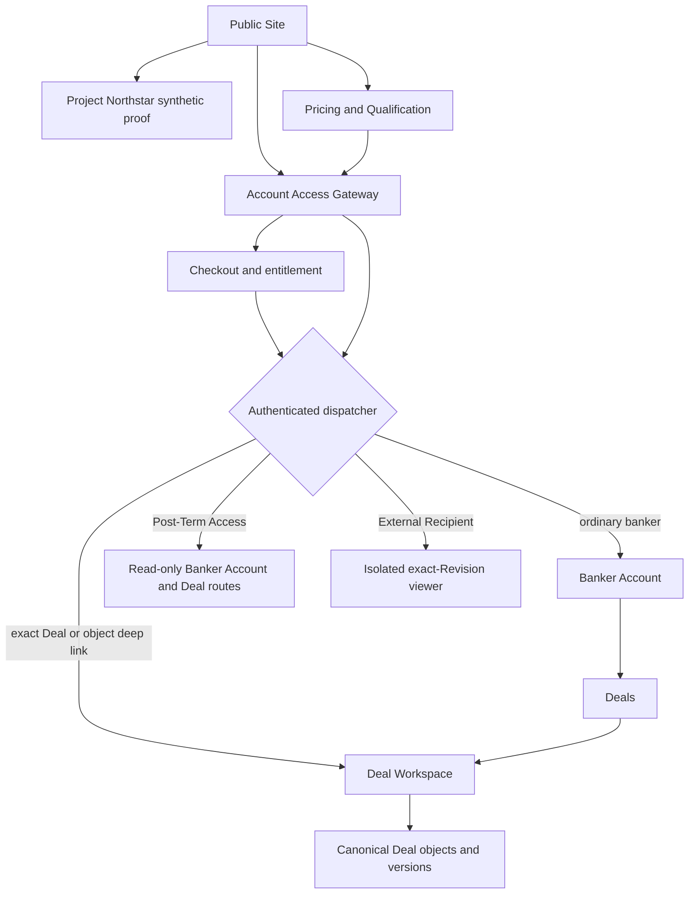
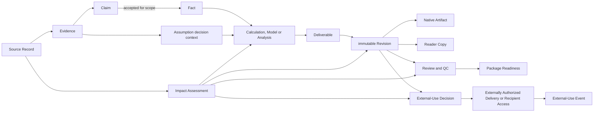

# Information Architecture — Controlled Sell-Side Auction Execution Workspace V1

Status: confirmed

Confirmed on: 2026-08-03

## Purpose

This document defines where V1 information lives and how an eligible user reaches it. It establishes the customer-facing surface map, navigation hierarchy, page and route model, canonical object locations, object relationships, role visibility, lifecycle modes, search and cross-link behavior, and desktop-to-small-screen projection.

It turns the confirmed User Journey Map and User Flow into a stable information structure. It is not a component specification, wireframe, visual design, field schema, API design, database design, authentication-vendor decision, or Operator Console design.

## Authority and scope

This Information Architecture is governed by, in order:

1. the confirmed [V1 Product Specification](../../.scratch/ai-investment-banking-productization-wayfinding/spec.md);
2. the canonical language in [CONTEXT.md](../../CONTEXT.md);
3. the confirmed [User Journey Map](user-journey-map.md);
4. the confirmed [User Flow](user-flow.md);
5. [ADR 0001 — Separate internal controlled export from externally authorized delivery](../adr/0001-separate-internal-export-from-external-delivery.md); and
6. the resolved Wayfinder assets when the higher-authority sources do not answer a question.

This document covers:

- the Public Site;
- the Account Access Gateway;
- the Banker Account;
- the Deal Workspace;
- the External Recipient's isolated Recipient Access surface;
- canonical business-object and immutable-version locations;
- First Deal Guide, Preflight-Restricted, Archived and Post-Term modes;
- desktop and bounded small-screen information access; and
- information ownership for empty, asynchronous, blocked and error states.

This document excludes:

- an Operator Console or internal operations IA;
- Team membership, collaboration, approval routing and organization administration;
- field-level forms and validation timing;
- exact component, modal, drawer, table or inspector behavior;
- final interface copy;
- responsive breakpoints and detailed accessibility interactions;
- visual design, brand, typography, color and motion;
- authentication, billing, storage, model, parsing or infrastructure vendors;
- database, API, queue, schema and permission implementation; and
- production code or implementation tickets.

## Information-architecture principles

1. **Deal-first authority.** One Deal has one authoritative Deal Workspace. No public proof, account page, Action Center, file browser, history view or notification becomes a competing source of Deal truth.
2. **Stable work domains.** Deal navigation is organized by enduring banker work domains, not Deal Business Stage, file type, AI skill or provider workflow.
3. **Canonical object locations.** Every durable business object and immutable version has one stable, addressable home. Lists, inspectors, search results, notifications and action views link to that home.
4. **Stage-aware, not stage-shaped.** Deal Business Stage changes priority, applicability and next actions without moving or duplicating objects.
5. **Current and historical truth coexist.** Current pointers can change; Source Records, Process Events, Human Decisions and Revisions remain immutable and addressable.
6. **Independent states remain independent.** Source Reliance, information freshness/conflict/disposition, Analysis State, Mechanical Validity, Professional Usability, Deliverable Readiness, Process State, Job State and external-use posture are never collapsed into one global status.
7. **Actions retain context.** State-changing actions originate from an exact Deal, object, version, purpose and authority context. There is no universal creation prompt or chatbot command surface.
8. **Readiness is not authorization.** Package content, QC/readiness, External-Use Decision, delivery creation and actual external use remain separate information neighborhoods and records.
9. **Modes reuse the same structure.** Guided, Preflight-Restricted, Archived, Post-Term and small-screen modes restrict actions without creating parallel object stores.
10. **Safe return is part of IA.** Authenticated deep links, notifications, durable checkpoints, search results and asynchronous jobs restore the exact authorized object and version.

## Surface map



The customer IA has four isolated product surfaces plus one cross-surface access gateway:

| Surface | Primary audience | Information responsibility | Must not become |
|---|---|---|---|
| Public Site | Prospective Individual Banker | Outcome comprehension, synthetic proof, trust, pricing, qualification and public resources | A real Deal intake surface or production-capability proof by assertion |
| Account Access Gateway | Banker or External Recipient entering an authenticated path | Registration, authentication, recovery, reauthentication and safe dispatch | A business dashboard or a source of Deal state |
| Banker Account | Individual Banker | Deal selection plus account, plan, billing, notification, security and data-lifecycle utilities | A cross-Deal business-content dashboard |
| Deal Workspace | Individual Banker | The authoritative current and historical working context for one Deal | A skill menu, chatbot, generic file repository or second onboarding product |
| Recipient Access | External Recipient | Read-only inspection of one exact authorized Deliverable Revision | Deal membership, general sharing, download, editing or navigation to other objects |

The Deployment Operator is outside this IA. Operator visibility is limited to privacy-safe operational metadata; V1 has no Operator Console, Banker impersonation, administrative Deal viewer or content-level support path.

## Global hierarchy and dispatch

The global hierarchy is:

```text
Account
└── Deals
    └── Deal Workspace
        └── Work domain
            └── Canonical object
                └── Immutable version or Revision
```

The authenticated dispatcher applies this order:

1. An exact authenticated deep link reauthorizes the Account, Deal, object and version, then opens the exact context or a safe denial.
2. An incomplete initial First Deal Guide resumes its durable checkpoint.
3. An account with no Deal opens Deal Setup.
4. An account with one applicable Deal opens that Deal's Overview with its next controlled action.
5. An account with multiple Deals opens Deals before any Deal content.
6. Post-Term Access opens the same canonical Account and Deal routes in the permitted read-only posture.
7. Recipient Access enters its separate identity-verification and exact-Revision path.

Browser history is not authoritative for dispatch. Stale, resolved, revoked or unauthorized links show a safe outcome and a valid next action without disclosing unauthorized object existence or content.

## Route principles

Routes below define the conceptual information contract. Exact identifier syntax, opacity and token implementation remain technical-design decisions.

- Routes never encode Deal Business Stage.
- A route that identifies an immutable object or Revision continues to identify that exact historical version after the current pointer changes.
- Human-readable filenames do not establish business identity.
- Query parameters may express view filters, sort, search and return context; they do not establish object authority.
- Every route is reauthorized independently of how the user reached it.
- A small-screen route resolves to the same object as desktop, with its action set restricted by the device contract.

## Public Site

### Public navigation

```text
Outcome
Project Northstar
How It Works
Security & Data Use
Pricing
Qualification
Resources
Account Access
```

Conceptual route tree:

```text
/
├── /project-northstar
│   └── /project-northstar/{proof-state}
├── /how-it-works
│   ├── /how-it-works/evidence-and-decisions
│   ├── /how-it-works/deterministic-validation
│   ├── /how-it-works/revisions-and-impact
│   └── /how-it-works/native-and-reader-artifacts
├── /security-data
│   ├── /security-data/source-rights
│   ├── /security-data/confidentiality-and-processing
│   └── /security-data/retention-export-deletion
├── /pricing
├── /qualification
├── /resources
│   ├── /resources/synthetic-artifacts
│   ├── /resources/utilities
│   └── /resources/recorded-walkthrough
├── /triggers/{trigger}
└── /account-access/*
```

### Public information organization

- **Outcome** identifies the Initial Design ICP, Sell-Side Auction problem, controlled outcome, self-serve boundary and primary proof entry.
- **Project Northstar** is the single canonical synthetic proof. It owns the material conflict, extraction correction, deterministic recovery, affected artifacts, Package Readiness, Revision and authorization-consequence demonstration.
- **How It Works** explains mechanisms without exposing the 21 official plugin skills as a product menu.
- **Security & Data Use** contains implemented source-rights, confidentiality, provider-processing, support-access, retention, export and deletion boundaries. It does not claim unimplemented certification.
- **Pricing** owns price, Active Deal capacity, allowances, add-ons, Guarantee, cancellation and Post-Term Access terms.
- **Qualification** owns the pre-payment compatibility and intended-use preview and accepts no real Confidential or Restricted Deal Materials.
- **Resources** owns rights-cleared synthetic artifacts, bounded utilities and the accessible recorded proof alternative.
- **Trigger pages** and artifact utilities deep-link to the matching Project Northstar proof state. They do not duplicate the proof.

Every public surface can enter Project Northstar, Pricing or Qualification. Project Northstar preserves the entry context and supports return to the originating public page or continuation toward purchase.

## Account Access Gateway

The Account Access Gateway is a cross-surface access family rather than a business information domain.

```text
Account Access
├── Create Account
├── Sign In
├── Verify Identity or Email
├── Recover Account
├── Reset Password
├── Reauthentication
├── Session Expired
└── Access Denied
```

Required information behavior:

- preserve the authorized return target without exposing its Deal or object content;
- distinguish account creation, ordinary sign-in, recovery and sensitive-action reauthentication;
- return a successful Banker to the authenticated dispatcher;
- return a successful External Recipient to the isolated Recipient Access check;
- provide safe denial and recovery when identity, entitlement or target authorization fails; and
- avoid binding the IA to a particular authentication provider, MFA method or session implementation.

An eligible purchase return target continues into the authenticated Checkout and entitlement path:

```text
/checkout
├── /checkout/order
├── /checkout/terms
├── /checkout/payment
└── /checkout/confirmation
```

The normal durable sequence is `Order → Terms → Payment → Confirmation`. `/checkout/recovery` is an exception route available from any affected step and returns to the preserved Checkout checkpoint after recovery; it is not a normal step. Checkout owns the exact plan, amount due now, renewal terms, applicable tax, add-ons, Guarantee and payment state. Confirmation exposes entitlement, Active Deal capacity, receipt/invoice entry and the next Deal Setup action. Payment failure and account recovery return to the same durable Checkout state. Successful payment creates entitlement but does not establish Source rights, Professional Usability or external-use authority.

## Banker Account

### Account navigation

`Deals` is the authenticated default and the only primary business collection. Low-frequency account utilities live in the account menu:

```text
Banker Account
├── Deals
├── Purchase & Entitlement (transitional)
├── Usage & Plan
├── Billing & Invoices
├── Notifications
├── Account & Security
├── Data, Export & Deletion
└── Help & Support
```

### Deals

Deals supports search and the following posture filters:

- Active;
- Setup / Preflight-Restricted;
- Paused;
- Closed / Terminated; and
- Archived.

Each Deal row or card may show only enough authenticated information to select and resume the Deal:

- Deal identity;
- Deal Business Stage;
- Workspace posture;
- Paid Preflight posture;
- current Revision or Package posture summary;
- blocker and pending-action counts;
- last durable update;
- next controlled action; and
- Active Deal capacity effect.

Deals does not provide cross-Deal financial comparison, Buyer aggregation, Evidence search, Package-content aggregation or a global business dashboard. It may show privacy-safe per-Deal action counts, but the underlying content remains Deal-scoped.

### Account utility ownership

| Account page | Owns | Does not own |
|---|---|---|
| Purchase & Entitlement | Authenticated Checkout, payment recovery, entitlement confirmation and first receipt/invoice entry | Source authority, Paid Preflight, Deal readiness or external-use authority |
| Usage & Plan | Entitlement, Active Deal capacity, allowances, add-ons and capacity actions | Deal readiness or job truth |
| Billing & Invoices | Subscription term, payment status, invoices, Guarantee/refund status and cancellation entry | Purchase authority for a Source or external-use authority |
| Notifications | Notification history, delivery preferences, digest/snooze and safe deep links | Process Event truth or Deal task state |
| Account & Security | Named Individual identity, access recovery, sessions and account-security actions | Deal roles, Team membership or professional authority |
| Data, Export & Deletion | Account-level export/deletion information, Post-Term clock and account deletion | Deal-level Internal Controlled Export contents or External-Use Decisions |
| Help & Support | Self-serve documentation and asynchronous product/account support | Banker review, manual Deal work or implementation service |

## Deal Workspace

### Primary navigation

The persistent Deal Execution Desk uses nine stable work domains in this order:

1. Overview
2. Action Center
3. Sources
4. Evidence & Decisions
5. Analysis
6. Auction Process
7. Execution Package
8. Review & Readiness
9. History & Portability

Conceptual route tree:

```text
/app/deals/{deal-id}
├── /overview
├── /actions
├── /sources
├── /evidence-decisions
├── /analysis
├── /auction-process
├── /execution-package
├── /review-readiness
├── /history-portability
├── /guide
├── /setup
└── /controls
    ├── /preflight
    └── /lifecycle
```

The official Investment Banking workflow skills are never navigation items. Work routing may exist internally, but the Individual Banker sees Deal tasks, controlled objects, valid next actions and applicable outcomes.

Deal creation begins at `/app/deals/new`. Once the identity-defining Deal information is accepted, the product creates the authoritative Preflight-Restricted Deal Workspace and continues at `/app/deals/{deal-id}/setup`. Deal Setup owns the required identity, Paid Preflight, authority, initial Source Packet and Work Objective path for every Deal. The First Deal Guide provides expanded guidance for the initial Deal without creating different controls.

### Overview

Overview is the stable ordinary-return page for one Deal. It organizes:

- Deal identity and mandate boundary;
- Deal Business Stage and activity/record posture;
- Paid Preflight result and permitted scope;
- current Source Packet and Work Objective;
- Output Ceiling;
- current Package and Revision summary;
- stage-applicable Milestones and Deliverables;
- material blockers and pending Human Decisions;
- recent accepted Process Events and changes;
- next controlled action;
- First Deal Guide entry or completed-loop summary; and
- Deal Controls for Preflight and lifecycle.

Overview summarizes and links; it does not become the canonical home for Sources, Evidence, Analysis, process objects, Deliverables, Reviews or history.

### First Deal Guide

The First Deal Guide is a recoverable mode inside the same Deal Workspace.

- Before Guide graduation, it is the initial Deal's default work mode and resumes its durable checkpoint.
- It sequences Deal identity, authority, Paid Preflight, Source Packet, Work Objective, observable controlled work, Evidence, typed Human Decision or correction, deterministic validation, affected consequences and the first permitted Internal Controlled Export.
- The normal Workspace navigation remains visible. Only destinations with unmet dependencies are locked; safe independent work remains reachable.
- Graduation requires the complete First Unmistakable Value loop, the first permitted Internal Controlled Export and an explicit entry into the Deal Execution Desk. These are three independent durable milestones.
- After graduation, Overview becomes the default and the Guide remains reopenable from Overview and contextual recovery links.
- Guide state is a view of the same canonical Deal objects, never a parallel onboarding model.

### Action Center

Action Center is Deal-scoped and contains five action views:

```text
Action Center
├── Needs Decision
├── Needs Source
├── Blocked
├── Jobs
└── New Events
```

Action Center items contain the exact Deal, object, version, reason, affected scope, smallest valid action and return target. They deep-link to canonical object or Job pages. Completing, resolving or dismissing an action does not independently mutate the underlying business object.

- **Needs Decision** indexes pending typed Human Decisions.
- **Needs Source** indexes missing Source Records or clarification required by exact work.
- **Blocked** indexes hard and recoverable gates with safe-continuation scope.
- **Jobs** indexes durable asynchronous processing.
- **New Events** indexes authenticated return-worthy changes; formal Process Events remain in Auction Process.

There is no global cross-Deal Action Center. Deals may display safe counts and next-action summaries only.

### Sources

```text
Sources
├── Source Overview
├── Source Materials
│   └── Source Material Detail and immutable Source Records
├── Source Record Detail
├── Source Packets
│   └── Source Packet Detail and Versions
├── Intake & Processing
├── Rights, Confidentiality & Compatibility
└── Parsing Coverage
```

Sources owns Source Material intake and the authoritative Source Record, Source Packet, rights, confidentiality, compatibility, freshness, conflict, disposition, Source Reliance and parsing-coverage information.

Paid Preflight remains a Deal-level control under Overview because it evaluates Deal identity, intended use, authority, confidentiality, processing path, compatibility and minimum Source Packet together. A Source Record may trigger Targeted Re-Preflight, but the resulting control record returns to the same Deal-level Preflight location.

Conceptual canonical routes include:

```text
/app/deals/{deal-id}/sources/{source-material-id}
/app/deals/{deal-id}/source-records/{source-record-id}
/app/deals/{deal-id}/source-packets/{packet-id}
/app/deals/{deal-id}/source-packets/{packet-id}/versions/{version-id}
/app/deals/{deal-id}/actions/jobs/{job-id}
```

### Evidence & Decisions

```text
Evidence & Decisions
├── Evidence
├── Claims
├── Facts
├── Assumptions
├── Conflicts
└── Human Decisions
```

This domain owns proposition type and Banker control. It preserves Evidence, Claim, Fact and Assumption as distinct objects and keeps supporting and challenging Evidence visible.

Every object exposes its exact Source Record and locator, Origin, version, period, definition, unit, currency, scope, intended use, conflicting alternatives, Human Confirmation, downstream dependencies and historical disposition. There is no generic `Approve AI` collection or action.

Conceptual canonical routes include:

```text
/app/deals/{deal-id}/evidence/{evidence-id}
/app/deals/{deal-id}/claims/{claim-id}
/app/deals/{deal-id}/facts/{fact-id}
/app/deals/{deal-id}/assumptions/{assumption-id}
/app/deals/{deal-id}/conflicts/{conflict-id}
/app/deals/{deal-id}/decisions/{decision-id}
```

### Analysis

```text
Analysis
├── Analysis Overview
├── Calculations
├── Models
├── Scenarios
├── Analyses
└── Deterministic Validation Records
```

Analysis owns quantitative and interpretive work. It references exact Facts, Assumptions, Evidence, Source Packet versions and Work Objectives without copying or redefining their proposition state.

- A Calculation exposes its inputs, formula/method, units, currency, period, precision, rule set and Mechanical Validity.
- A Model exposes dependent Calculations, definitions, Assumptions, Scenarios and output relationships.
- A Scenario remains a named alternative within a Model or Analysis rather than a separate prediction asserted as Fact.
- An Analysis exposes its question, inputs, Evidence, method, professional-judgment requirements and downstream uses.
- Deterministic Validation Records expose exact tested inputs, engine/rules, coverage, results, exceptions and affected gates.

Conceptual canonical routes include:

```text
/app/deals/{deal-id}/analysis/calculations/{calculation-id}
/app/deals/{deal-id}/analysis/models/{model-id}
/app/deals/{deal-id}/analysis/scenarios/{scenario-id}
/app/deals/{deal-id}/analysis/analyses/{analysis-id}
/app/deals/{deal-id}/analysis/validations/{validation-id}
```

### Auction Process

Auction Process is organized by stable object family, while Deal Business Stage sets the default filters and priority.

```text
Auction Process
├── Timeline & Milestones
├── Buyers & Outreach Waves
├── NDA & Data-Room Access
├── Diligence Issues & Information Requests
├── Bids & Recommendations
└── Stage Transitions
```

It preserves Buyer Candidate, Approved Buyer, Outreach Wave, actual outreach, NDA, disclosure permission, Data-Room Access, Diligence Issue, Information Request, Open Item, Bid, selection, Milestone, Process Event and Deal Business Stage as distinct objects or conditions.

Conceptual canonical routes include:

```text
/app/deals/{deal-id}/auction-process/events/{event-id}
/app/deals/{deal-id}/auction-process/milestones/{milestone-id}
/app/deals/{deal-id}/auction-process/buyers/{buyer-id}
/app/deals/{deal-id}/auction-process/outreach-waves/{wave-id}
/app/deals/{deal-id}/auction-process/ndas/{nda-id}
/app/deals/{deal-id}/auction-process/data-room-access/{access-id}
/app/deals/{deal-id}/auction-process/diligence-issues/{issue-id}
/app/deals/{deal-id}/auction-process/information-requests/{request-id}
/app/deals/{deal-id}/auction-process/open-items/{item-id}
/app/deals/{deal-id}/auction-process/bids/{bid-id}
```

Stage transitions append supported history. A backward transition does not move, duplicate or delete the objects associated with an earlier stage.

### Execution Package

```text
Execution Package
├── Package Overview
├── Templates & Compatibility
│   └── Artifact Template Detail and Versions
├── Deliverables
│   └── Deliverable Detail
│       ├── Current Revision
│       └── Revision History
│           └── Exact Revision
│               ├── Native Artifact
│               ├── Reader Copy
│               ├── Lineage
│               └── Control-state links
└── Package Manifest
```

The Package groups Deliverables by applicability:

- always required;
- required for the current stage and scope;
- conditional; and
- `not stage-required`.

Stage-inapplicable Deliverables remain visible and accurately labeled; they are not manufactured early, hidden as defects or counted as blockers.

The two always-required Native Artifact spines are the Analysis and Valuation Workbook and Auction Control Workbook. Stage-triggered Deliverables include applicable Teaser, CIM and Bid Evaluation and Recommendation Memo Native Artifacts with exact Reader Copies. Conditional materials appear only when their stage, audience and purpose make them applicable.

Conceptual canonical routes include:

```text
/app/deals/{deal-id}/execution-package
/app/deals/{deal-id}/execution-package/templates
/app/deals/{deal-id}/artifact-templates/{template-id}
/app/deals/{deal-id}/artifact-templates/{template-id}/versions/{version-id}
/app/deals/{deal-id}/deliverables/{deliverable-id}
/app/deals/{deal-id}/deliverables/{deliverable-id}/revisions/{revision-id}
/app/deals/{deal-id}/deliverables/{deliverable-id}/revisions/{revision-id}/native-artifact
/app/deals/{deal-id}/deliverables/{deliverable-id}/revisions/{revision-id}/reader-copy
/app/deals/{deal-id}/execution-package/manifest
```

Execution Package owns content, Artifact Templates, representations, stage applicability and artifact lineage. `Templates & Compatibility` is the canonical Deal-level home for product-provided and user-supplied Artifact Templates, their exact versions, rights posture, Compatibility Reports, fallback posture and artifact-class bindings. Each Deliverable Detail displays its currently bound Artifact Template version and links to that canonical record. Execution Package displays Review, QC, readiness and authorization summaries that link to their formal records under Review & Readiness.

### Review & Readiness

```text
Review & Readiness
├── Reviews
├── QC Findings
├── Impact Assessments
├── Package Readiness
├── External-Use Decisions
├── Externally Authorized Deliveries
└── Recipient Access Control
```

- **Reviews** retain reviewer type, scope, object/version and conclusion.
- **QC Findings** retain exact location, severity, Evidence, effect, remediation and re-test.
- **Impact Assessments** retain affected and unaffected objects and independent recalculation, regeneration, re-review and circulation-blocking consequences.
- **Package Readiness** aggregates applicable blockers and next controlled actions without creating a scalar score or independent contradictory truth.
- **External-Use Decisions** bind exact eligible Revisions, hashes, audience, purpose, channel/time, conditions and invalidation triggers.
- **Externally Authorized Deliveries** and **Recipient Access Control** exist only under a matching External-Use Decision and remain distinct from actual use.

Conceptual canonical routes include:

```text
/app/deals/{deal-id}/review-readiness/reviews/{review-id}
/app/deals/{deal-id}/review-readiness/qc-findings/{finding-id}
/app/deals/{deal-id}/review-readiness/impact-assessments/{assessment-id}
/app/deals/{deal-id}/review-readiness/package-readiness
/app/deals/{deal-id}/review-readiness/external-use-decisions/{decision-id}
/app/deals/{deal-id}/review-readiness/deliveries/{delivery-id}
/app/deals/{deal-id}/review-readiness/recipient-access/{access-id}
```

An Internal Controlled Export does not live here as an external-use action. It belongs to the exact object/Revision and History & Portability under the boundary in ADR 0001.

### History & Portability

```text
History & Portability
├── Deal Timeline
├── Revision History
├── Decision & Authorization History
├── Internal Controlled Exports
├── Reimports & Three-Way Comparisons
├── Archive Packages
├── Lifecycle & Deletion Receipts
└── Audit Trail
```

History & Portability answers what happened, which exact versions and records were involved, and which permitted internal copies exist. It indexes and links to canonical objects; it does not create editable duplicate records.

- Process Events are searchable in the Deal Timeline but remain canonical Auction Process objects.
- External-Use Decisions remain canonical Review & Readiness objects.
- External-Use Events are historical Process Events and remain distinct from authorization and delivery creation.
- Internal Controlled Exports preserve exact identity, posture, limitations, manifest data and declared exclusions without authorizing circulation.
- Reimports use the prior exported Revision, externally edited artifact and current controlled Revision and result in accepted new state, conflicts or a new immutable Revision.

Conceptual routes include:

```text
/app/deals/{deal-id}/history-portability/timeline
/app/deals/{deal-id}/history-portability/revisions
/app/deals/{deal-id}/history-portability/decisions
/app/deals/{deal-id}/history-portability/internal-exports/{export-id}
/app/deals/{deal-id}/history-portability/reimports/{reimport-id}
/app/deals/{deal-id}/history-portability/archive-packages/{archive-id}
/app/deals/{deal-id}/history-portability/audit
```

## Canonical object-detail contract

Every durable object detail page uses the same information skeleton while preserving type-specific semantics:

1. **Identity** — object type, Deal, stable identity, Origin and current/version posture.
2. **Current State** — current content and each applicable independent state.
3. **Lineage & Dependencies** — upstream Sources/Evidence and downstream dependents.
4. **Controls** — applicable Human Decisions, Reviews, QC, rights and confidentiality.
5. **Versions & History** — immutable versions, changes and current pointer.
6. **Related Objects** — bidirectional domain and process relationships.
7. **Valid Actions** — actions permitted for this exact object, version, purpose, mode and device.

The UX Spec may realize these regions as pages, tabs, inspectors, drawers or split views, but none may be the only addressable location of durable information.

## Object hierarchy and relationships

The primary business-object hierarchy is:

```text
Deal
└── Deal Workspace
    └── Controlled Sell-Side Auction Deal Book
        └── Controlled Auction Execution Package
            └── Deliverable
                └── immutable Revision
                    ├── Native Artifact
                    └── Reader Copy
```

The hierarchy does not erase cross-domain relationships:



Every material cross-link resolves to the exact object and version rather than a filtered list alone.

### Relationship navigation

Object pages provide:

- a hierarchy path: Account → Deal → domain → object → version;
- upstream lineage to Source Records, Evidence, Facts, Assumptions and Calculations;
- downstream impact to Analyses, Deliverables, Revisions, QC and Decisions;
- related process context such as Buyer, Bid, Milestone and Process Event;
- current/history switching; and
- a return link to the originating action, search, notification, proof or Review context.

An inspector may preview a relationship without replacing the canonical destination.

## Current and historical information

Current object views default to the current pointer while always exposing:

- current/historical designation;
- exact version, time and Origin;
- prior and subsequent versions where they exist;
- Stale, Conflicted, Superseded, Withdrawn or Historical conditions;
- whether prior Reviews, QC, readiness and Decisions still apply;
- earlier External-Use Decisions and Events without implying current validity; and
- a complete-history entry.

Historical objects are inspectable and linkable but cannot be edited in place. A correction, accepted external edit or material change creates a new version or Revision and preserves the earlier state.

## Contextual action placement

There is no universal creation menu or chat-first command surface.

| Action | Primary entry |
|---|---|
| Create Deal | Deals |
| Add Source | Sources, Source Packet or exact missing-source blocker |
| Create or change Source Packet | Source Packets |
| Start controlled Analysis or Model work | Work Objective, relevant Evidence or Analysis |
| Record Process Event or stage transition | Auction Process |
| Record Human Decision | Exact proposition, process object, Review or action item |
| Create new Revision | Affected Deliverable or accepted Impact Assessment |
| Run Review or QC | Exact object/Revision or Review & Readiness |
| Create External-Use Decision | Eligible exact circulation-candidate Revision |
| Create Externally Authorized Delivery or Recipient Access | Matching External-Use Decision |
| Record product-external use | Applicable receipt and exact External-Use Decision context |
| Create Internal Controlled Export | Exact object/Revision or History & Portability |
| Reimport edited Native Artifact | Prior Internal Controlled Export/Revision context |
| Pause, close, terminate, archive, reactivate or delete Deal | Overview → Deal Controls → Lifecycle |

## Independent state organization

Lists and detail pages expose applicable dimensions independently and allow explicit filtering by them:

- Source Reliance State;
- freshness, conflict and disposition conditions;
- Analysis State;
- Mechanical Validity;
- Professional Usability;
- Deliverable Readiness;
- Process State;
- Deal Business Stage;
- Job State;
- Human Decision posture; and
- external-use posture.

Package Readiness may summarize applicable blockers, affected objects and next controlled actions. It never becomes a master status, percentage or score, and the product has no global `ready`, `approved` or `complete` flag.

## Stage-aware information priority

Deal Business Stage changes default emphasis without changing information ownership:

| Stage | Overview and Auction Process priority | Execution Package priority |
|---|---|---|
| Initiated | Identity, authority, source perimeter, initial events | Applicable setup and initial package requirements |
| Preparation | Sources, normalization, valuation, Buyers, launch blockers | Workbooks, Teaser, CIM and applicable launch materials |
| In Market | Buyers, Outreach Waves, NDA/access, diligence, meetings, Milestones | Current marketing materials and source/process refresh |
| Bid Evaluation | Exact Bids, comparison, conditions and recommendation | Bid Evaluation and Recommendation Memo plus affected workbooks/materials |
| Exclusive Execution | Continuing diligence, conditions, updated events and risks | Targeted package and analysis refresh |
| Signed | Signed event, remaining conditions and closing work | Current controlled package and closing-related materials |
| Closed / Terminated | Final outcome, unresolved history, export/archive options | Final exact Revisions and records without rewriting prior uncertainty |

Paused preserves the underlying stage. Archived changes record posture, not Deal outcome. A supported backward stage transition changes priority and history but never relocates objects.

## Workspace modes

### Preflight-Restricted

The full navigation skeleton remains visible to preserve orientation:

- Overview, Action Center, Paid Preflight and permitted Source metadata are available;
- Limited Proceed enables only its explicitly accepted scope;
- unavailable domains show the gate, Output Ceiling, permitted safe work and smallest recovery action; and
- no locked route reveals or permits unauthorized Deal content or processing.

### Guided first use

The First Deal Guide is the primary task mode while normal navigation remains visible. Unmet dependencies lock only affected destinations. Graduation changes the default navigation and next-action emphasis, not Deal identity, object locations or history.

### Archived Deal

The same canonical routes enter a visible read-only posture. Allowed information and actions are search, Evidence inspection, download where permitted, Internal Controlled Export, deletion and reactivation. New Sources, material work, Revisions and readiness advancement are unavailable.

Archive does not automatically revoke valid Recipient Access. Recipient Access remains governed by its own expiry, revocation and invalidation state.

### Post-Term Access

The same canonical routes remain available for the confirmed time-bounded read-only window. Allowed actions are inspection, Internal Controlled Export and deletion. New substantive work, external delivery and sharing are unavailable. Old Recipient Access is not restored by later resubscription.

### Closed, Terminated and Paused

Closed and Terminated are Deal outcomes; Paused is an activity posture. They do not automatically archive the Deal or revoke Recipient Access. Overview presents the exact outcome/posture, remaining valid state and available lifecycle actions.

## Lifecycle action placement

Deal lifecycle actions live under `Overview → Deal Controls → Lifecycle` rather than primary navigation.

```text
Deal Controls
├── Paid Preflight
└── Lifecycle
    ├── Pause / Resume
    ├── Advance / Move Backward
    ├── Close
    ├── Terminate
    ├── Archive
    ├── Reactivate
    └── Delete Deal
```

Archived banners and Deals may provide contextual Archive/Reactivate entries that return to the same lifecycle control. Subscription cancellation belongs to Usage & Plan or Billing & Invoices. Account deletion belongs to Data, Export & Deletion. Protected irreversible actions require reauthentication and an exact scope; detailed confirmation behavior belongs to the UX Spec.

## Search and filtering

| Surface | Search scope | Explicit exclusions |
|---|---|---|
| Public Site | Public pages and Resources | No authenticated or real Deal content |
| Deals | Deal identity and posture filters | No cross-Deal content, Evidence, Buyer or Package search |
| Deal Workspace | Authorized objects and versions within the current Deal | No other Deal content, including for the same Individual Banker |
| Recipient Access | Information within the one exact authorized Revision when needed for reading | No other Deal, Deliverable or Revision discovery |

Deal search defaults to current information. Historical information appears only through an explicit include-history filter and retains visible Historical, Superseded, Withdrawn, Stale or Conflicted conditions. Search results open canonical objects and versions.

## Notifications and return paths

- External email or notification content is generic and contains an authenticated deep link without Deal payload.
- Account Notifications owns delivery history, preferences, digest/snooze and safe return links.
- Deal Action Center → New Events owns the authenticated attention view.
- Auction Process owns formal Process Event truth.
- A stale, resolved or revoked notification remains historical communication; it never changes the linked business object.
- A notification deep link reauthorizes the Account, Deal, object and version before opening content.

## Asynchronous jobs, loading, blockers and errors

### Job information ownership

Every durable Job has an addressable status detail containing:

- accepted input perimeter;
- affected object and version;
- current Job State;
- last durable update and heartbeat;
- work completed and accepted state;
- safe continuation;
- cancellation and retry posture;
- smallest recovery action;
- expected return point; and
- allowance and Guarantee consequence.

The affected canonical object displays its relevant Job state, and Action Center → Jobs indexes Jobs for return. A toast or transient status message is never the only error or progress record.

### Permitted Job States

`queued`, `running`, `waiting-for-user`, `waiting-for-source`, `blocked`, `failed-retryable`, `failed-terminal`, `canceled` and `completed` remain distinct. Completion applies only to the declared Job scope and never establishes unrelated truth, Professional Usability, readiness or authorization.

### Blocker and error contract

Every material blocker or error is attached to the exact object, Job and version and explains:

1. what failed, conflicts or remains unknown;
2. the affected downstream scope;
3. what work may safely continue;
4. the smallest valid recovery action;
5. the durable state to which recovery returns;
6. whether retry is safe and idempotent; and
7. the allowance and Guarantee consequence.

## Empty states

An empty state remains at its canonical destination rather than redirecting to a chatbot, generic dashboard or unrelated settings page. It identifies:

- why the collection or object is empty;
- whether this is normal lifecycle state or a blocker;
- the current Output Ceiling where applicable;
- the minimum next controlled action;
- the required upstream object or decision;
- whether desktop is required; and
- where the user returns after recovery.

Required examples include:

| Context | Canonical empty-state response |
|---|---|
| Paid Account with no Deal | Deals opens Deal Setup |
| Preflight-Restricted Deal | Overview shows exact Preflight state and recovery |
| Deal with no Source Record | Sources shows minimum authorized anchor-source requirement |
| Deal with one anchor source | Sources and Evidence permit bounded inventory/Claim mapping under the Output Ceiling |
| No current Open Item | Overview shows lifecycle posture and next controlled action |
| No stage-required Deliverable | Execution Package shows `not stage-required`, not false incompleteness |
| Archived Deal | Same read-only routes with export, deletion and reactivation options |
| Post-Term Access | Same read-only routes with the remaining access clock and permitted actions |

## Role visibility

| Information or surface | Prospective Individual Banker | Individual Banker | External Recipient |
|---|---:|---:|---:|
| Public outcome, proof, pricing and qualification | Yes | Yes | Public only |
| Real Deal creation and Paid Preflight | No | Own Deals only | No |
| Deal navigation and Workspace membership | No | Own Deals only | No |
| Source Records, Evidence, Analysis and process objects | Synthetic proof only | Own Deal only | No |
| Deliverables and Revisions | Synthetic proof only | Own Deal only | One exact authorized Revision only |
| Reviews, QC and Package Readiness | Synthetic proof only | Own Deal only | Only reader-facing authorized context, if included |
| Human and External-Use Decisions | Synthetic proof only | Own Deal only | Matching authorization conditions only |
| Internal Controlled Export | Synthetic downloads only | Where permitted | No |
| Recipient Access control | No | Exact authorized paths for own Deal | Own access verification only |
| Billing, account, deletion and Post-Term controls | Public terms only | Own Account | No |

Senior bankers or specialists outside the product receive no V1 product role by title. Their conclusions may enter the Deal through an Individual Banker with provenance. AI and deterministic procedures are responsibility planes, not navigation roles.

## External Recipient IA

Recipient Access is a navigation-free, single-task flow:

```text
/recipient-access/{access-id}
├── Verify Recipient Identity
├── Access Check
├── Exact Revision Viewer
└── Unavailable State
    ├── Identity Mismatch
    ├── Expired
    ├── Revoked
    ├── Invalidated
    └── Safe Denial
```

The Exact Revision Viewer may show only the information necessary to understand the authorized content and scope:

- Deliverable identity;
- exact Revision identity;
- Reader Copy;
- authorizing party;
- stated audience/recipient and purpose;
- conditions and limitations;
- validity/expiry posture; and
- safe access help.

It exposes no Deal navigation, membership, other Revision, editing, onward sharing or V1 download. The Individual Banker sees Recipient Access history and controls within Review & Readiness and History; the External Recipient does not receive a second history product.

## Device and channel projection

### Desktop Web

Desktop Web carries the complete customer IA and every V1 banker action: public proof, purchase, Deal Setup, source intake, Evidence and Human Decisions, Analysis, Auction Process, artifact review, QC/readiness, external-use control, export, lifecycle and continuing execution.

### Mobile or small-screen Web

Small-screen Web resolves to the same canonical objects through a reduced navigation projection:

```text
Deals
Overview
Action Center
Read-only Object Viewer
History & Internal Exports
Account
```

It supports account access/recovery, safe notification return, authenticated read-only review, Job/status inspection, access to existing Internal Controlled Exports, subscription cancellation and deletion.

It does not support source upload, native editing in the browser, creation of a new Internal Controlled Export, material Human Decisions, Deal Business Stage changes, External-Use Decisions or new Recipient Access creation. A prohibited action remains visible in context with a `Continue on desktop` explanation; it cannot be executed through a compressed control.

### Native Office applications

XLSX, PPTX and DOCX Native Artifact editing occurs through Internal Controlled Export and controlled reimport/three-way comparison. Native Office applications are editing channels, not alternate authoritative Deal Workspaces.

### Notification channel

Email and operating notifications contain only generic event information and an authenticated deep link. They do not carry Deal content or become an action-execution channel.

## User Flow traceability

| Information-architecture area | Primary User Flow coverage |
|---|---|
| Public Site and Project Northstar | UF-01, UF-02, UF-03 |
| Account Access Gateway, Checkout and authenticated dispatcher | UF-03, UF-04, UF-37 |
| Deals and Banker Account | UF-03, UF-04, UF-30, UF-31, UF-32, UF-33, UF-34 |
| Overview, Deal Setup and Paid Preflight | UF-05, UF-06, UF-07 |
| Sources | UF-08–UF-09 |
| First Deal Guide | UF-10, UF-11, UF-12, UF-13, UF-14, UF-15 |
| Action Center and Jobs | UF-11, UF-16–UF-17, UF-35 |
| Evidence & Decisions | UF-12, UF-13, UF-14 |
| Analysis | UF-11, UF-12, UF-13, UF-14, UF-17 |
| Auction Process | UF-18, UF-19, UF-29, UF-30, UF-31 |
| Execution Package | UF-20, UF-22, UF-28 |
| Review & Readiness | UF-20, UF-23, UF-24, UF-25, UF-27, UF-28 |
| History & Portability | UF-21, UF-22, UF-26, UF-27, UF-28, UF-29, UF-30, UF-31, UF-32, UF-33, UF-34 |
| Recipient Access | UF-24, UF-25 |
| Empty, blocker, notification and device behavior | UF-35, UF-36, UF-37, UF-38 |

## Information Architecture completion criteria

This Information Architecture succeeds only if the later UX Spec and implementation can preserve all of the following:

- a user can enter through public proof, Account Access, an authenticated deep link, ordinary Deal resume, Post-Term Access or Recipient Access without entering the wrong information domain;
- one Deal and one Deal Workspace remain the authoritative business context;
- every durable object and immutable version has one canonical, authorized location;
- the nine Deal work domains remain stable across all Deal Business Stages and legitimate backward transitions;
- the First Deal Guide, Preflight-Restricted, Archived, Post-Term and small-screen modes reuse the same object structure without weakening gates;
- Source, Evidence, proposition, Analysis, process, Deliverable, Revision, Review, Decision and external-use distinctions remain visible;
- Action Center, search, notifications, history and inspectors never become competing sources of truth;
- Source-to-output lineage and change-to-impact navigation reach exact objects and versions in both directions;
- Package content remains distinct from Review, QC, readiness, authorization, delivery and actual external use;
- Internal Controlled Export remains distinct from Externally Authorized Delivery under ADR 0001;
- the External Recipient can inspect only one exact authorized Revision without gaining Deal membership or download capability;
- empty, Job, blocker and error states preserve accepted progress and expose the next smallest valid recovery action; and
- desktop carries the complete workflow while small-screen access remains truthful, useful and action-bounded.

## Deferred to the UX Spec

The UX Spec must define, without changing this information ownership:

- exact page composition and component hierarchy;
- field names, required inputs and validation timing;
- list, table, inspector, drawer, modal and split-view behavior;
- exact empty, loading, success, blocker, error, confirmation and notification copy;
- keyboard, focus, screen-reader, status-announcement and accessible-dialog behavior;
- responsive breakpoints and the action-level small-screen matrix;
- desktop handoff behavior;
- sorting, filtering and pagination interactions;
- comparison and lineage visualization interactions;
- destructive-action confirmation patterns; and
- final navigation labels if usability testing requires copy refinement without changing the confirmed domains or object ownership.
