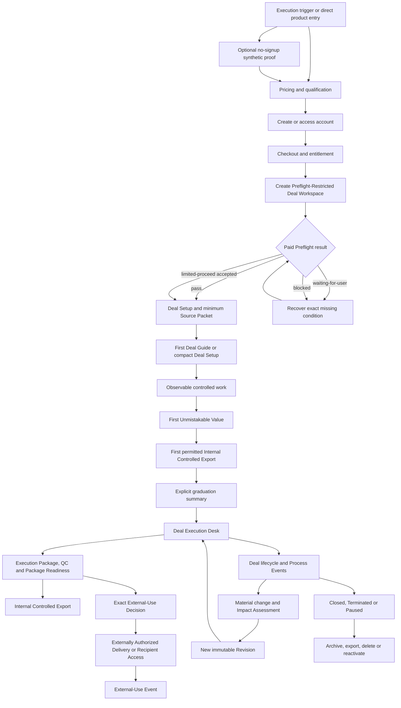
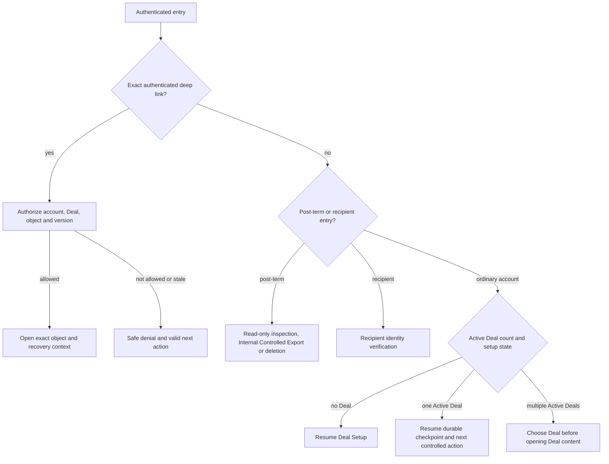
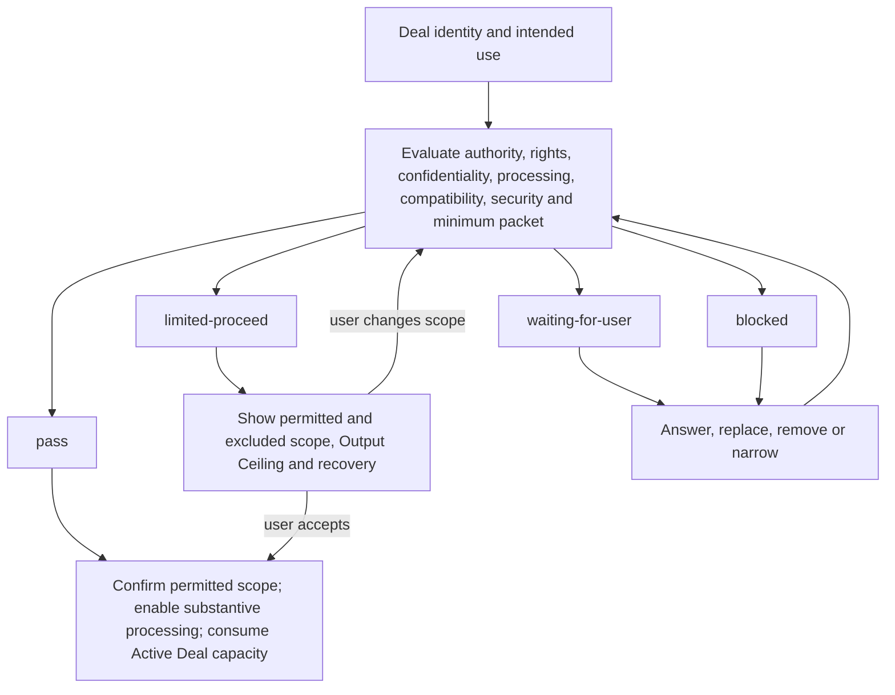
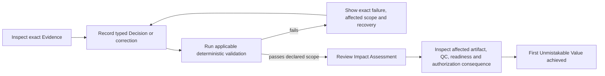
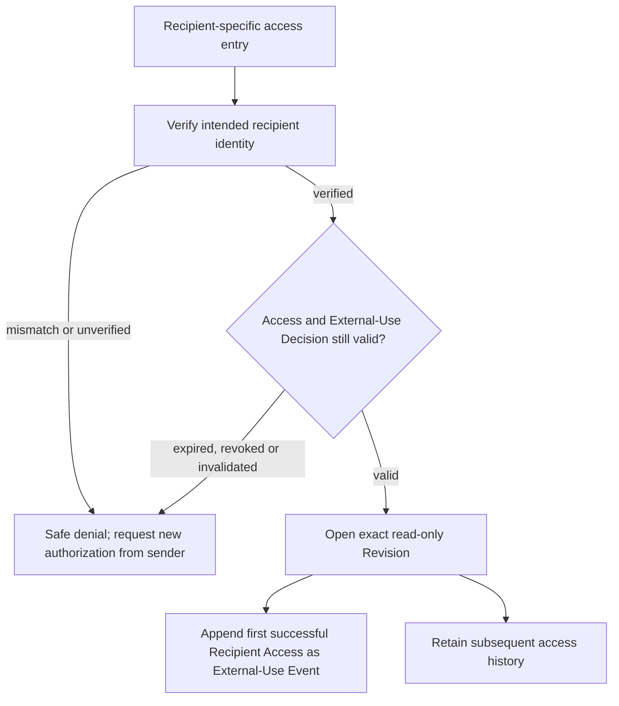

# User Flow — Controlled Sell-Side Auction Execution Workspace V1

Status: confirmed  
Confirmed on: 2026-08-02

## Purpose

This document defines the user-visible task paths through which a prospective or paying Individual Banker evaluates, buys, qualifies, sets up, operates, revises, exports, externally authorizes, archives, and exits the product, and through which an External Recipient accesses an exact authorized Revision.

It turns the confirmed User Journey Map into executable steps, decisions, branches, blockers, and recovery paths. It is not an Information Architecture, URL map, component specification, wireframe, visual design, or technical implementation design.

## Authority and scope

This flow is governed by, in order:

1. the confirmed [V1 Product Specification](../../.scratch/ai-investment-banking-productization-wayfinding/spec.md);
2. the canonical language in [CONTEXT.md](../../CONTEXT.md);
3. the confirmed [User Journey Map](user-journey-map.md);
4. [ADR 0001 — Separate internal controlled export from externally authorized delivery](../adr/0001-separate-internal-export-from-external-delivery.md); and
5. the resolved Wayfinder assets when the higher-authority sources do not answer a question.

This document must not:

- expose the official Investment Banking workflow skills as a product menu;
- turn the product into a chatbot or one-shot file generator;
- merge Source Material, Source Record, Evidence, Claim, Fact, or Assumption;
- merge Mechanical Validity, Professional Usability, Deliverable Readiness, External-Use Decision, delivery creation, or External-Use Event;
- invent Team roles, approval routing, provider-side Banker review, external-system mutation, or autonomous external action;
- establish URLs, navigation group labels, component placement, final interface copy, responsive breakpoints, authentication vendors, or infrastructure choices; or
- treat the synthetic proof, prototype, successful download, or attractive output as production-readiness evidence.

## Flow actors and visibility

| Actor or responsibility plane | Sees | May do | Must not do |
|---|---|---|---|
| Prospective Individual Banker | Public outcome proof, synthetic Sources and Revisions, pricing, qualification, methodology, security/data-use, guarantee, export and deletion boundaries | Inspect the proof, download rights-cleared synthetic artifacts, qualify, create or access an account, purchase | Upload real Deal Materials before entitlement and Paid Preflight |
| Individual Banker | Their own Deal Workspaces, exact Sources, Evidence, controlled work, Deliverables, Revisions, Reviews, QC, Decisions, readiness, exports and lifecycle history | Perform every V1 product task and every material Human Decision | Delegate professional judgment to AI or treat payment/access as source authority |
| External Recipient | Only the exact Revision and permitted reader-facing information bound to valid Recipient Access | Authenticate, inspect the authorized read-only Revision | Become a Deal Workspace member, navigate to another Deal or Revision, edit, decide, share onward, or download in V1 |
| Senior banker or specialist outside the product | Nothing by virtue of role | Provide conclusions or comments that the Individual Banker records with provenance | Act as a V1 product role or approval-routing participant |
| AI responsibility plane | Only the permitted scoped inputs for its task | Extract, compare, propose, analyze, draft, explain, flag and recommend with Origin, lineage, uncertainty and blockers | Promote a Claim to Fact, approve an Assumption, resolve material judgment, select a Buyer or Bid, or authorize external use |
| Deterministic responsibility plane | Exact applicable inputs, rules, versions and dependencies | Calculate, validate, tie out and enforce mechanically decidable gates | Claim Professional Usability or replace a Human Decision |
| Deployment Operator | Privacy-safe entitlement, Job, cost, failure, security and lifecycle metadata | Deploy, observe, isolate, restart, rotate and perform tested recovery | Enter a Banker/Recipient session, inspect or decrypt Deal content, mutate domain state or provide Banker review |

## Flow conventions

### Node types

- **Entry** — a valid way into a task flow.
- **Action** — an intentional user command.
- **System work** — AI, deterministic, file, rendering, billing or lifecycle processing.
- **Decision** — a user-visible branch; a material Human Decision is always typed, scoped and version-bound.
- **Gate** — a condition that cannot be bypassed by navigation or a generic approval.
- **Durable checkpoint** — accepted state to which the user can safely return.
- **Exit** — a truthful completed, deferred, blocked or abandoned outcome.

### Cross-flow invariants

1. One Deal has one authoritative Deal Workspace.
2. A material change to the Deal identity-defining elements creates a new linkable Deal; ordinary sources, Bids, stages, pauses, restarts and failed exclusivity remain in the same Deal.
3. Hard rights, confidentiality, isolation, corruption, deterministic-truth, exact-recipient and external-use gates fail closed.
4. A blocker stops only affected work when safe continuation is possible.
5. Accepted history, Source Records, Revisions, Decisions and External-Use Events are not silently overwritten.
6. A successful parser, model run, build, render, Review or check clears only the condition it proves.
7. No single progress percentage or global `ready`, `approved` or `complete` status represents the Deal.
8. Every state-changing command returns an accepted, rejected or conflict result and exposes the durable state when work becomes asynchronous.

## End-to-end flow spine

## Entry, evaluation, purchase and resume flows

### UF-01 — Trigger-to-proof entry

**Entries:** trigger-specific search content, rights-cleared artifact or utility, recorded walkthrough, direct visit, Pricing or Qualification.

1. The prospective Individual Banker sees the target user, Sell-Side Auction problem, controlled outcome and software boundary.
2. A trigger-specific entry offers the matching Project Northstar synthetic proof state.
3. The user may open the interactive proof, use the accessible recorded alternative, continue to Pricing/Qualification, or leave.
4. The proof remains available without email, card or real upload.

**Branches and recovery:**

- If the trigger is outside V1 Sell-Side Auction scope, show the boundary and supported direction; do not imply capability.
- If interactive proof is unavailable or unsuitable, provide the captioned, transcript-backed recorded path and deep links.
- If the user enters Pricing or Qualification directly, proof completion is not required and remains available for later inspection.

**Exit:** the user understands the outcome and mechanism, proceeds directly to qualification, or leaves with an accurate scope understanding.

### UF-02 — Synthetic control-loop proof

1. The user opens the complete synthetic Controlled Auction Execution Package rather than a feature tour.
2. The user traces an exact synthetic Source Record and locator to a Claim and affected output.
3. The proof preserves the `$18.4m` versus `$17.8m` EBITDA conflict.
4. The user corrects the synthetic Cash extraction from `$6.2m` to `$4.7m`; the original extraction remains visible.
5. Deterministic validation closes the `$1.5m` EV-to-equity tie-out and shows the exact affected workbook, CIM, Reader Copy, QC and readiness consequences.
6. The user appends synthetic `SR-006`, creates Rev 0.4 without overwriting Rev 0.3, and sees that Rev 0.3 authorization does not carry forward.
7. The user may download rights-cleared synthetic native, reader, control and archive artifacts bound to the displayed synthetic Revision.

**Gate:** every surface and artifact identifies the data and actions as synthetic; the proof does not provide access to real upload or count as paid activation or production evidence.

### UF-03 — Qualification, account and checkout

1. Before account creation, the user reviews exact pricing, two-Active-Deal capacity, allowances, add-ons, support, guarantee, cancellation, Post-Term Access, export and deletion terms.
2. The user previews purchase authority, intended use, supported inputs/templates, rights, confidentiality and likely processing compatibility without uploading confidential content.
3. If likely eligible, the user creates or accesses an account.
4. Checkout shows the exact amount due now, renewal term and amount, taxes as applicable, add-ons, guarantee and refund conditions.
5. The user confirms payment with a supported personal or company card.
6. Successful payment creates one entitlement and two available Active Deal slots exactly once.
7. The user receives a receipt and downloadable invoice record.

**Branches and recovery:**

- Likely hard blocker before payment → show the condition and stop purchase unless a truthful limited path remains.
- Payment fails → preserve plan, qualification and checkout state; return to the payment step.
- Duplicate processor event → do not duplicate charge, entitlement or capacity; expose the resolved payment state.
- Duplicate charge → detect and refund under the deterministic billing contract.
- Account access failure → route through self-serve recovery and then return to the durable checkout or product checkpoint.

### UF-04 — Authenticated resume dispatcher

The dispatcher uses durable product state, not browser history. A notification deep link contains no Deal content outside the authenticated surface.

## Deal creation, Paid Preflight and Source Packet flows

### UF-05 — Establish Deal identity and current stage

1. The user enters client or represented party, transaction subject and perimeter, Banker role or side, and mandate objective.
2. The user records the real current Deal Business Stage, intended purpose and audience, currency, units and authority context.
3. The product checks whether the identity matches an existing Deal.
4. If identity is new, create one authoritative Preflight-Restricted Deal Workspace while preserving the declared truthful current Business Stage for validation.
5. If an in-flight Deal starts at `In Market`, `Bid Evaluation` or another later stage, require the minimum supporting Evidence, Process Events and Human Decisions for that stated stage; do not fabricate or force replay of earlier history.

**Decision:** if an identity-defining element materially changes, preserve the original Deal and create a new linkable Deal. Otherwise continue the same Deal.

### UF-06 — Paid Preflight outcomes

Rules:

- `pass` enables the supported scope after user confirmation.
- `limited-proceed` becomes operative only after explicit acceptance of the bounded scope.
- `waiting-for-user` and `blocked` preserve non-sensitive progress and do not consume Active Deal capacity.
- Extra capacity cannot cure a Preflight blocker.
- Recovery reruns only affected checks.
- A blocked user may revise intended use, replace or remove a source, narrow scope, delete the Workspace, cancel the subscription, or follow the confirmed refund/guarantee contract.

### UF-07 — Targeted Re-Preflight

**Triggers:** changed Deal use, audience, channel, Source Record, rights, confidentiality, employer policy, processing path, provider posture, template/file compatibility, necessary security capability, expired basis, or attempted expansion of Limited Proceed.

1. The product identifies affected Preflight dimensions and prospective downstream work.
2. Unaffected accepted work continues where safe.
3. Affected upload, processing, generation or external use enters `waiting-for-user` or `blocked`.
4. The user supplies the smallest correction, replacement, narrower scope or confirmation.
5. Only affected checks rerun.
6. Prior history, Revisions, Decisions and External-Use Events remain visible but do not authorize the changed future scope.

**Identity branch:** a material Deal identity change exits this flow and creates a new linkable Deal under UF-05.

### UF-08 — Source intake and safety screening

1. The user selects an authorized PDF, PPTX, XLSX, DOCX, CSV, bounded ZIP/VDR export, or bounded email/process export.
2. Before transfer or processing, the product confirms the permitted purpose, rights, confidentiality and restrictions for that source.
3. The product accepts the file command and exposes a durable intake job.
4. Integrity, supported-type, archive safety, active content and malware policy run before substantive parsing or provider transfer.
5. On acceptance, preserve original bytes or exact public observation and create a Source Record with provenance, version, date, authority, rights and confidentiality posture.
6. Parsing exposes OCR, table, visual and native-structure coverage independently.

**Branches and recovery:**

- Rights unassessed → metadata-only intake; request assessment.
- Rights blocked, expired or withdrawn → exclude from prospective reliance; an Assumption cannot cure it.
- Encrypted or protected → request an authorized unlocked copy; do not crack or store passwords.
- Unsafe, executable, malformed or path-traversing content → quarantine or reject before AI/rendering.
- Unsupported template or feature → provide a compatibility report and default-template or replacement-export path.
- Duplicate bytes with different provenance or authority → preserve separate Source Records.
- New version → create a new Source Record; never overwrite the earlier version.

### UF-09 — Build the minimum Source Packet and Work Objective

1. The user inspects exact Source Records, versions, native locators, rights, confidentiality, freshness and parse coverage.
2. The user selects a versioned Source Packet for a stated Deal purpose, stage or decision scope.
3. The product distinguishes selected sources from truth, freshness, conflict, reliance and external-use status.
4. With one authorized anchor source, the product may establish source inventory, Claim mapping and a missing-source plan.
5. The product calculates and explains the Output Ceiling: what can proceed, what cannot proceed or circulate, and the next smallest source or confirmation that raises the ceiling.
6. The user accepts the Source Packet, bounded Work Objective and the separate AI, deterministic and Banker responsibilities.

**Exit:** controlled work begins only within the accepted source and purpose perimeter.

## First Deal Guide and First Unmistakable Value flows

### UF-10 — Select the appropriate Deal Setup mode

1. For the account's initial Deal, open the expanded First Deal Guide inside the authoritative Deal Workspace.
2. For later Deals, open compact Deal Setup with the same required controls and less explanatory content.
3. The user may open the expanded explanations from a later Deal and may reopen the First Deal Guide after graduation.
4. The flow exposes all checkpoints and their `completed`, `waiting`, `blocked` or recoverable posture.
5. Only nodes with unmet dependencies are locked; safe independent work remains reachable.

**Hard gate:** neither mode can bypass rights, confidentiality, isolation, deterministic truth, material Human Decisions or external-use control.

### UF-11 — Run observable controlled work

1. The user authorizes the exact Work Objective and Source Packet version.
2. The product starts applicable ingestion, extraction, Analysis, deterministic validation, native generation, rendering and export lanes independently.
3. Each lane exposes its accepted input perimeter, affected object, current state, last durable update, safe continuation, cancellation/retry behavior and expected return point.
4. The user may leave and later return through UF-04 without losing accepted state.
5. A lane may surface Evidence, Claims, proposed Facts or Assumptions, conflicts, missing sources, QC Findings or typed Decision tasks.

Permitted asynchronous states are:

| State | Meaning | Primary next action |
|---|---|---|
| `queued` | Accepted but not running | Wait or safely cancel if available |
| `running` | Work is active and heartbeat is current | Monitor; continue unaffected work |
| `waiting-for-user` | A user answer or Decision is required | Open the exact required action |
| `waiting-for-source` | A Source Record or clarification is required | Add, replace or explicitly narrow scope |
| `blocked` | A stated gate prohibits affected progress | Perform the smallest valid recovery action |
| `failed-retryable` | Product can safely retry from durable state | Retry without duplicate side effects |
| `failed-terminal` | Current method/input cannot complete | Change source, method or scope; preserve history |
| `canceled` | Future work stopped at a safe boundary | Inspect preserved accepted state and restart deliberately |
| `completed` | The lane completed only its declared scope | Inspect result; do not infer unrelated readiness |

### UF-12 — Resolve Evidence, Claim, Fact, Assumption and conflict tasks

1. The product opens the exact controlled object, Origin, Source Record, locator, period, definition, unit, currency, scope and downstream use.
2. The user compares supporting and challenging Evidence without losing contrary history.
3. Depending on the task, the user may:
   - correct an extraction or classification as a new version;
   - accept or reject a Claim as Fact for an exact scope and purpose;
   - approve, modify or reject a bounded Assumption;
   - resolve a material conflict while retaining alternatives;
   - request a source or clarification;
   - narrow the permitted use; or
   - keep the affected work blocked.
4. A material Human Decision records actor, time, exact object/version, scope, Evidence, alternatives, rationale, conditions and downstream effect.
5. The product creates an Impact Assessment when the accepted change may affect controlled downstream work.

**Forbidden shortcut:** no generic `Approve AI` action may substitute for the distinct decisions above.

### UF-13 — Honest first-value case without a genuine exception

1. If the first supported real Deal contains no material conflict or extraction error, the product does not invent one.
2. It selects an honest, material proposition review or applicable deterministic validation within the accepted Work Objective.
3. The user inspects exact Evidence, records the required typed Decision or confirmation, and observes the deterministic and downstream consequence.
4. The flow proceeds to the same First Unmistakable Value test as an exception-driven case.

### UF-14 — Close the first controlled loop

The milestone requires the complete loop. Upload completion, AI generation, artifact preview, a dashboard percentage or a successful file open is insufficient.

### UF-15 — Explicit graduation into the Deal Execution Desk

1. After First Unmistakable Value, the user creates the first permitted Internal Controlled Export under UF-21; the export is a distinct portability milestone and does not become external-use authorization.
2. After both milestones complete, show a graduation summary containing the Evidence, Decision/correction, deterministic result, affected objects, exact Internal Controlled Export, remaining blockers and next controlled actions.
3. The user may inspect the completed loop and export, remain in or reopen the Guide, or explicitly choose to enter the Deal Execution Desk.
4. On explicit entry, the product changes the primary operating mode without creating a new Deal, Workspace, source of truth or duplicated state.
5. The First Deal Guide and its history remain accessible.

## Deal Execution Desk and Sell-Side Auction flows

### UF-16 — Return to current Deal work

1. Entry from UF-04 opens the exact deep-linked object or the Deal's latest durable checkpoint and next controlled action.
2. The user sees Deal identity and Business Stage, new Process Events, Sources, controlled work, Evidence and Decisions, Analysis, Execution Package, QC and Package Readiness, History and Export.
3. The product separates current work, waiting work, blockers, stage-applicable requirements and historical records.
4. The user chooses the next business task rather than selecting an AI skill.

**Empty state:** if there is no current Open Item, show the current Deal lifecycle posture and a truthful next controlled action; do not show an empty chatbot or manufacture work.

### UF-17 — Progress a controlled work object

This shared subflow applies to a Calculation, Model, Scenario, Analysis, Diligence Issue, Information Request, Open Item, Buyer Candidate, Bid, Deliverable or other controlled Deal object.

1. Open the exact object and its current/historical versions.
2. Inspect Sources, Evidence, assumptions, dependencies, applicable states, responsible plane and unresolved questions.
3. Choose a valid action: provide source, run bounded AI work, run deterministic work, make a Human Decision, correct, re-review, resolve an Open Item, or retain the blocker.
4. The product accepts/rejects the action and exposes durable async state where applicable.
5. Inspect the result and its exact effect; no unrelated status advances.
6. If material state changed, enter UF-27 for Impact Assessment and Revision.

### UF-18 — Advance or change Deal Business Stage

1. The user selects the proposed stage transition or records the Process Event that may support it.
2. The product shows the current stage, proposed stage, completion criteria, supporting Evidence/Process Events, required Human Decisions and affected Deliverables/Milestones.
3. The user resolves missing prerequisites or explicitly abandons the transition.
4. A valid transition appends the Process Event and new stage while preserving the prior path.

Canonical forward path:

`Initiated → Preparation → In Market → Bid Evaluation → Exclusive Execution → Signed → Closed`

Branches:

- `Terminated` is a distinct truthful end state with reason, not a failed `Closed`.
- `Paused` suspends active progression while retaining the underlying business stage.
- A legitimate backward transition, including failed exclusivity or a process recut, records the supporting event and preserves history.
- `Archived` is a record posture and never substitutes for a Deal outcome.

### UF-19 — Operate Buyer, NDA, access, diligence and Bid controls

1. AI or the user may propose a Buyer Candidate with exact rationale and source context.
2. Only the Individual Banker may approve a Buyer Candidate into the controlled buyer universe.
3. An Outreach Wave requires an exact Approved Buyer set, purpose, timing, disclosure posture and material conditions.
4. The product prepares action packets but does not send outreach or change an external system.
5. NDA execution, disclosure permission and Data-Room Access remain distinct decisions/events.
6. Diligence Issue, Information Request and Open Item remain distinct even when related.
7. Every Bid is an immutable version for a stated round and time.
8. Bid comparison exposes economics, structure, conditions, financing, approvals, timing and source support.
9. Bid selection and recommendation require a typed Human Decision.

### UF-20 — Review the Controlled Auction Execution Package

1. The user opens the package's stage-applicable Deliverables and two workbook spines.
2. Each Deliverable exposes purpose, audience, stage, current Revision, Native Artifact, Reader Copy, dependencies, Reviews, QC Findings, readiness, Decisions and confidentiality conditions.
3. Stage-inapplicable Deliverables show `not stage-required`; the product does not manufacture false completeness.
4. The user inspects bidirectional lineage from source to output and from changed source to affected outputs.
5. Native/reader parity, deterministic integrity, visual/QC results and unresolved professional judgment remain independent.
6. Package Readiness aggregates blockers and next controlled actions without a scalar score.

Readiness for an exact Revision and stated use is one of:

`working-draft → analysis-ready → senior-review-ready → circulation-candidate`

`blocked` may apply at any attempted gate. There is no `circulated` readiness state.

## Export, external authorization and recipient flows

### UF-21 — Internal Controlled Export

1. The user selects an exact Revision, Native Artifact, Reader Copy, control record or permitted archive scope.
2. The product shows current readiness, unresolved blockers, rights/confidentiality restrictions, exact identity, included/excluded items and intended internal use.
3. Ordinary readiness blockers do not prohibit export for inspection, native editing, backup or reimport.
4. Hard rights, confidentiality, isolation, corruption, quarantine or unbound-Revision conditions block export and show the smallest recovery action.
5. Export validation binds exact files, hashes, manifest, lineage, applicable Decisions, missing items and declared exclusions.
6. The user confirms Internal Controlled Export.
7. The product supplies the files and receipt without modifying the Native Artifact merely to add a warning or watermark.

**Feedback:** export does not clear blockers, create an External-Use Decision, authorize circulation or record an External-Use Event.

### UF-22 — Reimport an externally edited Native Artifact

1. The user selects the exported Revision context and uploads the externally edited artifact.
2. Safety, rights, integrity and compatibility checks run before merge or substantive processing.
3. The edited artifact becomes a new Source Record or Revision input; it never overwrites the prior Revision.
4. The product compares the prior exported Revision, externally edited artifact and current controlled Revision.
5. The user resolves protected Banker edits, generated changes, conflicts and unsupported structures.
6. Accepted changes trigger Impact Assessment, targeted recalculation/regeneration/re-review and a new immutable Revision.

### UF-23 — Create an External-Use Decision

1. Only an exact `circulation-candidate` Revision may enter Decision preparation.
2. The user inspects exact artifact hashes, Native/Reader parity, QC, unresolved limitations, audience/recipient, purpose, channel/time, confidentiality, rights, conditions and invalidation triggers.
3. Any mismatch or missing required record blocks prospective authorization.
4. The Individual Banker judges Professional Usability and records the typed External-Use Decision.
5. The Decision authorizes only the exact object/Revision and stated scope; it does not transmit anything or record actual use.

### UF-24 — Create Externally Authorized Delivery or Recipient Access

1. The user selects a valid External-Use Decision and permitted delivery mode.
2. The product rechecks exact Revision/hash, recipient/audience, purpose, conditions, expiry, revocation and active invalidation state.
3. On success, create either an external-purpose delivery package or authenticated Recipient Access.
4. Creation is recorded separately from authorization and from actual external use.
5. In V1, Recipient Access is online, read-only and non-downloadable.

**Failure branches:** changed Revision, recipient, audience, purpose, rights, confidentiality, expired/withdrawn Decision, failed parity or missing record → do not create delivery; return to the exact unmet gate.

### UF-25 — External Recipient access

The recipient sees no Deal navigation, membership, other Revision, editing, sharing or V1 download capability. Failed verification, link preview and blocked attempt do not count as actual external use.

### UF-26 — Record product-external use

1. Generating an Internal Controlled Export or Externally Authorized Delivery does not record actual use.
2. After an email send, file handoff, meeting presentation or another product-external action, the Individual Banker opens the applicable receipt and chooses `Record External Use`.
3. The product prefills exact Revision, artifact, audience/purpose and matching External-Use Decision.
4. The user confirms actual recipient, channel, time and necessary factual notes.
5. Append an External-Use Event without editing the External-Use Decision or earlier history.
6. If recorded incorrectly, append a correction/superseding event; do not silently edit the original occurrence record.

## Material change and Revision flow

### UF-27 — Accept a material change and assess impact

**Triggers:** new Source Record, Process Event, correction, audience, purpose, template, Decision, rights condition or material external edit.

1. Verify that the change belongs to the same Deal identity; otherwise create a linkable new Deal.
2. Preserve exact origin, version, rights, time, scope and prior state.
3. Produce an Impact Assessment across affected and unaffected Facts, Assumptions, Calculations, Models, Analyses, Deliverables, Reviews, QC Findings, Decisions, readiness and process objects.
4. Keep `Recalculation Required`, `Regeneration Required`, `Re-review Required` and `Circulation Blocked` independent.
5. The user accepts/corrects the event and chooses the applicable recovery work; AI may propose materiality but cannot own the judgment.

### UF-28 — Create and control the new Revision

1. Supply missing sources, correct content, revise an Assumption, rerun deterministic work or narrow scope.
2. Resume from durable accepted state and change only affected controlled scope.
3. Create a new immutable Revision; preserve the prior Revision and its exact authorization/history.
4. Inspect new Native Artifact, Reader Copy, lineage, hashes and dependency context.
5. Renew required Review, QC, Professional Usability and readiness work.
6. Prior Decisions carry forward only where deterministic impact evidence proves unchanged inputs, meaning, presentation, audience, purpose and conditions.
7. A prior External-Use Decision never automatically authorizes a changed Revision.
8. Return to the Deal Execution Desk with the new Revision and remaining blockers explicit.

## Lifecycle, retention and deletion flows

### UF-29 — Pause and resume

1. The user records the pause reason, expected return condition and applicable Process Event/Human Decision.
2. The Deal retains its underlying Business Stage, exact current state and complete history.
3. Pause takes effect immediately: the product stops new Job claims, fences later domain-result commits, and shows what remains valid, what may become stale, current Jobs and what work is canceled or posture-blocked. Already-committed history remains; existing Recipient Access is not revoked merely by pause.
4. On resume, the user selects the explicit return stage and completes Targeted Re-Preflight or impact work required by elapsed time and new events.

### UF-30 — Archive and reactivate

1. Before Archive, show running, queued, waiting and blocked jobs plus valid External-Use Decisions and Recipient Access.
2. The user chooses to let eligible jobs finish or request safe cancellation; the product never silently discards accepted work.
3. Archive remains pending until every domain-mutating Job finishes or safely cancels; when it becomes effective, no prior Job Scope may commit another domain result.
4. The user may separately revoke selected or all Recipient Access, but Archive does not revoke access automatically.
5. Archive makes the Deal read-only for search, Evidence inspection, download, Internal Controlled Export and deletion; it cannot create new Source Records, material work, Revisions or readiness advancement.
6. Valid external authorization/access continues only under its own expiry, revocation and invalidation conditions.
7. Reactivation preserves the same Deal and history, requires an explicit return stage and consumes Active Deal capacity.
8. If no slot is available, offer the existing capacity choices: archive another Active Deal or explicitly purchase additional capacity.

### UF-31 — Close or terminate

1. The user records the exact supporting Process Event and required Human Decision.
2. `Closed` requires its completion criteria; `Terminated` requires a truthful reason and does not masquerade as success.
3. The product shows final current/historical Revisions, unresolved items, existing external authorization/access and archive/export/delete options.
4. Closed or Terminated status does not automatically archive the Deal or revoke Recipient Access.

### UF-32 — Cancel subscription and enter Post-Term Access

1. Before confirmation, show end-of-term date, billing consequence, Active/Archived Deals, exports, Recipient Access and deletion options.
2. Cancellation takes effect at the end of the paid term; ordinary paid access and valid Recipient Access continue until then under their own conditions.
3. At term end, revoke all Recipient Access and enter the confirmed 30-day Post-Term Access window for the Individual Banker.
4. Post-Term Access permits read-only inspection, Internal Controlled Export and deletion; it permits no new substantive Deal work, delivery or sharing.
5. Renewal or later resubscription does not silently restore old Recipient Access.

### UF-33 — Delete a Deal

1. Show exact deletion scope, lifecycle timing, retention exceptions, affected Recipient Access and an optional Internal Controlled Export path.
2. Export is strongly offered but never required.
3. Require reauthentication and typed confirmation of the exact Deal.
4. On submission, immediately remove normal access and revoke all Recipient Access for that Deal.
5. Deletion is not self-service reversible.
6. Provide a privacy-safe deletion receipt and lifecycle status without Deal content.
7. Complete active-system deletion and ordinary encrypted backup expiry under the confirmed contractual clocks.

### UF-34 — Delete the account

1. Show subscription consequence, all Deals, all Recipient Access, invoice/payment-record treatment, retention exceptions and optional export paths.
2. Require reauthentication and typed account confirmation.
3. On submission, cancel applicable future billing, remove normal access and revoke all Recipient Access immediately.
4. Account deletion is not self-service reversible and cannot silently preserve a recoverable copy.
5. Provide privacy-safe lifecycle evidence; retain only records that the stated contract or applicable obligations require.

## Cross-cutting failure, empty, notification and device flows

### UF-35 — Material blocker and recovery contract

Every material blocker or error exposes:

1. what failed, conflicts or remains unknown;
2. the exact blocked object and affected downstream scope;
3. what work may safely continue;
4. the smallest valid recovery action;
5. the durable state to which recovery returns;
6. whether retry is safe and idempotent; and
7. the allowance and guarantee consequence.

Recovery options may include source replacement, authorized unlocked copy, rights clarification, correction, bounded Assumption, scope narrowing, deterministic rerun, targeted regeneration, re-review, capacity purchase, cancellation, or continued truthful blocking. The product never recommends omitting necessary Evidence, waiving deterministic truth or asking the founder to complete Deal work manually.

### UF-36 — Empty states

| Context | User-visible task path |
|---|---|
| Unauthenticated visitor | Open the no-signup synthetic proof, Pricing or Qualification |
| Paid account with no Deal | Resume Deal Setup and create a Preflight-Restricted Deal Workspace |
| Deal with no Source Record | Show minimum anchor-source requirement, rights conditions and recovery path |
| Deal with one anchor source | Permit source inventory, Claim mapping and missing-source planning under the Output Ceiling |
| No current Open Item | Show lifecycle posture and next controlled action |
| Archived Deal | Offer read-only search, Evidence inspection, Internal Controlled Export, deletion or reactivation |
| Post-Term Access | Offer read-only inspection, Internal Controlled Export and deletion before the window ends |

### UF-37 — Confidentiality-safe notification return

1. Outside authenticated surfaces, a notification states only a generic Deal Workspace event and contains an authenticated deep link.
2. It contains no client, Buyer, filename, value, Bid, finding, Decision or artifact excerpt.
3. After authentication, UF-04 reauthorizes account, Deal, object and version before opening exact context.
4. Stale, resolved, revoked or unauthorized links show a safe outcome and valid next action without leaking existence or content.

### UF-38 — Desktop and small-screen branch

| Surface | Supported V1 flow responsibility |
|---|---|
| Desktop Web | Complete public proof, purchase, Deal Setup, source intake, Evidence/Human Decisions, Analysis, artifact review, QC/readiness, lifecycle changes, external-use control, export and continuing execution |
| Mobile or small-screen Web | Account access/recovery, generic safe notification return, authenticated read-only review, job/status inspection, Internal Controlled Export access, subscription cancellation and deletion |
| Native Office applications | Inspect/edit applicable XLSX, PPTX and DOCX through Internal Controlled Export and controlled reimport/three-way comparison |
| Recipient-specific Web access | Authenticated, read-only, non-downloadable inspection of one exact authorized Revision |

Mobile-primary work, source upload, native editing in the browser, material Human Decisions, Deal stage changes, External-Use Decisions and new Recipient Access creation are not V1 small-screen tasks. The later UX Spec owns exact action permissions, responsive layouts, handoff behavior and breakpoints without weakening this boundary.

## Traceability to the User Journey Map

| Journey stage | Primary User Flow coverage |
|---|---|
| 0. Execution pressure emerges | UF-01 |
| 1. Outcome-first discovery | UF-01–UF-02 |
| 2. Inspect the controlled proof | UF-02 |
| 3. Evaluate fit, trust, price and qualification | UF-03 |
| 4. Account, checkout and entitlement | UF-03–UF-04 |
| 5. Paid Preflight and Deal creation | UF-05–UF-07 |
| 6. Minimum Source Packet and Work Objective | UF-08–UF-09 |
| 7. Observe controlled work | UF-10–UF-13, UF-35 |
| 8. Reach First Unmistakable Value | UF-14–UF-15 |
| 9. Deal Execution Desk and package control | UF-16–UF-20 |
| 10. Exact external-use control and export | UF-21–UF-26 |
| 11. Complete Deal lifecycle | UF-18–UF-20, UF-29–UF-32 |
| 12. Material Revision loop | UF-22, UF-27–UF-28 |
| 13. Close, terminate, archive or exit | UF-30–UF-34 |

## User Flow completion criteria

The User Flow succeeds only if the implemented experience can demonstrate that an eligible Individual Banker can:

- enter from a real execution trigger, inspect or bypass the optional synthetic proof, qualify, create an account and purchase without mandatory human assistance;
- recover payment and authenticated product state without duplicating entitlement or losing accepted progress;
- establish one exact Deal, enter at its truthful current stage and pass or explicitly accept a bounded Paid Preflight result before substantive processing;
- add an authorized Source Packet while understanding parse coverage, rights, conflicts, missing sources and Output Ceiling;
- complete an Evidence → typed Human Decision/correction → deterministic validation → affected output/readiness consequence loop;
- create the first permitted Internal Controlled Export without implying external authority, explicitly graduate into and return through the persistent Deal Execution Desk;
- operate the complete Sell-Side Auction lifecycle without collapsing independent states or permitting autonomous external action;
- create, inspect, export, reimport and revise banker-native artifacts without overwriting history;
- distinguish Internal Controlled Export, External-Use Decision, Externally Authorized Delivery, Recipient Access and External-Use Event;
- recover from waiting, blocking, retryable, terminal and canceled work without repeating accepted steps;
- complete a material new-event Revision loop without carrying prior authorization forward;
- pause, resume, move backward, close, terminate, archive, reactivate, cancel, export and delete under explicit truthful postures; and
- preserve the defined desktop-primary and bounded small-screen experience.

## Deferred to subsequent UX artifacts

Information Architecture will define page hierarchy, navigation groups, routes, object locations and cross-link structure. The UX Spec will define component behavior, field-level requirements, exact validation timing, final copy, confirmation patterns, accessibility interaction details, responsive breakpoints and the small-screen action matrix. Neither artifact may weaken the business paths, gates, role boundaries, recovery semantics or state distinctions defined here.
