# User Journey Map — Controlled Sell-Side Auction Execution Workspace V1

Status: confirmed

Confirmed by the product owner on 2026-08-08.

## Purpose

This document describes the complete experience of an execution-oriented Individual Banker from the moment a Sell-Side Auction creates a material execution need through Self-Serve Purchase, First Unmistakable Value, continuing Deal execution, exact-Revision external-use control, completion or termination, and archive or exit.

It is a User Journey Map, not a User Flow, Information Architecture, route specification, wireframe, or visual design. It defines the user's changing context, goals, actions, visible product response, pain, recovery needs, and hypothesized emotional movement without choosing screen layouts or component behavior.

## Authority and evidence status

The journey is derived from:

1. the current [V1 product specification](../../.scratch/ai-investment-banking-productization-wayfinding/spec.md);
2. the canonical [Domain Context](../../CONTEXT.md);
3. the confirmed [V1 Productization Blueprint](../../.scratch/ai-investment-banking-productization-wayfinding/assets/v1-productization-blueprint.md);
4. the validated [Self-Serve Deal Workspace First-Value Journey](../../.scratch/ai-investment-banking-productization-wayfinding/assets/self-serve-first-value-journey-verdict.md); and
5. the resolved Wayfinder decisions and supporting research assets.

Product scope, control boundaries, lifecycle, First Unmistakable Value, and C → A → B product form are confirmed Product Design Decisions. The throwaway prototype is evidence for those structural decisions only; its code, layout, visual styling, simulated actions, and browser state are not production requirements.

The emotional curve in this document is explicitly a **UX hypothesis**. Repository evidence establishes workflow pressure and product decisions, but no direct user research establishes how real Individual Bankers describe their emotions. Future observed behavior or rights-safe feedback may refine the curve without reopening the confirmed product contract.

## Journey subject

### Primary user

The primary user is one execution-oriented **Individual Banker** at an overseas boutique investment bank, small or midsize M&A advisory firm, or independent transaction advisory practice. The same person moves through prospective, eligible buyer, paying, active, returning, and exiting states; these are lifecycle states, not separate personas.

The Individual Banker:

- personally produces or reviews material Sell-Side Auction work;
- can purchase the product independently;
- separately confirms authority to upload, process, rely on, and disclose each applicable Deal source;
- owns material professional judgment and all reserved Human Decisions; and
- alone authorizes an exact Revision for a stated external use.

### Boundary participants

| Participant | What the participant may see or do in V1 | Journey boundary |
|---|---|---|
| Individual Banker | Complete public, purchase, Deal, Evidence, Analysis, Execution Package, QC, Decision, export, lifecycle, archive, and deletion experience | The only primary V1 journey actor |
| Deployment Operator | Privacy-safe entitlement, Job, failure, cost, security, and lifecycle event data | Cannot enter a Banker/Recipient session, inspect or decrypt Deal content, mutate domain state, or supply Banker review |
| External recipient | An authenticated, recipient-specific, read-only exact Revision when a matching External-Use Decision permits it | Is not a Deal Workspace member; access may expire or be revoked |
| Senior banker or specialist | Review conclusions, comments, or professional inputs brought into the Deal by the Individual Banker | Not a separate V1 product role or approval-routing persona |
| AI | Bounded extraction, classification, comparison, proposal, analysis, drafting, explanation, issue detection, and recommendation | A responsibility plane, not a user and not a professional authority |
| Deterministic procedures | Reproducible calculation, recalculation, tie-out, validation, dependency, state-rule, and consistency work | A responsibility plane, not a user and not a substitute for judgment |

Advanced Team membership, shared Deal Workspaces, granular permissions, organization administration, and approval routing are outside V1.

## Starting condition and completed task

### Starting condition

The journey begins when a live or imminent Sell-Side Auction creates execution pressure that the Individual Banker cannot safely manage as disconnected files, trackers, calculations, drafts, messages, and manual reviews. Common triggers include:

- a new mandate or first usable management Source Packet;
- a financial update, corrected file, new forecast, or new public observation;
- a conflict between a Model, CIM, diligence report, or immutable Source Record;
- a new Buyer, NDA, diligence, Bid, Milestone, or process event;
- an approaching senior-review, circulation, exclusivity, signing, or closing decision; or
- a Paused or Archived Deal that must resume without losing its history.

The Individual Banker may enter through trigger-specific search content, a rights-cleared artifact or utility, a recorded control-loop walkthrough, a direct visit, or a direct pricing and qualification surface. Every discovery route converges on the same no-signup synthetic controlled-outcome proof rather than a generic feature tour.

### Completed task

The task is not complete when the user uploads a file, receives an AI draft, sees a dashboard, generates an artifact, reaches First Unmistakable Value, or completes a first export.

The complete journey requires the Individual Banker to:

1. establish and control one exact Deal;
2. operate that Deal across its applicable Sell-Side Auction lifecycle;
3. inspect and decide against exact Evidence rather than untraceable output;
4. produce and maintain the applicable Controlled Auction Execution Package;
5. separate Professional Usability, Circulation Candidate, External-Use Decision, and actual external use;
6. complete at least one material return loop that creates a new immutable Revision without overwriting history or carrying prior authorization forward; and
7. reach an honest terminal posture: Closed or Terminated, followed by retained history, archive, export, deletion, or later reactivation as applicable.

## Two-layer journey model

The journey uses two levels so that first use and a multi-month Deal lifecycle remain legible.

```mermaid
flowchart LR
    N["Execution need"] --> D["C: outcome-first discovery"]
    D --> E["Synthetic proof and evaluation"]
    E --> P["Purchase and Paid Preflight"]
    P --> G["A: First Deal Guide"]
    G --> V["First Unmistakable Value"]
    V --> X0["First Internal Controlled Export"]
    X0 --> B["Explicit graduation to B: Deal Execution Desk"]
    B --> R["Package review and readiness"]
    R --> X["Internal Controlled Export or exact-Revision external-use control"]
    X --> L["Continuing Sell-Side Auction lifecycle"]
    L --> T["Closed or Terminated"]
    T --> O["Archive, export, delete, or later reactivate"]

    L --> EV["New Source Record or Process Event"]
    EV --> IA["Impact Assessment"]
    IA --> NR["Targeted recalculation, regeneration, and re-review"]
    NR --> RV["New immutable Revision"]
    RV --> R
```

The main layer describes the complete customer journey. The embedded loop describes repeat value whenever a new Source Record, Process Event, correction, Human Decision, audience, purpose, or Deal condition changes affected work.

## Main journey map

| Stage | User context and goal | What the user sees | What the user does | Product feedback and value | Pain and emotional hypothesis | Failure and recovery | Exit condition |
|---|---|---|---|---|---|---|---|
| **0. Execution pressure emerges** | A live or imminent Sell-Side Auction creates source, revision, review, process, or deadline pressure. The user wants control without rebuilding the Deal by hand. | A fragmented current reality: files, Models, materials, trackers, messages, conflicting values, comments, and deadlines. Trigger-specific product entry points describe the same concrete problem. | Identifies the immediate trigger and evaluates whether a controlled workspace could replace manual reconstruction. | The entry surface names the matching Sell-Side Auction problem, intended Individual Banker, controlled outcome, and software boundary. | **Pain:** version hunting, re-entry, hidden downstream impact, professional risk, time pressure. **UX hypothesis:** pressure and loss of control. | If the trigger is outside the Sell-Side Auction scope, the product states that boundary and does not imply unsupported capability. | The user chooses to inspect the public synthetic proof or leaves with an accurate scope understanding. |
| **1. Outcome-first discovery** | The user wants to understand the finished professional outcome before exposing identity, payment details, or Deal Materials. | The Controlled Auction Execution Package, Native Artifacts, Reader Copies, Evidence and control records, Package Readiness, Revision history, and explicit synthetic-data labeling. | Opens a trigger-matched Project Northstar state and works backward from an output to exact synthetic sources and controls. | The product demonstrates that it is a persistent controlled execution workspace, not a chatbot, feature menu, PDF generator, or provider-side Banker service. | **Pain:** distrust of AI demos and fear that polished output hides unsupported work. **UX hypothesis:** suspicion and vigilance shifting to curiosity. | A recorded walkthrough with captions, transcript, and deep links provides an equivalent path when interactive proof is unavailable or unsuitable. | The user understands the outcome and chooses to inspect the control mechanism. |
| **2. Inspect the controlled proof** | The user wants evidence that corrections and new events propagate safely rather than being overwritten or hidden. | Exact synthetic Source Records and locators; the `$18.4m` versus `$17.8m` EBITDA conflict; the Cash correction from `$6.2m` to `$4.7m`; the `$1.5m` deterministic recovery; affected workbook, CIM, Reader Copy, QC, readiness, Revision, and authorization consequences. | Traces source to Claim and output, performs the synthetic correction, inspects the tie-out recovery, and observes SR-006 create Rev 0.4 without overwriting Rev 0.3. | Original and corrected states remain visible. Deterministic closure removes only its own blocker. Prior authorization remains attached only to the exact prior Revision. | **Pain:** uncertainty about provenance, calculation truth, and revision safety. **UX hypothesis:** focused curiosity and guarded interest. | The proof distinguishes simulation from production capability and exposes current implementation prerequisites for every market-facing claim. | The user can explain the source → Evidence → Decision → deterministic result → affected output → Revision mechanism. |
| **3. Evaluate fit, trust, price, and qualification** | The user wants to know whether the exact offer, supported inputs, employer constraints, security posture, and exit terms fit the intended Deal before paying. | Exact monthly and annual price, two-Active-Deal capacity, supported and unsupported inputs, usage envelope, add-ons, guarantee, security and provider disclosures, qualification, support boundary, cancellation, export, retention, and deletion terms. | Checks purchase authority separately from data-use authority; evaluates input compatibility, intended use, confidentiality, source rights, and employer policy without uploading confidential content. | The product presents the complete Individual capability and all material commercial or data-use limits before checkout. It does not expose tokens, prompts, citations, corrections, or professional-control actions as buyer-visible pricing units. | **Pain:** fear of discovering incompatibility after payment; concern about confidential data, hidden limits, and vendor continuity. **UX hypothesis:** cautious evaluation and rising authority/confidentiality anxiety. | A clearly limited proceed path is available only when the unsupported condition does not undermine the promised use. A true blocker is shown before payment. | The user is eligible to purchase, knowingly accepts the boundaries, and chooses a term—or leaves without being misled. |
| **4. Account, checkout, and entitlement** | An eligible buyer wants direct access without sales, a quote, implementation, or synchronous onboarding. | Email-first Account access, default Magic Link verification, required Passkey registration/sign-in, exact checkout terms, amount due, renewal, taxes as applicable, add-ons, cancellation/refund rules, and payment status. | Verifies first access by Magic Link, registers a Passkey before ordinary access, signs in with Passkey, pays by personal or company card, and retrieves the receipt or invoice record. | Successful payment creates entitlement exactly once and exposes two Active Deal slots. Duplicate events do not create duplicate charges or capacity. Password, numeric Email OTP, TOTP and MFA are absent. | **Pain:** authentication/payment friction, reimbursement needs, failed payment, and fear that purchase implies data permission. **UX hypothesis:** commitment tension followed by guarded optimism. | Failed payment preserves plan and progress. Duplicate charges are detected and refunded. Existing-user Magic Link recovery is self-serve but restricted to the recovery shell until continuity checks and a new Passkey login succeed; it exposes no Account/Deal content and does not restore Recipient Access. | Payment and entitlement are confirmed; no real Deal Material has yet been accepted for substantive processing. |
| **5. Paid Preflight and Deal creation** | The paying Individual Banker wants to know whether this exact Deal and processing path may safely proceed. | Paid Preflight status for purchase authority, Deal identity, intended use and audience, data-use authority, confidentiality class, source rights, processing compatibility, minimum security controls, input/template posture, minimum Source Packet, and guarantee eligibility. | Defines the client or represented party, transaction subject and perimeter, Sell-Side role, mandate objective, Deal Business Stage, currency, units, intended use, audience, authority, and confidentiality conditions. | The product creates one exact Deal Workspace only after required identity and control fields are known. Paid Preflight passes, blocks, or states the smallest recoverable gap without conflating payment with source authority. | **Pain:** legal/employer uncertainty, confidentiality risk, and dense setup decisions. **UX hypothesis:** high vigilance and responsibility. | Real Confidential or Restricted material remains blocked when entitlement, rights, processing, or minimum security conditions fail. Incorrect product acceptance followed by supported product-side failure follows the guarantee contract. | The exact Deal exists and is eligible to receive the permitted minimum source perimeter. |
| **6. Establish the minimum Source Packet and work objective** | The user wants to begin useful work without pretending an incomplete packet supports the complete outcome. | Source inventory; versions; native locators; rights; confidentiality; freshness; parse, OCR, table, and visual coverage; conflicts; Source Reliance State; missing-source plan; and Output Ceiling. | Uploads or imports supported authorized files, confirms source-specific rights and restrictions, selects exact Source Records into a Source Packet, and authorizes a bounded work objective. | The product states what it received, what it could not interpret, what may proceed, what cannot proceed or circulate, and the next smallest source or confirmation that would raise the Output Ceiling. AI, deterministic, and Banker responsibilities remain separate. | **Pain:** missing, damaged, encrypted, stale, conflicted, unsupported, or rights-limited sources. **UX hypothesis:** uncertainty and possible frustration, moderated by a concrete recovery path. | One authorized anchor source may establish the Deal and gap plan. Unsupported files receive a compatibility report and replacement/default-template path. Rights failure cannot be waived by an Assumption. | The user accepts the exact source perimeter, Output Ceiling, responsibility boundary, and first controlled objective. |
| **7. Observe controlled work** | The user wants acceleration without surrendering visibility or professional control. | Independent ingestion, extraction, Analysis, deterministic validation, and artifact-generation lanes; exact job states; Evidence locators; Claims; proposed Facts or Assumptions; conflicts; blockers; and next actions. | Monitors work, inspects material Evidence, supplies missing sources, corrects extraction, accepts or rejects a Claim as Fact, approves a bounded Assumption, resolves a conflict, or narrows the work scope. | Each lane reports durable accepted state and exact progress without using one aggregate percentage as authority. AI abstains when Evidence is missing or conflicted. Deterministic checks expose inputs, rules, coverage, results, exceptions, and unresolved judgment. | **Pain:** long-running work, cognitive load, false confidence, and fear that AI has silently made a professional decision. **UX hypothesis:** concentrated attention and ownership of judgment. | Jobs are resumable and idempotent. `waiting-for-user`, `waiting-for-source`, `blocked`, retryable failure, terminal failure, cancellation, and completion are distinguished. Partial progress is preserved. | At least one material control loop is ready for the Individual Banker's decision and deterministic closure. |
| **8. Reach First Unmistakable Value** | The user wants proof that the product can close a real control loop, not merely generate content. | Exact Evidence and locator, preserved original extraction or competing Claim, typed Decision requirements, deterministic failure and recovery, Impact Assessment, affected Native Artifact and Reader Copy, QC, Package Readiness, and authorization consequence. | Records the required scoped correction or Human Decision, runs applicable deterministic validation, reviews the Impact Assessment, and confirms the affected result. | The corrected or decided value remains versioned; deterministic closure is visible; affected objects update; unrelated blockers remain; and no authorization silently carries forward. | **Pain:** the user bears material professional responsibility at the moment of decision. **UX hypothesis:** intense focus followed by relief and the first defensible sense of control. | If no material exception exists, the product uses an honest supported Decision or validation case and never fabricates conflict. Product-side failure preserves state, restores applicable allowance, and applies guarantee rules. | A complete Evidence → typed Decision or correction → deterministic validation → affected output/readiness consequence loop succeeds. |
| **9. Create the first internal export, graduate, and complete package control** | The user now needs proof of controlled portability and a durable, non-linear working environment for parallel and returning Deal work. | The exact first Internal Controlled Export and manifest; Deal Brief; event history; Sources; controlled work; Evidence and Decisions; Analysis; Execution Package; QC and Readiness; exact Revisions; open blockers; next controlled actions; and History and Export. The First Deal Guide remains accessible. | Creates the first permitted Internal Controlled Export without implying external authority, explicitly enters the Deal Execution Desk, reviews the two workbook spines and applicable stage-triggered Deliverables, resolves remaining source, Analysis, QC, suitability, confidentiality and readiness blockers, and records further Human Decisions. | The export preserves exact Revision identity and limitations. Explicit graduation changes the primary working mode without changing Deal identity or duplicating state. Package Readiness aggregates independent states but never collapses them into a scalar score. | **Pain:** dense parallel work and concern that a green signal may hide a different red blocker. **UX hypothesis:** cautious confidence with continued vigilance. | A blocked export names the exact rights, confidentiality, isolation, corruption or required-record condition while preserving First Unmistakable Value and Guide state. No-work states show the next controlled action or current lifecycle posture. | The first permitted Internal Controlled Export exists, explicit entry makes the Deal Execution Desk the default, and an exact Deliverable Revision can later become a Circulation Candidate for a stated audience and purpose. |
| **10. Control internal export, exact external use, and delivery** | The user wants portable banker-native work while retaining exact control over whether, why, and for whom a Revision may leave the internal working boundary. | Exact Native Artifact and Reader Copy identity and hashes, readiness and blockers, parity and QC status, audience, purpose, channel or time, conditions, limitations, decision-maker, archive manifest, and included or excluded export contents. | Creates an Internal Controlled Export for inspection, native editing, backup, or reimport; or separately judges Professional Usability, promotes an eligible exact Revision to Circulation Candidate, records an External-Use Decision, and creates Externally Authorized Delivery or Recipient Access. | Internal Controlled Export does not authorize circulation. Readiness remains distinct from authorization; authorization remains distinct from delivery creation and the External-Use Event. Every receipt binds the exact Revision, files, records, hashes, Decisions, limitations, and declared exclusions. | **Pain:** maximum accountability for disclosure, recipient, purpose, confidentiality, and exact bytes while still needing editable local work. **UX hypothesis:** high responsibility followed by controlled confidence. | Ordinary readiness blockers may remain visible on Internal Controlled Export, but rights, confidentiality, isolation, corruption, recipient, native/reader parity, or required-record failure blocks the affected export or delivery. The product never autonomously sends, discloses, contacts, grants access, selects a Bid, or executes another external action. | The exact internal package is exported without implying circulation, or an exact externally authorized delivery/access path is created; actual external use is recorded separately. |
| **11. Operate the complete Deal lifecycle** | The Sell-Side Auction continues across changing sources, Buyers, diligence, Bids, comments, milestones, and professional judgments. | The persistent Deal Execution Desk, independent business and readiness states, Process Events, current and historical objects, stage-applicable Deliverables, and unresolved controlled work. | Advances, pauses, resumes, or legitimately moves the Deal backward based on applicable Evidence, Process Events, and Human Decisions; continues Preparation, In Market, Bid Evaluation, Exclusive Execution, and Signed work. | The same Deal identity and history survive every state change. Stage progress never silently approves a source, Analysis, Deliverable, Buyer, Bid, or external use. | **Pain:** repeated deadline pressure, revision fatigue, handoff risk, and changing decision context. **UX hypothesis:** renewed tension at each material event, with lower reconstruction anxiety because history persists. | A missing or conflicted source, failed check, or invalid authorization blocks only affected work where safe continuation is possible. Notifications reveal no Deal content outside authenticated surfaces. | The Deal reaches Closed or Terminated honestly, or remains Paused with a stated return posture. |
| **12. Return through a material Revision loop** | A new Source Record, Process Event, correction, audience, purpose, template, or Decision changes previously controlled work. | The accepted new event, affected and unaffected objects, prior immutable Revision, prior exact authorization, Impact Assessment, targeted recovery work, and new Revision branch. | Reviews the Impact Assessment, supplies missing inputs, recalculates, regenerates, re-reviews, resolves new blockers, and makes any required new External-Use Decision. | Prior history remains unchanged. The new Revision contains only accepted new state. Prior Review, QC, readiness, and authorization carry forward only where exact deterministic impact evidence permits; otherwise they are renewed. | **Pain:** fear that one change invalidates everything or that a stale result will escape notice. **UX hypothesis:** brief alarm followed by restored control when affected scope is explicit. | Failed impact processing preserves the last valid historical state and identifies the next smallest recovery action. No new Revision is represented as authorized merely because its predecessor was authorized. | At least one new immutable Revision completes its affected control loop and returns to current Deal work. |
| **13. Close, terminate, archive, or exit** | Current transaction work has ended, stopped, been paused, or must leave the product. The user wants a complete, portable record without paying for unnecessary active processing. | Closed, Terminated, Paused, Active, and Archived postures; final unresolved items; exact current and historical Revisions; export and archive packages; subscription, post-term, retention, and deletion status. | Records the applicable terminal Process Event and Human Decision, exports the final controlled record, archives or deletes the Deal, cancels or retains the subscription, and later reactivates the same Deal when appropriate. | Archive is read-only and does not rewrite transaction outcome. Post-term export and deletion behavior follows the stated contract. Reactivation preserves the Deal and consumes Active Deal capacity. | **Pain:** vendor lock-in, record loss, residual confidentiality, uncertain cancellation, and concern that a failed Deal will be misrepresented. **UX hypothesis:** completion or sober closure, followed by reassurance when history and exit remain controlled. | Export validation fails when required records or declared exclusions are missing. Deletion removes normal access immediately and provides privacy-safe lifecycle evidence. Capacity blocking explains archive/reactivation options. | The Deal is retained, exported, deleted, or reactivated under an explicit posture; no silent data or authorization ambiguity remains. |

## Longitudinal Deal lifecycle layer

The persistent Deal Execution Desk spans the full business lifecycle. These stages do not replace Source Reliance State, Analysis State, Deliverable Readiness, Process State, Package Readiness, or External-Use posture.

| Deal posture | Individual Banker's dominant goal | Critical journey work | Required feedback |
|---|---|---|---|
| Initiated | Establish exact mandate identity and control perimeter | Deal identity, authority, initial Source Packet, stage and intended use | What is known, missing, permitted, and blocked |
| Preparation | Build a controlled launch package | Source inventory, normalization, valuation, Buyer strategy, Teaser, CIM, workbooks, QC and readiness | Output Ceiling, source gaps, material decisions, stage-required Deliverables and blockers |
| In Market | Operate authorized outreach and live process state | Approved Buyers, Outreach Waves, NDA, access, diligence, meetings and Milestones | Authorization versus occurrence, current Process Events, disclosure conditions and deadlines |
| Bid Evaluation | Compare exact Bid versions and support a controlled recommendation | Economics, structure, conditions, financing, approvals, timing and recommendation | Non-comparable terms, source support, unresolved judgment and required Human Decision |
| Exclusive Execution | Continue controlled diligence and execution after selection | Conditions, updated sources, Models, agreement-related work, package and Decision refresh | Changed economics or risk, impacted work, milestone posture and unresolved conditions |
| Signed | Preserve the distinction between agreement execution and completion | Signed Process Event, remaining conditions, approvals, financing and closing work | Why the Deal is signed but not yet Closed |
| Closed | Complete and retain the successful transaction record | Final Process Event, archive/export, exact Revisions, Decisions and history | Complete outcome and record posture without rewriting prior uncertainty |
| Terminated | Represent an ended Deal truthfully | Termination reason, unresolved work, history, export and archive | Clear distinction from Closed and from a temporary pause |
| Paused | Suspend active progression without erasing the current business stage | Pause reason, preserved state, expected return condition | What remains valid, what will become stale, and how resumption works |
| Archived | Retain a historical record without active processing | Read-only search, Evidence inspection, download, export, deletion or reactivation | Archive status, capacity effect, retention and reactivation consequence |

## Embedded material Revision loop

This loop is the recurring value mechanism within the same Deal Workspace.

| Loop step | User need and action | Product obligation | Control gate |
|---|---|---|---|
| 1. Accept the event | Inspect and accept a new Source Record, Process Event, correction, Decision, audience, purpose, or template change | Preserve exact origin, version, rights, time, scope, and prior history | The change must belong to the same Deal identity; otherwise create a linkable new Deal |
| 2. Assess impact | Review affected and unaffected Facts, Assumptions, Calculations, Models, Analyses, Deliverables, Reviews, QC Findings, Decisions, and process objects | Produce a traceable Impact Assessment with recalculation, regeneration, re-review, and circulation-blocking results kept independent | AI may propose materiality; the Individual Banker owns material professional judgment |
| 3. Recover affected work | Supply sources, correct content, revise an Assumption, rerun deterministic work, or narrow scope | Resume from accepted state and change only the affected controlled scope | Hard rights, confidentiality, isolation, corruption, and deterministic failures are non-waivable |
| 4. Create the new Revision | Inspect the new artifact and state branch | Preserve the prior Revision and bind the new content, dependencies, hashes, render, and control context | Prior Review, QC, and authorization do not automatically carry forward |
| 5. Re-review and decide | Resolve applicable new QC, suitability, readiness, audience, and purpose questions | Expose remaining blockers and exact evidence for any safe inheritance | Circulation Candidate is not External-Use authorization |
| 6. Return to execution | Export or use the new exact Revision and continue the Deal | Record actual external use separately and make the new Revision current only under controlled rules | The loop returns to the persistent Deal Execution Desk, never a disconnected AI session |

## Cross-journey state principles

### Empty states

| Context | Required journey meaning |
|---|---|
| Unauthenticated visitor | Open the no-signup public synthetic proof; do not force registration before outcome comprehension |
| New account with no Deal | Begin exact Deal creation and Paid Preflight; do not open an empty chatbot |
| Deal with no Source Record | Preserve Deal identity and present the minimum anchor-source requirement and gap plan |
| Deal with one anchor source | Permit source inventory, Claim mapping, and missing-source planning while stating the Output Ceiling |
| No current Open Item | Show the current Deal lifecycle posture and next controlled action rather than an empty activity surface |
| Archived Deal | Provide read-only search, Evidence inspection, download, export, deletion, and reactivation consequences |

Exact empty-state layout and copy belong to Information Architecture and the UX Spec.

### Loading and long-running work

Ingestion, extraction, AI, deterministic validation, native generation, rendering, and export are independent lanes. The product must expose their accepted input, current state, last durable update, affected object, safe continuation, cancellation or retry behavior, and expected return point.

Applicable states are `queued`, `running`, `waiting-for-user`, `waiting-for-source`, `blocked`, `failed-retryable`, `failed-terminal`, `canceled`, and `completed`. One aggregate progress percentage must not be presented as proof of completion or readiness.

### Errors and blockers

Every material error or blocker must explain:

1. what failed or remains unknown;
2. the exact blocked object and affected downstream scope;
3. what work may safely continue;
4. the smallest recovery action;
5. the state to which recovery returns;
6. whether a retry is safe and idempotent; and
7. whether allowance restoration or guarantee eligibility is affected.

The product must preserve accepted progress and fail closed for rights, confidentiality, isolation, deterministic truth, exact-recipient, and External-Use conditions.

## Device and channel journey

| Surface | V1 journey responsibility |
|---|---|
| Desktop Web | Primary surface for public proof, Paid Preflight, source inspection, Evidence and Human Decisions, Analysis, artifact review, QC, Package Readiness, external-use control, export, and continuing Deal execution |
| Mobile or small-screen Web | Must not block basic account access and recovery, generic safe notifications, authenticated read-only review, export access, cancellation, or deletion; it is not the primary work surface |
| Native Office applications | Used to inspect and edit applicable XLSX, PPTX, and DOCX Native Artifacts under the export, reimport, and three-way comparison contract |
| Email or notification channel | Contains only generic Deal Workspace event information and an authenticated deep link; no client, Buyer, filename, value, Bid, finding, or Decision content |
| Recipient-specific Web access | Read-only, authenticated, exact-Revision, audience- and purpose-bound, expiring or revocable access when a matching External-Use Decision exists |

Mobile-primary use and full native Office editing inside a mobile browser are outside V1. Exact responsive layouts, device breakpoints, and small-screen action permissions remain for the UX Spec.

## Emotional hypothesis summary

This curve is a design hypothesis to be evaluated, not a statement of user research:

`pressure and loss of control → suspicion and vigilance → curiosity → cautious evaluation → authority and confidentiality anxiety → uncertainty about source gaps → concentrated professional responsibility → relief after deterministic recovery → cautious confidence during review → high responsibility at authorization → renewed tension after a new event → restored control through targeted Revision → completion or sober closure`

The UX should not attempt to eliminate necessary professional friction. Its purpose is to replace ambiguous friction with explicit Evidence, scope, consequences, and recoverable next actions.

## Journey success conditions

The journey succeeds only when an eligible Individual Banker can:

- understand the controlled outcome through no-signup synthetic proof;
- purchase and qualify without mandatory human assistance;
- pass Paid Preflight before real Confidential or Restricted processing;
- create one exact Deal and accept a minimum Source Packet;
- inspect exact Evidence and record a typed material Human Decision or correction;
- complete applicable deterministic validation;
- see the affected Native Artifact, Reader Copy, QC, Package Readiness, and authorization consequence;
- reach First Unmistakable Value, create the first permitted Internal Controlled Export, and explicitly graduate into the Deal Execution Desk as three independent milestones;
- operate the applicable complete Sell-Side Auction lifecycle;
- perform Internal Controlled Export or authorize and create an exact external delivery without confusing readiness, authorization, delivery creation, and actual external use;
- complete a material new-event Revision loop without losing history or carrying authorization forward; and
- close, terminate, pause, archive, export, delete, or reactivate under an explicit controlled posture.

## Deferred to later UX artifacts

This document intentionally does not decide:

- page, route, or navigation structure;
- screen-level task flows and branching diagrams;
- labels for navigation groups or exact control placement;
- component, modal, drawer, table, inspector, or wizard behavior;
- final empty, loading, blocker, error, confirmation, or notification copy;
- responsive breakpoints and action-level mobile permissions;
- accessibility interaction details beyond preserving the critical journey;
- visual hierarchy, brand, color, typography, motion, or high-fidelity design; or
- Team collaboration and organization roles deferred from V1.

Those decisions belong to the subsequent User Flow, Information Architecture, and UX Spec, in that order.
