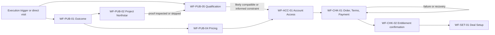
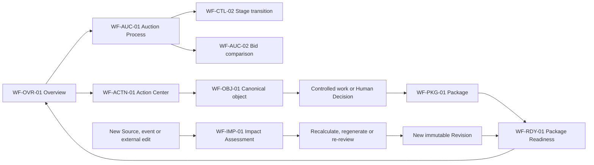
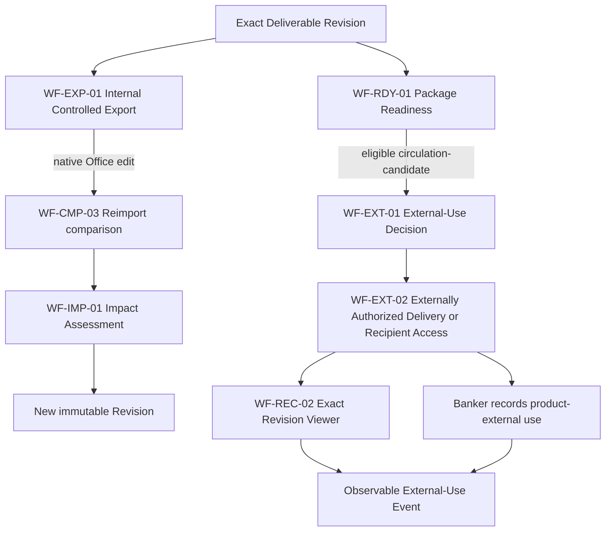
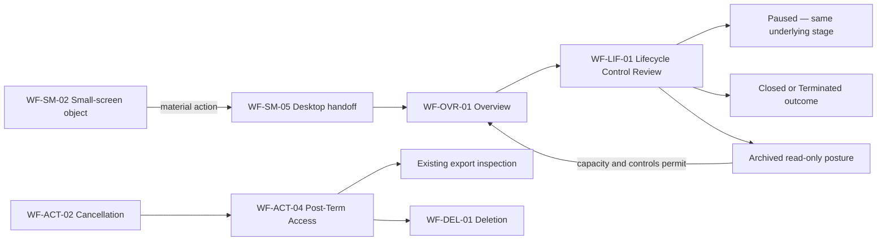

# Wireframes — Controlled Sell-Side Auction Execution Workspace V1

Status: confirmed

Confirmed on: 2026-08-08

## Purpose

This document defines the low-fidelity page structure for the V1 customer experience. It makes the confirmed User Journey Map, User Flow, Information Architecture and UX Spec spatially reviewable without introducing visual design, implementation choices or new product behavior.

The Wireframes answer where a user starts, what appears at each step, what the user may do, what feedback or recovery appears, how canonical objects and exact versions retain context, and how the complete desktop workspace projects into bounded small-screen access.

## Authority and scope

These Wireframes are governed by, in order:

1. the confirmed [V1 Product Specification](../../.scratch/ai-investment-banking-productization-wayfinding/spec.md);
2. the canonical [Domain Context](../../CONTEXT.md);
3. the confirmed [User Journey Map](user-journey-map.md);
4. the confirmed [User Flow](user-flow.md);
5. the confirmed [Information Architecture](information-architecture.md);
6. the confirmed [UX Spec](ux-spec.md);
7. [ADR 0001 — Separate internal controlled export from externally authorized delivery](../adr/0001-separate-internal-export-from-external-delivery.md); and
8. resolved Wayfinder assets when the higher-authority sources do not answer a question.

The Wireframes may arrange confirmed content and interaction patterns. They may not change product roles, the nine Deal work domains, canonical object ownership, business states, gates, permissions, exact-Revision authority, responsive capability boundaries or implementation-deferred values.

### Included

- every V1 customer surface and route family;
- reusable page archetypes for repeated collection, object, task, control and comparison patterns;
- low-fidelity frames for every structurally distinct or risk-critical page;
- critical task storyboards across acquisition, first value, continuing execution, external use, Revision and lifecycle flows;
- empty, loading, waiting, blocker, failure, completion, historical and denial states;
- full, compact and bounded small-screen projections;
- frame-to-route, actor, object, action and User Flow traceability; and
- structural accessibility annotations required to review the layouts.

### Excluded

- brand, color, typography, iconography, illustration and motion;
- production component libraries, design tokens and exact pixel styling;
- Operator Console, Team membership, organization administration and approval routing;
- provider, API, database, queue, model, parser, renderer or storage design;
- unverified file limits, compatibility versions, processing times, quality thresholds or security claims;
- implementation tickets, production code, deployment and analytics implementation; and
- high-fidelity visual design.

## Confirmed wireframe decisions

1. Coverage uses reusable page archetypes, critical task storyboards, a State Atlas and complete traceability rather than one repetitive frame per route.
2. The full Deal Workspace uses a left domain sidebar, top Deal context header, fluid primary work region and right collapsible Context Inspector.
3. Canonical object details use URL-backed regions: `Overview`, `Lineage & Impact`, `Controls & Decisions`, `Versions & History` and `Related Objects`.
4. Project Northstar uses a narrower proof shell with checkpoint rail, synthetic inspection region and structured control/impact pane.
5. First Deal Guide uses the ordinary Deal Workspace and temporarily replaces the Context Inspector with a task rail.
6. Collections use a table, optional contextual preview and full canonical detail page.
7. Material control uses an evidence-first dedicated Control Review with a sticky decision summary.
8. Revision and parity comparison use synchronized dual panes; reimport keeps the original export fixed and switches the comparison target between external edit and current controlled Revision.
9. Full, compact and small-screen reference canvases are `1440px`, `1180px` and `390px`; targeted `768px` frames are added only where structure materially differs.
10. Small-screen navigation uses `Deals`, `Overview`, `Actions` and `More`; a Read-only Object Viewer is contextual rather than a permanent navigation domain.
11. Frames use exact synthetic content where it reveals structural truth and never invent implementation-deferred capability values.
12. Checkout is `Order → Terms → Payment → Confirmation`; Recovery is an exception route returning to the preserved checkpoint.
13. `Templates & Compatibility` is the canonical Deal-level home of Artifact Templates.
14. Small-screen access permits inspection of existing Internal Controlled Exports but sends creation of a new export to desktop.
15. Internal Controlled Export, External-Use Decision, Externally Authorized Delivery, Recipient Access and External-Use Event remain five distinct records or events.

None of these layout and documentation choices qualifies for a new ADR. ADR 0001 remains the only hard decision that the Wireframes must make spatially unmistakable.

## Wireframe notation and review rules

### Reference canvases

| Canvas | Contract represented | Purpose |
|---|---|---|
| `1440` | Full workspace, `>=1280px` | Persistent navigation, primary work and Inspector may coexist |
| `1180` | Compact workspace, `1024–1279px` | Collapsed navigation, overlaid Inspector, complete Banker actions |
| `390` | Bounded small-screen, `<1024px` | Inspection, status, existing export, cancellation, deletion and desktop handoff |
| `768` targeted | Bounded small-screen, `<1024px` | Used only for dense read-only inspection or destructive confirmation where 390 does not expose the structural question |

These are review canvases, not new CSS breakpoints.

### Symbols

```text
[Primary action]    actionable control
(Secondary action)  secondary or contextual control
<Tab>               selected URL-backed region or queue
{State}             exact state, posture or mode
! Blocker            material interruption with durable recovery
->                   route or state transition
[Desktop required]  visible prohibited small-screen action
```

### Frame annotation contract

Every detailed frame identifies:

1. Frame ID;
2. surface and canonical route;
3. actor, mode and representative viewport;
4. user goal;
5. visible canonical objects and exact states;
6. primary, secondary and prohibited actions;
7. material feedback, gate and recovery behavior;
8. entry, exit and durable return point;
9. User Flow, IA and UX Spec traceability; and
10. invariants and implementation-deferred values.

Unless a frame states a narrower value, every frame inherits the following final annotation: **Invariant:** canonical object ownership, exact-version authority, independent states and actor/device permissions do not change. **Implementation-deferred:** any exact route slug not established by the Information Architecture, provider mechanism, verified numeric limit, compatibility range, processing time, performance threshold and visual styling value.

### Global low-fidelity constraints

- Every page has one descriptive H1 and a visible route or context change.
- Account, Deal, domain, object and version breadcrumbs appear wherever the user is inside a Deal object.
- The Deal context header never becomes a cross-Deal dashboard.
- No screen exposes a global chatbot, AI skill menu, aggregate confidence score, master readiness score or generic `Approve AI` action.
- A transient toast may acknowledge a command but is never the only Job, error, Decision, export or deletion record.
- Exact object/version identity remains visible during Review, comparison, export, external authorization and Recipient Access.
- Every Sensitive Action Grant frame includes the inherited branch `Grant missing or stale → preserve safe Draft and exact pending command → Passkey login no older than five minutes → verify unchanged binding/preconditions → issue single-use Grant → resume`; cancellation or mismatch returns to the owning review without mutation, and the opaque Grant token is never displayed.
- Loading does not remove the page heading or accepted state.
- Material errors preserve the durable checkpoint and state the smallest recovery action.
- Color is never required to distinguish state; these frames rely on text, order and grouping.

## Coverage model

### Customer surface coverage

| Surface | Complete page inventory | Detailed frame coverage |
|---|---|---|
| Public Site | Outcome, Project Northstar, How It Works, Security & Data Use, Pricing, Qualification, Resources, trigger routes | `WF-PUB-01`–`WF-PUB-05`; content-page mappings |
| Account Access | Create/sign in, verification, recovery, reauthentication, session expiry, denial | `WF-ACC-01` plus State Atlas |
| Checkout | Order, Terms, Payment, Confirmation, Recovery | `WF-CHK-01`–`WF-CHK-02`; acquisition storyboard |
| Banker Account | Deals, Usage & Plan, Billing & Invoices, Notifications, Account & Security, Data/Export/Deletion, Help & Support | `WF-ACT-01`–`WF-ACT-04`; utility mapping |
| Deal Setup | Create Deal, Setup, Paid Preflight, Targeted Re-Preflight | `WF-SET-01`, `WF-PRE-01` |
| First Deal Guide | Guided tasks, canonical work, graduation | `WF-GDE-01`–`WF-GDE-02`; first-value storyboard |
| Deal Workspace | Nine domains, canonical objects, Jobs, Controls, comparisons and lifecycle | `WF-DSK-01` through `WF-DEL-01` |
| Recipient Access | identity, access check, exact viewer, unavailable state | `WF-REC-01`–`WF-REC-03` |
| Bounded small-screen | reduced navigation and permitted/prohibited task projection | `WF-SM-01`–`WF-SM-06` |

### Reusable page archetypes

| Archetype | Used by | Required structure |
|---|---|---|
| Public content | Outcome, How It Works, Security & Data Use, Pricing, Resources | Public shell, outcome/mechanism content, proof/qualification continuation |
| Access gateway | Banker and Recipient identity entry | Narrow task, safe return context, generic non-enumerating response |
| Durable task | Qualification, Checkout, Deal Setup, Source intake | Step context, safe Draft, main task, Review, summary and durable recovery |
| Collection | Deals and professional object collections | Search, filters, sort, columns, pagination, explicit Open action, state region |
| Canonical object | Every durable object/version | Identity/state header, five URL-backed regions, valid exact-scope actions |
| Context Inspector | Collection preview, blocker, short Job, related object | Preview only, full canonical link, reversible preparation only |
| Control Review | Human Decision, external use, stage and lifecycle | Evidence, alternatives, impact, rationale, exact immutable result |
| Comparison | Revision, parity, Bid and reimport | Exact inputs, synchronized views, structured linear difference ledger |
| State/Job detail | Jobs, blocker, deletion, recovery | Outcome, scope, consequence, continuation, recovery, durable record |
| Isolated recipient viewer | One exact authorized Revision | Verification, exact Reader Copy, conditions, no Deal navigation or download |

## Shared shells

### WF-DSK-01 — Full Deal Workspace shell

**Frame contract:** Surface `/app/deals/{deal-id}/*`; Individual Banker; Active or restricted Deal; 1440; goal is complete Deal work with stable orientation. Visible objects are the current Deal, domain, object/version and independent states. Primary action belongs to the current page; Deal switching and Inspector are secondary; cross-Deal business aggregation is prohibited. Route entry preserves exact context; exit returns to Deals or another authorized exact route. Traces IA Deal Workspace, UX Spec shell and UF-04, UF-16–UF-35. Provider and numeric capability values remain deferred.

```text
+--------------------------------------------------------------------------------------+
| Skip to navigation | Skip to main | Skip to contextual status                        |
+----------------------+---------------------------------------------------------------+
| Account / Deals      | Deal: Project Northstar | Stage: Preparation | {Active}       |
| Deal switcher        | Paid Preflight: pass | Revision: 0.4 | Account menu           |
+----------------------+------------------------------------------+--------------------+
| OVERVIEW             | Breadcrumbs / return context             | CONTEXT INSPECTOR  |
| ACTION CENTER        | H1 Current page                           | Related object     |
| SOURCES              | Description + exact scope                | exact version      |
| EVIDENCE & DECISIONS | [Primary action] (Secondary action)      | state / blocker    |
| ANALYSIS             +------------------------------------------+ lineage preview    |
| AUCTION PROCESS      |                                          | [Open full record] |
| EXECUTION PACKAGE    |            PRIMARY WORK REGION           |                    |
| REVIEW & READINESS   |                                          | reversible prep    |
| HISTORY & PORTABILITY|                                          | only               |
|                      |                                          |                    |
| Guide                |                                          | (Collapse)         |
| Deal Controls        |                                          |                    |
+----------------------+------------------------------------------+--------------------+
```

**Invariant:** The Inspector never contains the final material Decision, stage transition, lifecycle action, deletion or only durable copy of information.

### WF-DSK-02 — Compact Deal Workspace shell

**Frame contract:** Same surface and actor as `WF-DSK-01`; 1180; goal is complete Banker work at compact width. Objects, actions and authority are unchanged. Navigation collapse and Inspector overlay are layout changes only. Traces UF-38 and the compact responsive contract.

```text
+--------------------------------------------------------------------------------+
| [Domains] Deal: Project Northstar | Stage: Preparation | {Active} | Account     |
+--------------------------------------------------------------------------------+
| Breadcrumbs                                                                    |
| H1 Current page                                      [Primary] (Open inspector) |
+--------------------------------------------------------------------------------+
|                                                                                |
|                         PRIMARY WORK REGION                                    |
|                                                                                |
|                                   +-------------------------------------------+|
|                                   | INSPECTOR OVERLAY                         ||
|                                   | exact related context                     ||
|                                   | [Open full record] (Close)                ||
|                                   +-------------------------------------------+|
+--------------------------------------------------------------------------------+
```

**Recovery:** Closing the navigation panel or Inspector restores focus and preserves table, form, comparison and Draft state.

## Public discovery and proof

### WF-PUB-01 — Outcome `/`

**Frame contract:** Public Site `/`; Prospective Individual Banker; public mode; 1440 and 390. Goal is to understand the Sell-Side Auction outcome, intended user and product boundary. Visible content is public and synthetic only. Primary action is `Inspect Project Northstar`; Qualification and Pricing are secondary; real upload and unsupported claims are prohibited. Entry may be direct or trigger-specific; exits preserve proof or qualification context. Traces UF-01 and UX Spec Outcome. Security and performance claims remain verification-bound.

```text
+--------------------------------------------------------------------------------+
| Outcome | Project Northstar | How It Works | Security | Pricing | Account Access|
+--------------------------------------------------------------------------------+
| H1 Control a Sell-Side Auction from source evidence to exact-Revision use       |
| For an Individual Banker operating an active Sell-Side Auction                 |
|                                                                                |
| [Inspect Project Northstar]  (Check qualification)  (View pricing)              |
+--------------------------------------------------------------------------------+
| CONTROLLED AUCTION EXECUTION PACKAGE PREVIEW                                   |
| [Analysis & Valuation] [Auction Control] [Teaser/CIM] [Bid Recommendation]      |
+--------------------------------------------------------------------------------+
| Evidence -> typed Banker Decision -> deterministic result -> Revision consequence|
+--------------------------------------------------------------------------------+
| WHAT THE PRODUCT DOES              | WHAT IT DOES NOT DO                       |
| controlled Deal execution          | no generic AI skill menu                  |
| exact versions and lineage         | no autonomous professional authority      |
+--------------------------------------------------------------------------------+
| PROJECT NORTHSTAR PROOF            | IMPLEMENTED TRUST EVIDENCE                |
| [Inspect the synthetic conflict]   | [Security & Data Use]                     |
+--------------------------------------------------------------------------------+
| $995/month | two Active Deals | [Check qualification]                          |
+--------------------------------------------------------------------------------+
```

### WF-PUB-02 — Project Northstar proof shell

**Frame contract:** `/project-northstar/{proof-state}`; Prospective Individual Banker; synthetic proof; 1440. Goal is to inspect the complete control loop without signup or real material. Visible objects are synthetic Package, Source Records, Evidence, Revisions, QC and authorization consequences. Primary action advances the current proof checkpoint; object inspection and accessible walkthrough are secondary; production actions and real upload are prohibited. Entry preserves trigger context; exit returns there or continues to Qualification/Pricing. Traces UF-01–UF-02. Interactive completion never claims production readiness.

```text
+--------------------------------------------------------------------------------------+
| Project Northstar | Synthetic Deal proof | (Return to trigger) | (Pricing)            |
| Every company, source, value, action and artifact is synthetic.                      |
+----------------------+------------------------------------------+--------------------+
| PROOF CHECKPOINTS    | SYNTHETIC INSPECTION                     | CONTROL / IMPACT   |
| <1 Package outcome>  | H1 Controlled Package — Revision 0.4     | Exact object/state |
|  2 EBITDA conflict  | [Workbook] [CIM] [Reader Copy]            | Evidence           |
|  3 Cash extraction  |                                          | Decision posture   |
|  4 Correction       | $18.4m vs $17.8m EBITDA                  | Deterministic      |
|  5 $1.5m recovery   | source location / artifact region        | consequence        |
|  6 Affected outputs |                                          |                    |
|  7 Revision 0.3/0.4 | [Inspect exact locator]                  | [Next checkpoint]  |
|  8 Authorization    |                                          |                    |
|  9 Manifest         |                                          |                    |
+----------------------+------------------------------------------+--------------------+
| Progress is resumable | (Watch accessible walkthrough) | (Transcript)               |
+--------------------------------------------------------------------------------------+
```

**Unavailable variant:** Keeps the H1 and disclosure, explains that no Account or Deal was affected, and offers `Retry interactive proof` or `Watch the accessible walkthrough`.

### WF-PUB-03 — Public mechanism/content page archetype

**Frame contract:** `/how-it-works/*`, `/security-data/*`, `/resources/*`, `/triggers/{trigger}`; public actor; 1440/390. Goal is to understand an exact mechanism, implemented boundary or rights-cleared resource. Primary action opens the matching proof state; Pricing or Qualification are secondary; duplicate production truth and unverified claims are prohibited. Traces UF-01–UF-03.

```text
+----------------------------------------------------------------------------+
| PUBLIC NAVIGATION                                                          |
+----------------------------------------------------------------------------+
| Breadcrumbs                                                                |
| H1 Mechanism or implemented boundary                                       |
| Scope / limitation                                                         |
+----------------------------------------------------------------------------+
| INPUT -> CONTROL -> PRODUCT WORK -> BANKER DECISION -> DURABLE RESULT       |
|                                                                            |
| Supporting explanation / verified manifest or resource                     |
| Known limitations and current verification scope                           |
+----------------------------------------------------------------------------+
| [Inspect this mechanism in Project Northstar] (Check qualification)         |
+----------------------------------------------------------------------------+
```

### WF-PUB-04 — Pricing

**Frame contract:** `/pricing`; Prospective Individual Banker; public; 1440/390. Goal is to understand exact commercial terms before purchase. Visible terms include plan, annual option, capacity, allowances, add-ons, Guarantee, cancellation and Post-Term Access. Primary action is `Check qualification`; purchase/account access is secondary; token/model-call metering and capability overclaim are prohibited. Traces UF-03.

```text
+----------------------------------------------------------------------------+
| H1 Pricing                                                                 |
| $995 / month            $10,950 / year paid upfront                        |
| One named Individual Banker | Two concurrent Active Deal Workspaces         |
+----------------------------------------------------------------------------+
| INCLUDED                           | CAPACITY / ADD-ONS                      |
| Complete V1 capability             | Additional Active Deal                 |
| Current verified allowances        | Intensive processing pack             |
| Unmetered professional controls     | Archive capacity                      |
+----------------------------------------------------------------------------+
| GUARANTEE | CANCELLATION | POST-TERM ACCESS | CAPABILITY MANIFEST           |
+----------------------------------------------------------------------------+
| [Check qualification] (Continue to account access)                         |
+----------------------------------------------------------------------------+
```

### WF-PUB-05 — Qualification

**Frame contract:** `/qualification`; Prospective Individual Banker; public no-real-data mode; 1440/390. Goal is to evaluate intended-use fit before purchase. Visible input is categorical and non-confidential. Primary action is `Review qualification`; Pricing, Security and exit are secondary; real files and Deal content are prohibited. Results are likely compatible, potential constraint or not supported, each with basis and unverified conditions. Traces UF-03.

```text
+--------------------------+--------------------------------+-----------------------+
| QUALIFICATION STEPS      | H1 Check qualification         | REVIEW                |
| <1 Banker context>       | Banker role [______________]   | Intended work         |
|  2 Intended work        | Purchase authority [_______]   | Input categories      |
|  3 Expected inputs      |                                | Restrictions          |
|  4 Authority & limits   | No real Deal Materials here.   | Unverified conditions |
|  5 Review               |                                |                       |
|                          | [Continue]                     |                       |
+--------------------------+--------------------------------+-----------------------+
| RESULT: {Potential constraint — review before purchase}                    |
| Basis | What Paid Preflight re-evaluates | [Security & Data Use] (Pricing)  |
+----------------------------------------------------------------------------+
```

## Account access and purchase

### WF-ACC-01 — Account Access Gateway

**Frame contract:** `/account-access/*`; Banker or External Recipient; public-to-auth transition; 1440/390. Goal is safe account continuation without choosing sign-in versus create-account prematurely. Visible information is generic identity and safe return class only. Primary action is `Continue`; recovery is secondary; account/object enumeration and Deal payload are prohibited. Successful exit dispatches to the exact authorized route or safe fallback. Traces UF-03–UF-04, UF-25, UF-37.

```text
+--------------------------------------------------------+
| Product mark                                           |
| H1 Continue to your account                            |
| Return target: Saved product task                      |
|                                                        |
| Email address                                          |
| [____________________________________________________] |
|                                                        |
| [Continue]                                             |
|                                                        |
| If this address can continue, we sent the next step.   |
| (Recover access)                                       |
+--------------------------------------------------------+
```

**State projection:** create, sign in, verify, recovery, Passkey registration/replacement, reauthentication, session expired and safe denial reuse this narrow shell and preserve the authorized return context without exposing its payload. The first verified default Magic Link opens mandatory Passkey registration before ordinary access. For an existing user, Magic Link fallback opens only the Account Security Restriction and Security Recovery Session; it never exposes Account/Deal content. Returning sign-in and sensitive-action reauthentication use Passkey. Successful sensitive-action reauthentication returns to the exact preserved review and resumes only its unchanged pending command after single-use Grant issuance; a changed binding or precondition returns to review without mutation. V1 presents no password, numeric Email OTP, TOTP or MFA control. External Recipient link/code verification remains a separate product-managed flow outside Supabase Auth.

### WF-CHK-01 — Checkout durable task shell

**Frame contract:** `/checkout/order`, `/checkout/terms`, `/checkout/payment`, `/checkout/confirmation`; authenticated eligible purchaser; 1440/390. Goal is to establish entitlement exactly once. Visible objects are Order, terms, payment posture and entitlement confirmation. Primary action names the exact step result; Back and recovery are secondary; Source authority and Deal readiness implications are prohibited. Recovery returns to the preserved step. Traces UF-03–UF-04.

```text
+----------------------+--------------------------------------+----------------------+
| CHECKOUT             | H1 Order                             | ORDER SUMMARY        |
| <1 Order>            | Billing term  (Monthly) (Annual)     | Term                 |
|  2 Terms             | Add-on capacity [____________]       | Amount due now       |
|  3 Payment           |                                      | Renewal              |
|  4 Confirmation      | [Continue to terms]                  | Active Deal capacity |
|                      |                                      | Guarantee            |
+----------------------+--------------------------------------+----------------------+
| Order saved | Account recovery and payment failure return to this checkpoint     |
+----------------------------------------------------------------------------------+
```

**390 projection:** Step title and current position remain above the task; Order Summary moves immediately before the submit action.

| Checkout step | Main task region | Persistent review summary | Submit/result |
|---|---|---|---|
| Order | billing term, add-on capacity and amount inputs | amount due, renewal, tax, Active Deal capacity and Guarantee | `Continue to terms` |
| Terms | purchase authority, Source-authority separation, Guarantee, cancellation, Post-Term, export/retention/deletion and processing acknowledgements | exact Order and acknowledged term groups | `Accept terms and continue to payment` |
| Payment | payment method integration, billing identity, address, country/region and applicable invoice/tax identity | exact amount, term and renewal | `Pay {amount} and start {term}` |
| Confirmation | entitlement, term, renewal, capacity, receipt/invoice and Guarantee posture | completed Order identity and no duplicate entitlement | `Set up first Deal` |

### WF-CHK-02 — Payment and entitlement states

**Frame contract:** Checkout state family; authenticated purchaser; 1440/390. Goal is to distinguish failed, pending, requires-action, duplicate and successful payment without duplicate entitlement. Primary recovery is state-specific. Receipt and invoice are durable on success. Traces UF-03–UF-04 and the Checkout UX contract.

```text
+--------------------------------------------------------------------------+
| H1 Payment status                                                        |
| {Pending} No duplicate retry is required while the result is pending.    |
| Order: ORD-SYN-0042 | Amount | Term | Last checked                       |
|                                                                          |
| [Check payment status] (Return to saved Order)                            |
|                                                                          |
| Durable record / recovery detail                                         |
+--------------------------------------------------------------------------+

SUCCESS
+--------------------------------------------------------------------------+
| H1 Entitlement active                                                    |
| Term | renewal | two Active Deals | receipt | invoice | Guarantee posture |
| [Set up first Deal] (View receipt)                                        |
+--------------------------------------------------------------------------+
```

## Banker Account

### WF-ACT-01 — Deals collection and no-Deal state

**Frame contract:** `/app/deals`; Individual Banker; authenticated Account; 1440/1180/390. Goal is to select or establish a Deal without cross-Deal business analysis. Visible objects are Deal identity and privacy-safe posture summaries. Primary action is `Open Deal` or `Start Deal Setup`; filters and search are secondary; cross-Deal Evidence, Buyer and valuation aggregation are prohibited. Entry is ordinary dispatcher or Account navigation. Traces UF-04, UF-05, UF-29–UF-34, UF-36.

```text
+--------------------------------------------------------------------------------+
| Deals                                                     Account menu          |
+--------------------------------------------------------------------------------+
| H1 Deals                 Search [________________]  [Create Deal]               |
| <Active> Setup/Preflight | Paused | Closed/Terminated | Archived                |
+--------------------------------------------------------------------------------+
| Deal                Stage        Posture      Blockers   Updated   Next action  |
| Northstar Energy    Preparation  Active       2          Today     [Open Deal]  |
| Harbor Software     In Market    Paused       1          Jul 30    [Review]     |
+--------------------------------------------------------------------------------+

EMPTY
+--------------------------------------------------------------------------------+
| H1 Deals                                                                        |
| Set up your first Deal                                                         |
| Establish Deal identity and Paid Preflight before adding real Deal Materials.  |
| [Start Deal Setup]                                                             |
+--------------------------------------------------------------------------------+
```

### WF-ACT-02 — Usage, Plan and cancellation

**Frame contract:** Banker Account → Usage & Plan; exact route slug implementation-deferred; Individual Banker; paid or canceling Account; 1440/390. Goal is to understand entitlement, capacity, allowances and cancellation consequences. Visible information is Account-level only. Primary actions are capacity purchase or cancellation review; Billing is secondary; Deal readiness implications are prohibited. Cancellation creates a durable receipt and later Post-Term mode. Traces UF-03, UF-32.

```text
+--------------------------------------------------------------------------+
| ACCOUNT NAV | H1 Usage & Plan                                             |
+--------------------------------------------------------------------------+
| Plan and term        | Active Deal capacity                               |
| Allowance posture    | Forecast threshold / exact remaining capacity      |
| Add-on options       | No retroactive overage                             |
+--------------------------------------------------------------------------+
| CANCELLATION                                                           |
| Paid-term end | new-work cutoff | Recipient Access consequence          |
| 30-day Post-Term window | inspect/export/delete allowed                  |
| [Review cancellation]                                                   |
+--------------------------------------------------------------------------+
```

### WF-ACT-03 — Account collection/settings archetype

**Frame contract:** Banker Account → selected utility; exact route slugs implementation-deferred; Individual Banker; authenticated Account; 1440/390. Goal is to manage Billing, Notifications, Security or Help without exposing Deal content. Visible objects are the exact utility records. State-changing actions remain scoped and durable. Traces UF-04, UF-32, UF-34, UF-37.

```text
+------------------------+------------------------------------------------+
| Deals                  | H1 Billing & Invoices / Notifications / Security|
| Usage & Plan           | Page scope and limitations                     |
| Billing & Invoices     +------------------------------------------------+
| Notifications          | Search / filters / settings                    |
| Account & Security     |                                                |
| Data, Export & Deletion| Records or form                                |
| Help & Support         |                                                |
+------------------------+------------------------------------------------+
```

### WF-ACT-04 — Data, Export, Deletion and Post-Term

**Frame contract:** Banker Account → Data, Export & Deletion; exact route slug implementation-deferred; Individual Banker; active, canceling or Post-Term Account; 1440/390/768. Goal is inspection, Account-level export/deletion and Post-Term exit. Visible information includes exact clock, allowed actions and deletion receipts. Primary actions are exact-scope export or deletion review; creating the Account data export inherits the fresh-Passkey and single-use Sensitive Action Grant exact-return branch, while deletion retains its stronger typed-confirmation control. New Deal work and external delivery are prohibited in Post-Term. Traces UF-32–UF-34.

```text
+--------------------------------------------------------------------------+
| {Post-Term Access} ends Aug 31, 2026 17:00 EDT                            |
| Inspection, permitted Internal Controlled Export and deletion remain.    |
+--------------------------------------------------------------------------+
| H1 Data, Export & Deletion                                                |
| Account data summary          | Existing export and receipt records       |
| Retention / backup timing     | Deletion request status                   |
|                                                                          |
| [Review account data export] [Review account deletion] (Open Deal exports)|
+--------------------------------------------------------------------------+
```

## Deal Setup and First Deal Guide

### WF-SET-01 — Create Deal and Deal Setup

**Frame contract:** `/app/deals/new` then `/app/deals/{deal-id}/setup`; Individual Banker; paid Account; 1440/1180. Goal is to establish immutable Deal identity and the control context required for Paid Preflight. Visible sections are Deal Identity, Deal Context, Authority & Confidentiality and Processing & Compatibility. Primary action is `Review Deal Setup`; safe Draft and Back are secondary; real Source upload before the permitted point is prohibited. Accepting identity creates a Preflight-Restricted Deal Workspace and durable return route. Traces UF-05.

```text
+--------------------------+--------------------------------------+---------------------+
| DEAL SETUP               | H1 Establish Deal identity           | REVIEW SUMMARY      |
| <1 Deal identity>        | Client or represented party          | Identity perimeter  |
|  2 Deal context          | [_______________________________]    | Stage / purpose     |
|  3 Authority & privacy   | Transaction subject                  | Authority gaps      |
|  4 Processing & compat.  | [_______________________________]    | Compatibility       |
|  5 Review                | Transaction perimeter                | Draft saved 14:32   |
|                          | [_______________________________]    |                     |
|                          | Banker role or side                  |                     |
|                          | Mandate objective                    |                     |
|                          |                                      |                     |
|                          | [Continue]                           |                     |
+--------------------------+--------------------------------------+---------------------+
| Creating the Deal establishes a Preflight-Restricted Deal Workspace.             |
+-----------------------------------------------------------------------------------+
```

**Validation variant:** Failed Review focuses `Review the fields that need attention`; linked errors preserve the Draft. A material change to identity-defining fields starts a new linkable Deal rather than editing identity in place.

### WF-PRE-01 — Paid Preflight outcomes

**Frame contract:** `/app/deals/{deal-id}/controls/preflight`; Individual Banker; Preflight-Restricted or Targeted Re-Preflight mode; 1440/390 read-only projection. Goal is to understand exact permitted scope and either accept it, recover or exit. Visible inputs include Deal identity, purpose/audience, authority, confidentiality, processing, compatibility and minimum Source Packet. Primary action depends on `pass`, `limited-proceed`, `waiting-for-user` or `blocked`; no Assumption or payment can waive a hard gate. Return is the preserved Deal Setup or permitted source intake. Traces UF-06–UF-07, UF-35.

```text
+----------------------+------------------------------------------------+------------------+
| DEAL NAVIGATION      | H1 Paid Preflight                              | SCOPE SUMMARY    |
| Overview             | Exact Deal / purpose / audience                | Permitted        |
| Action Center        +------------------------------------------------+ Excluded         |
| Sources              | {Limited Proceed}                              | Output Ceiling   |
| locked domains       | Review the permitted scope                     | Triggers         |
| remain visible       |                                                |                  |
|                      | Work may continue only within the stated scope. |                  |
|                      | Excluded actions remain blocked.                |                  |
|                      |                                                |                  |
|                      | [Accept limited scope] (Resolve constraint)     |                  |
+----------------------+------------------------------------------------+------------------+
```

**State variants:**

- `pass`: exact permitted scope and `Continue to source intake`;
- `limited-proceed`: accepted scope, exclusions, Output Ceiling and invalidation triggers;
- `waiting-for-user`: missing declaration, saved state and safe independent work;
- `blocked`: exact hard gate, affected scope, smallest recovery and `Exit Deal Setup` when no recovery is available.

### WF-GDE-01 — First Deal Guide shell

**Frame contract:** `/app/deals/{deal-id}/guide`; Individual Banker; guided first Deal; 1440/1180. Goal is to reach First Unmistakable Value through canonical Deal work. Visible objects are the same Deal objects used by the Desk. The right task rail replaces the ordinary Inspector; task completion is derived from canonical state; manual checking and Guide-only objects are prohibited. Each task opens the exact page and durable checkpoint. Traces UF-10–UF-14.

```text
+----------------------+------------------------------------------+--------------------+
| NINE DEAL DOMAINS    | Deal header / exact current context      | FIRST DEAL GUIDE   |
| remain available     +------------------------------------------+--------------------+
|                      | H1 Canonical task page                   | 1 Deal & Preflight |
| Overview             |                                          | 2 Source perimeter |
| Action Center        | Evidence / Source / Analysis / Control   | 3 Packet/objective |
| Sources              | opened from the current Guide task       | 4 Observe work     |
| Evidence & Decisions |                                          | <5 Inspect Evidence>|
| Analysis             | [Task-specific primary action]           | 6 Record Decision  |
| Auction Process      |                                          | 7 Validate         |
| Execution Package    |                                          | 8 Impact/results   |
| Review & Readiness   |                                          | 9 QC/readiness     |
| History & Portability|                                          | 10 Internal export |
|                      |                                          | 11 Enter Desk      |
+----------------------+------------------------------------------+--------------------+
| Locked task: exact unmet dependency | safe independent work | durable return point |
+------------------------------------------------------------------------------------+
```

### WF-GDE-02 — First controlled loop completion

**Frame contract:** Guide graduation state; Individual Banker; 1440/390 read-only. Goal is to verify the complete loop, the first permitted Internal Controlled Export and explicit entry into the Deal Execution Desk. Visible receipt binds exact Evidence, Human Decision, deterministic result, affected consequences and Internal Controlled Export. Primary action is `Enter Deal Execution Desk`; inspect export and reopen Guide are secondary; First Unmistakable Value without the export, upload or preview alone cannot complete the state. Traces UF-14–UF-15 and UF-21.

```text
+--------------------------------------------------------------------------+
| H1 First controlled loop complete                                        |
|                                                                          |
| Evidence: EVD-001 at exact Source locator                                |
| Human Decision: DEC-014, exact scope and actor                           |
| Deterministic result: VAL-009, declared gate only                        |
| Consequences: Revision 0.4 | QC-022 | Package Readiness changed          |
| Internal export: EXP-003 | exact Revision and signed manifest            |
|                                                                          |
| [Enter Deal Execution Desk] (Review the loop)                            |
| The First Deal Guide remains available from Overview.                    |
+--------------------------------------------------------------------------+
```

## Deal Execution Desk page archetypes

### WF-OVR-01 — Action-oriented Overview

**Frame contract:** `/app/deals/{deal-id}/overview`; Individual Banker; any Deal posture; 1440/1180/390 projection. Goal is to identify the next safe controlled action. Visible summaries link to exact canonical records. Primary action is singular and context-specific; Guide and Deal Controls are secondary; cross-Deal analytics, global readiness and generic AI input are prohibited. Entry is ordinary return, graduation or safe dispatcher. Traces UF-04, UF-15–UF-18, UF-29–UF-32, UF-36.

```text
+--------------------------------------------------------------------------------+
| MODE BANNER: {Active / Preflight-Restricted / Paused / Archived / Post-Term}    |
+--------------------------------------------------------------------------------+
| H1 Overview | Deal identity | Stage | activity/record posture                   |
+--------------------------------------------------------------------------------+
| NEXT CONTROLLED ACTION                                                         |
| Review the $18.4m / $17.8m EBITDA conflict for Source Packet SP-004            |
| [Review conflict]                                                              |
+----------------------------------------------+---------------------------------+
| ATTENTION                                    | CURRENT CONTROL CONTEXT         |
| 2 material blockers                         | Paid Preflight / Output Ceiling |
| 1 pending Human Decision                    | Source Packet / Work Objective  |
| 1 required Source                           | Package / current Revision      |
+----------------------------------------------+---------------------------------+
| STAGE-APPLICABLE MILESTONES & DELIVERABLES                                     |
| Preparation | Teaser {working-draft} | CIM {blocked} | Valuation {analysis-ready}|
+--------------------------------------------------------------------------------+
| RECENT PROCESS EVENTS / MATERIAL CHANGES | FIRST DEAL GUIDE                    |
+--------------------------------------------------------------------------------+
| DEAL CONTROLS: Paid Preflight | Lifecycle                                      |
+--------------------------------------------------------------------------------+
```

### WF-ACTN-01 — Five-queue Action Center

**Frame contract:** `/app/deals/{deal-id}/actions`; Individual Banker; 1440/1180/390. Goal is to find exact outstanding attention by semantic queue. Visible objects are action indexes, not duplicated domain truth. Primary action opens the canonical object or Control Review; preview and New Event attention state are secondary; material completion inside Action Center is prohibited. Traces UF-11, UF-16–UF-17, UF-35, UF-37.

```text
+--------------------------------------------------------------------------------+
| H1 Action Center                                                               |
| <Needs Decision 2> <Needs Source 1> <Blocked 2> <Jobs 3> <New Events 4>         |
+------------------------------------------------------------+-------------------+
| Priority | Exact object/version | Reason | Scope | Action   | PREVIEW           |
| High     | Claim CLM-018 v2      | conflict       [Review]  | $18.4m/$17.8m    |
| High     | CIM Revision 0.4      | re-review      [Open]    | affected outputs  |
| Medium   | Source Packet SP-004  | missing source [Add]     | recovery / return |
|                                                            | [Open full record]|
+------------------------------------------------------------+-------------------+
| No current controlled action: no implied stage/readiness/authorization change  |
+--------------------------------------------------------------------------------+
```

### WF-COL-01 — Professional collection with contextual preview

**Frame contract:** Any Deal collection route; Individual Banker; 1440/1180. Goal is to search, filter and inspect authorized exact objects. Visible results default to current information. Primary action is explicit `Open {object}`; preview, sort, filters and column controls are secondary; bulk material Decisions are prohibited. URL preserves query, state and current/history selection. Traces UF-16–UF-20 and all domain collections.

```text
+--------------------------------------------------------------------------------------+
| H1 Claims                                   Count 47 | Current only [Include history]|
| Search [____________] Filters [State v] Sort [Updated v] Columns [Manage]             |
+---------------------------------------------------------------+----------------------+
| ID      Proposition       Version State       Updated  Open   | CONTEXT PREVIEW      |
| CLM-018 EBITDA basis      v2      {Conflicted} Today   [Open] | identity / version   |
| CLM-019 Cash at close     v1      {Current}    Today   [Open] | Origin / states      |
| CLM-020 Revenue perimeter v3      {Stale}      Jul 29  [Open] | blocker / next action|
|                                                               | [Open full record]  |
+---------------------------------------------------------------+----------------------+
| 1–25 of 47                         [Previous] Page 1 of 2 [Next]                     |
+--------------------------------------------------------------------------------------+
```

**Empty/loading/failure:** Remain inside the table region and retain the H1, filters, Output Ceiling, smallest next action and return point.

### WF-OBJ-01 — Canonical object detail

**Frame contract:** the conceptual canonical route defined by the object's owning Deal domain, with optional exact version; Individual Banker; 1440/1180/390 read-only projection. Goal is to inspect and act on one durable object/version. Visible identity, Origin, version, time and applicable independent states persist above the five URL-backed regions. Primary actions are exact-scope only; historical edit and generic approval are prohibited. Entry preserves originating action/search/notification. Traces UF-12, UF-16–UF-28.

```text
+--------------------------------------------------------------------------------+
| Account > Deal > Evidence & Decisions > Claim CLM-018 > version 2              |
| H1 Claim CLM-018 | {Current} | Origin: AI proposal | v2 | Aug 3, 14:21         |
| Source {conflicted} | Decision {required} | Downstream {circulation blocked}    |
| [Prepare decision] (Inspect source) (Open current/history)                      |
+--------------------------------------------------------------------------------+
| <Overview> | Lineage & Impact | Controls & Decisions | Versions & History | Related|
+--------------------------------------------------------------------------------+
| OBJECT-SPECIFIC OVERVIEW                                                       |
| Proposition / definitions / period / unit / scope                              |
| Supporting and challenging Evidence                                            |
| Current conditions / blocker / next controlled action                          |
+--------------------------------------------------------------------------------+
```

**Historical banner:** The page states that the exact version cannot be edited in place and offers `Open current version` or a valid correction from current context.

### WF-JOB-01 — Durable Job detail

**Frame contract:** `/app/deals/{deal-id}/actions/jobs/{job-id}`; Individual Banker; any durable Job state; 1440/390. Goal is to understand accepted progress, current phase and safe recovery without fabricated completion. Visible input perimeter, object/version, state, heartbeat, completed scope and consequences are durable. Primary action is state-specific retry/cancel/recovery; unrelated work remains available. Traces UF-11, UF-17, UF-35.

```text
+--------------------------------------------------------------------------+
| H1 Job JOB-0098 | {waiting-for-source}                                   |
| Affected object: Analysis ANL-014 v3 | Input perimeter: SP-004 v2         |
+--------------------------------------------------------------------------+
| Current phase: reconcile historical EBITDA definitions                   |
| Accepted progress: extraction and unit normalization preserved            |
| Last heartbeat: 14:32:09                                                 |
|                                                                          |
| ! Source is required                                                     |
| Blocked: forecast reconciliation and affected Deliverables                |
| Safe continuation: Buyer research and unrelated process work              |
| Recovery: add or identify the requested exact Source                      |
| Return point: this Job and Analysis ANL-014 v3                             |
| Allowance / Guarantee consequence: exact recorded result                   |
|                                                                          |
| [Add or identify Source] (View preserved state) (Cancel remaining scope)  |
+--------------------------------------------------------------------------+
```

## Sources, Evidence and Analysis

### WF-SRC-01 — Four-stage Add Source

**Frame contract:** Sources → Intake & Processing → Add Source; exact task route slug implementation-deferred; Individual Banker; permitted desktop Deal; 1440/1180. Goal is to create an authorized Source Record and optionally add its exact version to a Source Packet. Visible stages are declaration, safe receive, inspection and packet selection. Primary action advances the durable step; safe Draft and exit are secondary; file selection before authority declaration and small-screen upload are prohibited. Traces UF-08, UF-35–UF-36.

```text
+----------------------+------------------------------------------+--------------------+
| ADD SOURCE           | H1 Declare Source                        | CONTROL CONTEXT    |
| <1 Declaration>      | Source category [__________________]     | Paid Preflight     |
|  2 Safe receive      | Origin/acquisition [_______________]     | permitted scope    |
|  3 Inspect record    | Authority basis [__________________]     | confidentiality    |
|  4 Select packet     | Permitted purpose [________________]     | Capability Manifest|
|                      | Confidentiality class [___________]     | Output Ceiling     |
|                      | Processing restrictions [_________]     |                    |
|                      |                                          |                    |
|                      | [Review declaration]                     |                    |
+----------------------+------------------------------------------+--------------------+
| Draft saved. No Source has entered substantive processing.                          |
+-------------------------------------------------------------------------------------+
```

**Safe receive states:** rejected, quarantined, supported, supported with limitations, replacement/default required and unsupported remain distinct and state whether substantive processing occurred.

Batch file selection may occur only in Safe receive. Authority, safety, Compatibility Report and Source Record outcomes remain exact per Source; a batch result never converts individual restrictions into one aggregate pass.

### WF-SRC-02 — Source Packet builder

**Frame contract:** `/app/deals/{deal-id}/source-packets/{packet-id}`; Individual Banker; desktop; 1440/1180. Goal is to bind exact immutable Source Records to a purpose and Work Objective. Visible exclusions, conflicts, missing sources and Output Ceiling remain explicit. Primary action is `Review Source Packet`; source inspection is secondary; silent substitution from the same Source Material and assumption waiver are prohibited. Traces UF-09, UF-12.

```text
+----------------------------------------------------+-----------------------------+
| H1 Source Packet SP-004 v2                         | PACKET SUMMARY              |
| Name / purpose / intended use and audience         | Work Objective             |
+----------------------------------------------------+ Output Ceiling             |
| [x] SR-003 Management accounts {Current}           | Missing Source plan        |
| [x] SR-004 QoE report {Conflicted}                 | Declared exclusions        |
| [ ] SR-005 Forecast {Stale}                        | Rights / confidentiality   |
|                                                    |                             |
| [Add exact Source Record]                          |                             |
+----------------------------------------------------+-----------------------------+
| Declared exclusions [____________________________________________________]       |
| Output Ceiling acceptance [Review exact boundary]                               |
| [Review Source Packet]                                                          |
+---------------------------------------------------------------------------------+
```

### WF-TPL-01 — Templates & Compatibility

**Frame contract:** `/app/deals/{deal-id}/execution-package/templates`; Individual Banker; desktop; 1440/1180. Goal is to inspect product and user Artifact Templates, exact versions, rights and compatibility. Visible bindings link to Deliverables. Primary actions are preflight, replace or open exact template; product default selection is secondary; silent flattening or discarded native structures are prohibited. Traces UF-08, UF-20, UF-22 and the Deliverable round-trip contract.

```text
+--------------------------------------------------------------------------------+
| H1 Templates & Compatibility                        [Add Artifact Template]      |
| <All> Product defaults | User supplied | Limited | Blocked                      |
+------------------------------------------------------------+-------------------+
| Artifact class | Template/version | Origin | Compatibility | Bound Deliverables|
| CIM            | AT-003 v2        | User   | {Limited}     | CIM Rev 0.4       |
| Teaser         | AT-DEF-PPT v5    | Product| {Supported}   | Teaser Rev 0.2    |
| Valuation      | AT-DEF-XLSX v4   | Product| {Supported}   | Workbook Rev 0.6  |
+------------------------------------------------------------+-------------------+
| PREVIEW: rights | manifest/report | native structures | fallback | [Open]      |
+--------------------------------------------------------------------------------+
```

### WF-EVD-01 — Evidence Inspector

**Frame contract:** exact Evidence/Source route; Individual Banker; desktop/compact; 1440/1180. Goal is to inspect exact Source context alongside structured Evidence and control posture. Visible Source Record/version and native locator persist. Primary action is exact correction or decision preparation; canonical source and lineage navigation are secondary; unsupported rendering inference is prohibited. The viewer preserves position across pane changes. Traces UF-12–UF-14, UF-27.

```text
+--------------------------------------------------------------------------------------+
| H1 Evidence EVD-001 | SR-004 v1 | XLSX > QoE > Cash!B24 | {Conflicted}                |
| [Open native location] (Open Source Record) (Prepare decision)                        |
+------------------------------------------------------+-------------------------------+
| SOURCE REPRESENTATION — 60%                         | STRUCTURED PANE — 40%          |
| Workbook: QoE                                        | <Evidence> Controls Lineage    |
| Sheet: Cash                                          | Locators                       |
|                                                      |                               |
|  B23 Reported cash      6.2                          | Proposition: Cash at close     |
| >B24 Restricted cash    1.5<                         | Extracted: $6.2m               |
|  B25 Available cash     4.7                          | Challenging Evidence: B24/B25 |
|                                                      | Decision: required             |
| surrounding rows / columns / formulas                | Downstream uses: 6             |
+------------------------------------------------------+-------------------------------+
| Keyboard locator list | representation limitation / Compatibility Report             |
+--------------------------------------------------------------------------------------+
```

### WF-CTL-01 — Human Decision Control Review

**Frame contract:** exact Decision preparation route; Individual Banker; desktop/compact; 1440/1180. Goal is to record a typed, evidence-bounded Human Decision. Visible object/version, purpose, Evidence, alternatives, deterministic result and impact remain exact. Primary action names the result; return to object is secondary; generic approval, modal submission and AI authority are prohibited. Success creates an immutable receipt and returns to affected objects. Traces UF-12–UF-14, UF-17, UF-19.

```text
+----------------------------------------------------------+---------------------------+
| H1 Resolve conflict for Claim CLM-018 v2                 | DECISION SUMMARY          |
| Object / exact version | purpose | scope                  | Outcome selected          |
+----------------------------------------------------------+ Exact immutable record    |
| SUPPORTING AND CHALLENGING EVIDENCE                      | Affected / unaffected     |
| EVD-001 $6.2m original extraction                        | Conditions / triggers     |
| EVD-002 $1.5m restricted cash                            |                           |
| EVD-003 $4.7m available cash                             | [Go to submit]            |
+----------------------------------------------------------+---------------------------+
| ALTERNATIVES / DETERMINISTIC RESULT / IMPACT                                         |
| (Accept 6.2) (Correct to 4.7) (Request Source) (Retain blocker)                       |
+--------------------------------------------------------------------------------------+
| Selected outcome [Correct extraction to $4.7m]                                       |
| Rationale [_______________________________________________________________]          |
| Conditions / bounds / review trigger [____________________________________]          |
| [Resolve conflict using this source] (Cancel and preserve review context)             |
+--------------------------------------------------------------------------------------+
```

### WF-ANL-01 — Analysis, AI proposal and deterministic result

**Frame contract:** `/app/deals/{deal-id}/analysis/analyses/{analysis-id}`; Individual Banker; desktop; 1440/1180. Goal is to inspect a bounded Analysis and distinguish AI proposal from deterministic validation and Human Decision. Visible Source Packet, Work Objective, exact inputs, method, uncertainty and downstream uses remain separate. Primary actions are inspect, correct, prepare decision or reject proposal; global confidence and transcript authority are prohibited. Traces UF-11–UF-14, UF-17.

```text
+--------------------------------------------------------------------------------+
| H1 Analysis ANL-014 v3 | Question | Source Packet SP-004 v2 | {blocked}         |
| <Overview> Lineage & Impact | Controls & Decisions | Versions & History | Related|
+--------------------------------------------------------------------------------+
| AI PROPOSAL                         | DETERMINISTIC VALIDATION RECORD             |
| Origin / input perimeter            | Exact inputs and versions                  |
| Supporting/challenging Evidence     | Rule set / engine version                  |
| Missing/conflicted Evidence         | Coverage / result / exceptions             |
| Assumptions / uncertainty           | Judgment still required                    |
| Abstention/blocker                  | Gate cleared or created                    |
+--------------------------------------------------------------------------------+
| [Inspect evidence] [Correct extraction] [Prepare decision] (Reject proposal)    |
| A pass clears only the declared gate.                                           |
+--------------------------------------------------------------------------------+
```

## Auction Process and Execution Package

### WF-AUC-01 — Auction collection and object archetype

**Frame contract:** `/app/deals/{deal-id}/auction-process/*`; Individual Banker; desktop/compact; 1440/1180. Goal is to operate Buyers, Outreach Waves, NDA/access, diligence, Information Requests, Bids, Milestones and Process Events without conflating proposed, approved and occurred states. Visible exact objects and versions remain stage-aware, not stage-owned. Primary actions create or open domain objects; stage transition is separate; external system mutation is prohibited. Traces UF-18–UF-19, UF-29–UF-31.

```text
+--------------------------------------------------------------------------------+
| H1 Auction Process | Stage: In Market                                           |
| <Timeline & Milestones> Buyers & Waves | NDA & Access | Diligence | Bids         |
+--------------------------------------------------------------+-----------------+
| State/filter controls                                        | PREVIEW         |
|                                                              | Exact object    |
| Object           Proposed Approved Occurred Current   Open    | Evidence/event  |
| Outreach Wave 2  Jul 20   Jul 22   Jul 24   {Occurred}[Open]  | restrictions    |
| NDA — Buyer 07   Jul 24   —        Jul 26   {Executed}[Open]  | next action     |
| Data Access 07   Jul 26   Jul 27   Jul 27   {Granted} [Open]  | [Open full]     |
+--------------------------------------------------------------+-----------------+
| [Record Process Event] (Review stage transition)                               |
+--------------------------------------------------------------------------------+
```

### WF-AUC-02 — Bid comparison

**Frame contract:** Bid comparison route; Individual Banker; Bid Evaluation; 1440/1180. Goal is to compare exact Bid versions across separate material dimensions. Visible inputs retain Sources, versions and comparability gaps. Primary action prepares a recommendation/selection Decision; inspect Evidence is secondary; rank-only or AI-selected winner is prohibited. A revised Bid invalidates affected comparison and triggers Impact Assessment. Traces UF-19, UF-27.

```text
+--------------------------------------------------------------------------------+
| H1 Compare Bids | Exact versions: BID-01 v2, BID-02 v1, BID-03 v3               |
| [Economics] [Structure] [Conditions] [Financing] [Approvals] [Timing] [Sources] |
+----------------------+----------------------+----------------------+-------------+
| DIMENSION            | Buyer 01 — v2        | Buyer 02 — v1        | Buyer 03 v3 |
| Headline value       | value + source       | value + source       | value/source|
| Consideration        | structure            | structure            | structure   |
| Conditions           | exact conditions     | comparability gap    | conditions  |
| Timing               | dates / assumptions  | dates / assumptions  | dates       |
+----------------------+----------------------+----------------------+-------------+
| [Prepare Bid recommendation] (Inspect exact Bid) (Review gaps)                 |
+--------------------------------------------------------------------------------+
```

### WF-CTL-02 — Stage-transition Control Review

**Frame contract:** Auction Process → Stage Transitions; exact task route slug implementation-deferred; Individual Banker; desktop; 1440/1180. Goal is to record an evidence-supported forward, backward or terminal Deal Business Stage change. Visible current/proposed stage, Evidence, Decision, Process Event and affected work remain exact. Primary action names the stage result; cancel is secondary; Package readiness alone and generic confirmation are prohibited. Traces UF-18, UF-31.

```text
+----------------------------------------------------------+---------------------------+
| H1 Move Deal to Bid Evaluation                           | TRANSITION SUMMARY        |
| Current: In Market -> Proposed: Bid Evaluation            | Exact result / history    |
+----------------------------------------------------------+ Affected work / package   |
| REQUIRED EVIDENCE AND EVENT                              | Unaffected objects        |
| Bid events and comparable exact versions                 | Backward consequences     |
| Supporting Process Event                                 | [Go to submit]            |
+----------------------------------------------------------+---------------------------+
| Banker rationale / conditions / effective time                                       |
| [Move Deal to Bid Evaluation] (Cancel)                                                |
+--------------------------------------------------------------------------------------+
```

### WF-PKG-01 — Package Overview

**Frame contract:** `/app/deals/{deal-id}/execution-package`; Individual Banker; desktop/compact; 1440/1180/390 read-only. Goal is to inspect applicable Deliverables without implying package-wide approval. Visible groups are always required, current-stage required, conditional and not stage-required. Primary action opens a Deliverable or applicable task; Templates and Manifest are secondary; master readiness score is prohibited. Traces UF-20, UF-28.

```text
+--------------------------------------------------------------------------------+
| H1 Execution Package                 (Templates & Compatibility) (Manifest)      |
| Stage: Preparation | Current package perimeter | Revision summary               |
+--------------------------------------------------------------------------------+
| ALWAYS REQUIRED                                                                 |
| Analysis & Valuation Workbook | Rev 0.6 | {analysis-ready} | [Open]             |
| Auction Control Workbook      | Rev 0.5 | {working-draft} | [Open]              |
+--------------------------------------------------------------------------------+
| CURRENT-STAGE REQUIRED                                                          |
| Teaser | Rev 0.2 | {senior-review-ready} | [Open]                               |
| CIM    | Rev 0.4 | {blocked: re-review}  | [Open blocker]                       |
+--------------------------------------------------------------------------------+
| CONDITIONAL                      | NOT STAGE-REQUIRED                            |
| Management Presentation [Open]   | Bid Recommendation Memo [View applicability] |
+--------------------------------------------------------------------------------+
| (Review Package Readiness) (Open current Package history)                       |
+--------------------------------------------------------------------------------+
```

### WF-PKG-02 — Deliverable and Revision detail

**Frame contract:** `/app/deals/{deal-id}/deliverables/{deliverable-id}` and exact Revision route; Individual Banker; desktop; 1440/1180/390 read-only. Goal is to inspect a stable Deliverable and one immutable Revision with its Native Artifact, Reader Copy, template, dependencies, QC and external-use posture. Primary actions create a new Revision or permitted Internal Controlled Export; historical edit and authorization carry-forward are prohibited. Traces UF-20–UF-24, UF-28.

```text
+--------------------------------------------------------------------------------+
| H1 CIM | Current Revision 0.4 | {blocked} | audience/purpose/confidentiality     |
| Artifact Template AT-003 v2 {Limited} | Native PPTX | Reader PDF                |
| [Create new Revision] (Create internal export) (Compare Revisions)              |
+--------------------------------------------------------------------------------+
| <Overview> | Lineage & Impact | Controls & Decisions | Versions & History | Related|
+------------------------------------------+-------------------------------------+
| NATIVE ARTIFACT / READER COPY            | CONTROL SUMMARY                     |
| exact hashes and representation links    | Reviews / QC Findings               |
|                                          | Deliverable Readiness               |
| Dependencies / current source perimeter  | External-Use posture                |
|                                          | Current blockers / next action      |
+------------------------------------------+-------------------------------------+
```

### WF-CMP-01 — Revision comparison

**Frame contract:** exact Deliverable Revision comparison; Individual Banker; desktop/compact; 1440/1180. Goal is to compare two immutable Revisions and see semantic, dependency, state, QC and authorization changes. Primary action opens an exact difference or starts valid follow-up; version replacement and authorization carry-forward are prohibited. Traces UF-20, UF-27–UF-28.

```text
+--------------------------------------------------------------------------------+
| H1 Compare CIM Revision 0.3 with 0.4                                            |
| Scope [Content v] [Dependencies v] [QC v] [Authorization v]                     |
+-----------------------------------------+--------------------------------------+
| REVISION 0.3                            | REVISION 0.4                         |
| exact time/hash/template                | exact time/hash/template             |
| synchronized content                    | synchronized content                 |
| prior authorization: audience/purpose   | authorization: none / renewed needed |
+-----------------------------------------+--------------------------------------+
| DIFFERENCE LEDGER                                                              |
| locator | old | new | classification | impact | control status | [Open]         |
+--------------------------------------------------------------------------------+
```

### WF-CMP-02 — Native Artifact / Reader Copy parity

**Frame contract:** exact Revision parity route; Individual Banker; desktop/compact; 1440/1180. Goal is to inspect synchronized Native and Reader representations and location-specific QC Findings. Visible text, numbers, charts, tables, citations, confidentiality markings, order and qualification remain separate. Primary action opens a Finding or exact location; unsupported visual equivalence claims are prohibited. Traces UF-20, UF-28.

```text
+--------------------------------------------------------------------------------+
| H1 Native / Reader parity | CIM Revision 0.4 | exact hashes / renderer           |
+-----------------------------------------+--------------------------------------+
| NATIVE ARTIFACT                         | READER COPY                          |
| PPTX slide 17 / object 4                | PDF page 17 / region B               |
| synchronized position                  | synchronized position                |
| [Previous] [Next]                       | [Previous] [Next]                    |
+-----------------------------------------+--------------------------------------+
| QC FINDINGS: location | category | severity | native value | reader value [Open]|
+--------------------------------------------------------------------------------+
```

### WF-CMP-03 — Reimport three-way comparison

**Frame contract:** controlled reimport route from an exact Internal Controlled Export; Individual Banker; desktop/compact; 1440/1180. Goal is to classify external edits against the original export and current controlled Revision before accepting any change. Original export remains fixed; the right target switches between external edit and current Revision. Primary action prepares acceptance/Impact Assessment; inspect and reject are secondary; automatic material merge is prohibited. Traces UF-22, UF-27–UF-28.

```text
+--------------------------------------------------------------------------------+
| H1 Reimport comparison | Export EXP-021 | Current Revision 0.4                  |
| Compare original with: <Externally edited> | Current controlled Revision        |
+-----------------------------------------+--------------------------------------+
| ORIGINAL INTERNAL EXPORT — FIXED        | SELECTED COMPARISON TARGET           |
| exact artifact/hash/version             | external edit or current Revision    |
| synchronized location                   | synchronized location                |
+-----------------------------------------+--------------------------------------+
| DIFFERENCE LEDGER                                                              |
| locator | Banker edit | generated-region change | conflict | unsupported | review|
| Cell B24 | 6.2 -> 4.7 | formula/source change | circulation consequence [Open]  |
+--------------------------------------------------------------------------------+
| [Prepare accepted changes and Impact Assessment] (Reject reimport)              |
+--------------------------------------------------------------------------------+
```

## Review, readiness, external use and lifecycle

### WF-QC-01 — QC Finding

**Frame contract:** `/app/deals/{deal-id}/review-readiness/qc-findings/{finding-id}`; Individual Banker; desktop/390 read-only. Goal is to understand one exact defect/gap/judgment item and its remediation/re-test posture. Visible artifact/Revision/location, Origin, Evidence, severity and intended-use consequence remain exact. Primary action starts valid remediation or Decision; dismissal without explicit Decision and deletion are prohibited. Traces UF-20, UF-27–UF-28.

```text
+--------------------------------------------------------------------------+
| H1 QC Finding QC-022 | CIM Rev 0.4 | Slide 17 | {open}                  |
| Type / severity / Origin / owner                                          |
+--------------------------------------------------------------------------+
| Finding and exact locator                                                 |
| Evidence or deterministic rule                                            |
| Impact on intended use and affected scope                                 |
| Remediation criteria | re-test result                                     |
|                                                                          |
| [Start remediation] (Prepare accepted-limitation Decision)                |
+--------------------------------------------------------------------------+
```

### WF-IMP-01 — Impact Assessment

**Frame contract:** `/app/deals/{deal-id}/review-readiness/impact-assessments/{assessment-id}`; Individual Banker; desktop/compact; 1440/1180/390 read-only. Goal is to see exact downstream consequences of a material change and recover them in task order. Visible affected and unaffected objects retain versions. Primary actions open the smallest recovery tasks; selected lineage path is secondary; unconstrained graph-first navigation and automatic clearance are prohibited. Traces UF-27–UF-28.

```text
+--------------------------------------------------------------------------------+
| H1 Impact Assessment IA-014 | Change: Cash $6.2m -> $4.7m | Source SR-004 v1    |
| Direct dependencies 3 | affected 8 | inspected/unaffected 11                    |
+--------------------------------------------------------------------------------+
| RECALCULATION REQUIRED  2  | [Open tasks]                                      |
| REGENERATION REQUIRED   2  | [Open tasks]                                      |
| RE-REVIEW REQUIRED      3  | [Open tasks]                                      |
| CIRCULATION BLOCKED     1  | [Open exact Revision]                             |
| INSPECTED / UNAFFECTED 11  | (Inspect basis)                                   |
+--------------------------------------------------------------------------------+
| Selected source-to-output path: Source -> Evidence -> Analysis -> Revision -> QC |
| Equivalent hierarchical list [Open exact node/version]                         |
+--------------------------------------------------------------------------------+
```

### WF-RDY-01 — Blocker-first Package Readiness

**Frame contract:** `/app/deals/{deal-id}/review-readiness/package-readiness`; Individual Banker; desktop/compact/390 read-only. Goal is to inspect applicable requirements, blockers and next actions without a global score. Visible exact perimeter and independent postures remain separate. Primary actions open exact blockers or controls; External-Use Decision is a separate conditional entry; `Ready`, percentage and master green action are prohibited. Traces UF-20, UF-23, UF-27–UF-28.

```text
+--------------------------------------------------------------------------------------+
| H1 Package Readiness | Package perimeter / exact current Revisions                    |
| Active blockers 3 | expired controls 1 | pending re-review 2 | changed today 4        |
+--------------------------------------------------------------------------------------+
| Requirement | Exact scope | Current posture | Evidence/control | Blocker | Next action |
| Cash basis  | Valuation v6| {blocked}       | DEC-014 / VAL-09 | QC-022  | [Open]      |
| CIM parity  | CIM v0.4    | {re-review}     | PAR-018          | pending | [Review]    |
| Bid memo    | current stage| {not stage-required}| applicability| none   | [Inspect]   |
+--------------------------------------------------------------------------------------+
| No scalar score. A circulation-candidate exact Revision may separately enter          |
| External-Use Decision.                                                               |
+--------------------------------------------------------------------------------------+
```

### WF-EXT-01 — External-Use Decision

**Frame contract:** exact eligible Revision Control Review; Individual Banker; desktop; 1440/1180. Goal is to authorize one circulation-candidate Revision for a stated recipient/audience, purpose, channel/time and conditions. Visible hashes, parity, QC, limitations, readiness and blockers remain exact. Primary action is `Authorize this Revision for the stated external use`; a missing or stale Grant preserves this exact review, traverses the inherited fresh-Passkey branch and resumes only the unchanged Decision command. Cancel is secondary; delivery creation and actual use are not implied. Traces UF-23.

```text
+----------------------------------------------------------+---------------------------+
| H1 Authorize CIM Revision 0.4 for external use            | AUTHORIZATION SUMMARY     |
| Exact Revision and artifact hashes                        | Recipient / audience      |
+----------------------------------------------------------+ Purpose / channel / time  |
| Native / Reader parity | QC | Package Readiness          | Rights / confidentiality |
| Unresolved limitations and blockers                       | Conditions / limitations |
| Supporting authority and disclosure basis                 | Invalidation triggers     |
+----------------------------------------------------------+---------------------------+
| Required fields / rationale / specialist conditions                                  |
| Sensitive action: fresh Passkey and single-use exact-bound Grant required             |
| [Authorize this Revision for the stated external use] (Cancel)                        |
+--------------------------------------------------------------------------------------+
| Success creates a Decision receipt only. No delivery or use has occurred.             |
+--------------------------------------------------------------------------------------+
```

### WF-EXT-02 — Externally Authorized Delivery and Recipient Access creation

**Frame contract:** matching External-Use Decision route; Individual Banker; desktop; 1440/1180. Goal is to create an exact Externally Authorized Delivery or Recipient Access path after authorization. Visible Revision, recipient, purpose, conditions, expiry and permissions are re-displayed. Primary action creates delivery/access; a missing or stale Grant preserves this exact command, traverses the inherited fresh-Passkey branch and resumes only while the Decision and every bound field/precondition remain unchanged. Return to Decision is secondary; broader Deal access and implied recipient use are prohibited. Traces UF-24, UF-26.

```text
+--------------------------------------------------------------------------+
| H1 Create Recipient Access                                               |
| Matching External-Use Decision: EUD-018                                  |
| Deliverable / exact Revision / hashes                                    |
| Recipient identity | purpose | conditions | expiry                       |
| Permissions: read-only | non-downloadable | revocable                    |
| Sensitive action: fresh Passkey and single-use exact-bound Grant required|
| [Create exact Recipient Access] (Return to authorization)                |
+--------------------------------------------------------------------------+
| Created access is not proof of access. Actual use is a separate event.   |
+--------------------------------------------------------------------------+
```

### WF-HIS-01 — History & Portability

**Frame contract:** `/app/deals/{deal-id}/history-portability`; Individual Banker; any Deal posture; 1440/1180/390 read-only. Goal is to inspect immutable business/process, object/version, Decision/use and system/portability records. Visible events include actor, Origin, time, object, version, type and result. Primary action opens the exact record; export creation is separate; editing history is prohibited. Traces UF-21–UF-34.

```text
+--------------------------------------------------------------------------------+
| H1 History & Portability                                                       |
| <Business & Process> Object & Revision | Decisions & External Use | Audit/Export|
| Filter: object type | event type | actor | date | current/history                |
+--------------------------------------------------------------------------------+
| Time       Actor       Origin   Exact object/version     Event          Result   |
| Aug 3 14:41 Banker     Human    Decision DEC-014        recorded       immutable|
| Aug 3 14:43 Product    Determ.  Validation VAL-009      completed      scoped   |
| Aug 3 14:47 Product    System   Revision CIM 0.4        created        current  |
| Aug 3 15:01 Banker     Human    Export EXP-021          created        internal |
+--------------------------------------------------------------------------------+
```

### WF-EXP-01 — Internal Controlled Export

**Frame contract:** exact object/Revision or History export review; Individual Banker; desktop creation, small-screen existing access only; 1440/390. Goal is to create or inspect a portable internal copy without implying external authority. Visible exact objects, hashes, posture, restrictions, included/excluded records, intended internal use and manifest remain explicit. Primary action on desktop is `Create internal controlled export`; a missing or stale Grant preserves this exact export review, traverses the inherited fresh-Passkey branch and resumes only while every bound Revision, artifact, manifest, exclusion and precondition remains unchanged. Existing download/inspection is secondary; external circulation and small-screen creation are prohibited. Traces UF-21 and ADR 0001.

```text
+----------------------------------------------------------+---------------------------+
| H1 Create Internal Controlled Export                      | EXPORT SUMMARY            |
| Exact objects / Revisions / Native / Reader hashes        | Included / excluded       |
+----------------------------------------------------------+ Readiness / limitations   |
| Rights and confidentiality restrictions                  | Intended internal use     |
| Control records / manifest / reimport relationship        | Manifest version          |
+----------------------------------------------------------+---------------------------+
| Sensitive action: fresh Passkey and single-use exact-bound Grant required             |
| [Create internal controlled export] (Cancel)                                          |
+--------------------------------------------------------------------------------------+
| This does not authorize external circulation.                                         |
+--------------------------------------------------------------------------------------+
```

### WF-ARC-01 — Archive package

**Frame contract:** History & Portability archive route; Individual Banker; desktop; 1440/1180. Goal is to create an index-first, integrity-checked archive without rewriting unresolved state. Visible required files, hashes, lineage, Decisions and exclusions remain exact. Primary action creates the archive after validation; missing/invalid items route to recovery. Traces UF-21, UF-30.

```text
+--------------------------------------------------------------------------+
| H1 Create archive package                                                |
| Package / Deal identity / exact Revision perimeter                       |
|                                                                          |
| [x] Index and manifest    [x] Native / Reader hashes                      |
| [x] Lineage records       [!] Missing Decision receipt                   |
| [x] Declared exclusions   [x] Current limitations                        |
|                                                                          |
| ! Archive cannot be created: one required record is missing.             |
| [Open missing record] (Return to History)                                |
+--------------------------------------------------------------------------+
```

### WF-LIF-01 — Lifecycle Control Review

**Frame contract:** `/app/deals/{deal-id}/controls/lifecycle`; Individual Banker; desktop/390 only where allowed. Goal is to pause/resume, close, terminate, archive, reactivate or delete with exact consequences. Visible current stage/posture, evidence/event, capacity, Recipient Access effect and history result remain separate. Primary action names the result; generic confirm is prohibited. Archive does not change outcome or revoke Recipient Access automatically. Traces UF-29–UF-33.

```text
+----------------------------------------------------------+---------------------------+
| H1 Archive this Deal Workspace                            | LIFECYCLE SUMMARY         |
| Deal identity / current stage / current posture           | Read-only effect          |
+----------------------------------------------------------+ Capacity release          |
| Consequences                                              | Recipient Access reminder |
| - new work unavailable                                    | Immutable event           |
| - search, inspect, export, delete remain                  |                           |
| - Deal outcome remains unchanged                          |                           |
+----------------------------------------------------------+---------------------------+
| [Archive Deal Workspace] (Cancel)                                                     |
+--------------------------------------------------------------------------------------+
```

### WF-DEL-01 — Deletion confirmation and status

**Frame contract:** Deal or Account deletion route; Individual Banker; 1440/390/768. Goal is to remove normal access through a protected destructive action and inspect subsequent deletion stages. Visible exact scope, access loss, revocation, active/backup handling and preservation exceptions remain explicit. Primary action requires a Passkey login no older than five minutes, a single-use Sensitive Action Grant and typed identity; cancel is secondary; instant false completion is prohibited. Traces UF-33–UF-34.

```text
+--------------------------------------------------------------------------+
| H1 Delete Deal and remove normal access                                  |
| Passkey reauthentication {completed within 5 minutes}                    |
| Exact scope: Deal Northstar Energy and listed dependent records          |
| Immediate access loss / access revocation / active deletion / backups    |
| Minimum payment, security or legal-preservation records                  |
|                                                                          |
| Type exact Deal identity: [________________________________________]      |
| [Delete Deal and remove normal access] (Cancel)                           |
+--------------------------------------------------------------------------+

STATUS
+--------------------------------------------------------------------------+
| H1 Deletion request DEL-008                                               |
| {active deletion in progress} | submitted time | scope                   |
| normal access removed -> active deletion -> scheduled backup expiry      |
| preservation exception / completion receipt                              |
+--------------------------------------------------------------------------+
```

## Recipient Access

### WF-REC-01 — Recipient identity and access check

**Frame contract:** `/recipient-access/{access-id}` before content; External Recipient; 1440/390. Goal is to verify identity and exact Access without revealing Deal content. Visible information is generic access purpose and safe help only. Primary action verifies identity; safe exit is secondary; Deal/object enumeration is prohibited. Success opens one exact Revision; failure opens the common unavailable state. Traces UF-24–UF-25.

```text
+--------------------------------------------------------------+
| H1 Verify recipient identity                                 |
| Open one authorized document with the identity used for this |
| access. Protected Deal information is not shown on this page.|
|                                                              |
| Identity verification control                                |
| [Continue access check] (Access help)                         |
+--------------------------------------------------------------+
```

### WF-REC-02 — Navigation-free Exact Revision Viewer

**Frame contract:** `/recipient-access/{access-id}` after verification; External Recipient; 1440/390. Goal is to inspect one exact authorized Reader Copy and its conditions. Visible Deliverable, Revision, authorizing party, recipient/purpose, expiry and limitations remain fixed. Viewer navigation within the document is primary; safe help is secondary; Deal navigation, other Revisions, edit, download and onward sharing are prohibited. Traces UF-25.

```text
+--------------------------------------------------------------------------------+
| H1 CIM — Revision 0.4 | Authorized by Individual Banker | Expires Aug 17, 2026 |
| Recipient: verified identity | Purpose: stated external review                   |
+----------------------------------------------------------+---------------------+
| EXACT READER COPY                                       | CONDITIONS          |
| Page 1 of 42                                            | stated limitations  |
|                                                         | validity / expiry   |
|                 read-only content                       | safe access help    |
|                                                         |                     |
| [Previous page] [Next page]                             |                     |
+----------------------------------------------------------+---------------------+
| No download | No edit | No onward sharing | No other Revision discovery          |
+--------------------------------------------------------------------------------+
```

### WF-REC-03 — Common unavailable state

**Frame contract:** Recipient Access failure state; External Recipient; 1440/390. Goal is safe denial without confirming whether access, Deal, content or identity exists. Primary action returns to identity verification or safe help; diagnosis disclosure and alternative object discovery are prohibited. Traces UF-25, UF-35.

```text
+--------------------------------------------------------------+
| H1 This access is unavailable                                |
| The requested content cannot be opened with the current      |
| access. Verify the identity used for this link or contact the|
| authorizing party.                                           |
|                                                              |
| [Verify identity] (Access help)                               |
+--------------------------------------------------------------+
```

## Bounded small-screen projection

### WF-SM-01 — Small-screen shell and navigation

**Frame contract:** authenticated Account/Deal route below 1024px; Individual Banker; 390. Goal is safe inspection and exit-task access without compressing material work. Visible navigation is Deals, Overview, Actions and More. Primary actions are permitted by the matrix; desktop-only actions remain visible in context with handoff. Traces UF-38.

```text
+--------------------------------------+
| Deal: Northstar Energy    [Account]  |
| H1 Overview / current object          |
+--------------------------------------+
| {Mode / exact posture banner}         |
|                                      |
| READ-ONLY OR PERMITTED TASK CONTENT   |
|                                      |
| [Permitted primary action]            |
| [Desktop required] material action    |
+--------------------------------------+
| Deals | Overview | Actions | More     |
+--------------------------------------+
```

`More` contains History & Internal Exports and Account. A contextual Object Viewer uses a top Back action and exact object/version title rather than a permanent bottom-navigation destination.

### WF-SM-02 — Read-only object inspection

**Frame contract:** exact canonical object deep link; Individual Banker; 390. Goal is to inspect identity, version, State Summary, Evidence and related durable records. Primary action follows read-only links; a prohibited material action opens the desktop handoff. Traces UF-37–UF-38.

```text
+--------------------------------------+
| [Back] Claim CLM-018 v2              |
| {Current} {Conflicted}               |
+--------------------------------------+
| <Overview v>                         |
| Proposition / definition / scope     |
| Evidence links                       |
| Independent states                   |
| Blocker and smallest recovery         |
|                                      |
| [Inspect Evidence]                    |
| [Desktop required] Prepare decision  |
+--------------------------------------+
| Deals | Overview | Actions | More     |
+--------------------------------------+
```

### WF-SM-03 — Job/status inspection

**Frame contract:** exact Job route; Individual Banker; 390. Goal is to inspect durable Job truth and perform only safe small-screen recovery. Visible phase, accepted progress, heartbeat, continuation and consequence remain complete. Traces UF-35, UF-38.

```text
+--------------------------------------+
| [Back] Job JOB-0098                  |
| {failed-retryable}                   |
+--------------------------------------+
| Phase / accepted progress            |
| Last heartbeat                       |
| Affected exact object/version        |
| Safe continuation                    |
| Recovery / return point              |
| Allowance / Guarantee consequence    |
|                                      |
| [Retry from checkpoint]              |
+--------------------------------------+
```

### WF-SM-04 — Existing Internal Controlled Export

**Frame contract:** existing export record; Individual Banker; 390. Goal is to inspect or download a previously created internal export. Visible exact Revision, hashes, limitations and manifest remain explicit. Primary action is permitted existing download; new creation is prohibited and hands off. Traces UF-21, UF-32, UF-38 and ADR 0001.

```text
+--------------------------------------+
| [Back] Internal Export EXP-021       |
| Created Aug 3 | exact Revision 0.4   |
+--------------------------------------+
| Included / excluded records          |
| Readiness and limitations            |
| Rights / confidentiality             |
| Manifest / hash                      |
|                                      |
| [Download existing export]           |
| [Desktop required] Create new export |
| Not authorized for external use.     |
+--------------------------------------+
```

### WF-SM-05 — Continue-on-desktop handoff

**Frame contract:** prohibited small-screen action in exact context; Individual Banker; 390. Goal is to preserve progress and move safely to a complete desktop workspace. Visible exact scope and reason remain present. Handoff links are enabled only after safe Draft save. Primary actions copy or email an expiring secure link; action execution on small-screen is prohibited. Traces UF-38.

```text
+--------------------------------------+
| H1 Continue on desktop               |
| This action changes Claim CLM-018 v2 |
| and its affected downstream scope.   |
|                                      |
| Draft saved at 14:32. No Decision    |
| or authorization has been recorded. |
|                                      |
| [Copy secure link]                   |
| (Send link to my account email)      |
| (Return to read-only object)         |
+--------------------------------------+
```

### WF-SM-06 — Cancellation and destructive-action projection

**Frame contract:** Account cancellation or Deal/Account deletion; Individual Banker; 390/768. Goal is to complete explicitly permitted exit tasks with the same consequence, fresh-Passkey and single-use Sensitive Action Grant controls as desktop. Primary action names the exact result; typed identity remains required for deletion. No material Deal work becomes available. Traces UF-32–UF-34, UF-38.

```text
+--------------------------------------+
| H1 Cancel at end of paid term        |
| Paid term ends [exact time]          |
| New-work cutoff                      |
| Recipient Access consequence         |
| Post-Term clock and allowed actions  |
|                                      |
| [Cancel at end of paid term]         |
| (Keep subscription)                  |
+--------------------------------------+
```

## Critical task storyboards

The storyboards show page-to-page control and durable return. They do not replace the detailed frame contracts.

### SB-01 — Trigger, proof, qualification and purchase



**Control points:** Project Northstar is encouraged but optional; Qualification accepts no real Deal Materials; payment creates entitlement only; Recovery returns to the exact Checkout checkpoint.

### SB-02 — Deal Setup to First Unmistakable Value

```mermaid
flowchart LR
    D["WF-SET-01 Deal identity"] --> R["Preflight-Restricted Deal Workspace"]
    R --> P["WF-PRE-01 Paid Preflight"]
    P -->|"pass or accepted limited scope"| S["WF-SRC-01 Add Source"]
    P -->|"waiting or blocked"| X["Exact recovery or safe exit"]
    S --> SP["WF-SRC-02 Source Packet and Work Objective"]
    SP --> G["WF-GDE-01 First Deal Guide"]
    G --> J["WF-JOB-01 Controlled work"]
    J --> E["WF-EVD-01 Evidence Inspector"]
    E --> C["WF-CTL-01 Human Decision"]
    C --> V["WF-ANL-01 Deterministic validation"]
    V --> I["WF-IMP-01 Impact Assessment"]
    I --> K["Affected Revision, QC and readiness"]
    K --> U["WF-EXP-01 First Internal Controlled Export"]
    U --> F["WF-GDE-02 Graduation conditions complete"]
    F --> O["WF-OVR-01 Deal Execution Desk Overview"]
```



**Control points:** No upload, generation or preview counts as first value. Exact Evidence, typed Decision/correction, deterministic result and visible downstream consequence are all required for First Unmistakable Value; the first permitted Internal Controlled Export and explicit Desk entry remain separate graduation milestones.

### SB-03 — Continuing Deal execution and material Revision



**Control points:** Deal Business Stage changes priority but not object location; a material change never overwrites a Revision or carries forward QC, readiness or authorization silently.

### SB-04 — Internal export versus external authorization and use



**Control points:** Internal export never authorizes circulation. WF-EXP-01, WF-EXT-01 and WF-EXT-02 each traverse the same fresh-Passkey, single-use Sensitive Action Grant and unchanged-command return gate before their distinct mutation. Authorization, delivery creation and actual use are distinct durable events. An external edit returns through comparison, Impact Assessment and a new Revision.

### SB-05 — Lifecycle, Post-Term and bounded small-screen



**Control points:** Paused, Archived, Closed and Terminated remain different. Archive does not automatically revoke Recipient Access. Post-Term permits inspection, existing or desktop-created permitted internal export, and deletion; it does not permit new work or external delivery.

## State Atlas

### State placement rules

| State | Where it appears | Required visible structure | Primary action pattern | Full separate frame required when |
|---|---|---|---|---|
| `empty` | Canonical collection or destination | what belongs here; why empty; normal/dependency/blocker; Output Ceiling; next action; return point | establish minimum prerequisite | page hierarchy changes, such as no-Deal setup |
| `loading` | Existing page region | retained H1; accepted state; accessible status; cancellability; durable return | continue safe work or inspect status | load becomes durable Job |
| `queued` | Object summary and Job detail | exact input/object/version; queue posture; accepted time | inspect Job; cancel if permitted | queue has independent commercial consequence |
| `running` | Object and Job detail | phase; accepted progress; heartbeat; safe continuation | inspect or cancel remaining scope | long-running work is the primary task |
| `waiting-for-user` | Object, Action Center, Job | required typed Decision; preserved progress; affected/safe scope | open exact Control Review | material Decision changes page hierarchy |
| `waiting-for-source` | Object, Action Center, Job | exact missing Source/clarification; Output Ceiling; preserved progress | add or identify Source | Source intake is entered |
| `blocked` | Exact object and affected summaries | gate; exact affected scope; safe continuation; recovery; return; retry; commercial consequence | context-specific recovery | blocker changes the entire mode, such as Preflight restriction |
| `failed-retryable` | Job and object | checkpoint; idempotent retry basis; unaccepted scope | retry from checkpoint | retry requires reauthentication or new inputs |
| `failed-terminal` | Job and object | reason; preserved state; safe alternative/support | alternate path | no safe alternative exists |
| `canceled` | Job/history | completed scope; unapplied scope; receipt | view preserved state | cancellation changes entitlement/lifecycle |
| `completed` | Job/object/history | declared completed scope; exact result; non-implications | view result | completion creates entitlement or a control receipt |
| `conflict` | Evidence, Claim, Source, comparison | every exact source/version; definitions/periods; downstream scope | review conflict | a Human Decision is required |
| `historical` | Exact version/object | immutable banner; time/Origin; current link; prior controls | open current or valid correction | historical and current comparison is the task |
| `archived` | Same Deal routes | read-only banner; available search/export/delete/reactivate | inspect or review lifecycle | Archive is first entry after state change |
| `post-term` | Same Account/Deal routes | exact end time; allowed and prohibited actions | export, inspect or delete | cancellation receipt or deletion is primary |
| `safe denial` | Gateway, deep link, Recipient Access | non-enumerating outcome; safe recovery | return to access or verify identity | denial is the complete isolated surface |

### SA-01 — Canonical empty state

```text
+--------------------------------------------------------------------------+
| H1 Sources                                                               |
| Add an authorized anchor Source                                          |
| This Deal has no Source Record. Add one supported Source you are          |
| authorized to use. Coverage and Output Ceiling are established before    |
| substantive work proceeds.                                               |
|                                                                          |
| [Add Source] (Review Paid Preflight scope)                                |
| Return: Sources with the accepted Source Record selected                  |
+--------------------------------------------------------------------------+
```

### SA-02 — Loading and durable Job boundary

```text
+--------------------------------------------------------------------------+
| H1 Analysis ANL-014                                                       |
| Existing accepted state remains visible                                  |
|                                                                          |
| Processing accepted for SP-004 v2                                        |
| Current phase: normalize units and periods                               |
| No reliable overall percentage is available.                             |
| Last heartbeat: 14:32:09                                                 |
|                                                                          |
| [Open Job JOB-0098] (Continue safe Deal work)                             |
+--------------------------------------------------------------------------+
```

### SA-03 — Material blocker

```text
+--------------------------------------------------------------------------+
| H1 This work is blocked                                                  |
| Gate: Source rights cannot be established for SR-007 v1                  |
| Blocked scope: SR-007 and every prospective dependent output             |
| Safe continuation: unrelated Buyer and process work                      |
| Recovery: provide authority basis or remove SR-007 from the packet       |
| Return: Source Packet SP-004 v2                                           |
| Retry: safe after a new rights record; no duplicate accepted effects     |
| Allowance / Guarantee consequence: exact recorded outcome                |
|                                                                          |
| [Resolve Source rights] (Open Source Packet)                              |
+--------------------------------------------------------------------------+
```

### SA-04 — Material success receipt

```text
+--------------------------------------------------------------------------+
| H1 External-Use Decision recorded                                        |
| Revision 0.4 is authorized only for the stated recipient, purpose and    |
| conditions. No delivery or external-use event has occurred.              |
|                                                                          |
| Decision EUD-018 | actor | time | exact hashes | invalidation triggers   |
| [Review delivery options] (Open immutable Decision receipt)               |
+--------------------------------------------------------------------------+
```

### SA-05 — Safe denial

```text
+--------------------------------------------------------------------------+
| H1 This access is unavailable                                            |
| The requested content cannot be opened with the current access.          |
|                                                                          |
| [Return to account access]                                               |
+--------------------------------------------------------------------------+
```

## Actor and action visibility

| Surface/action | Prospective Individual Banker | Individual Banker | External Recipient | Small-screen Individual Banker |
|---|---:|---:|---:|---:|
| Public outcome, proof, pricing, qualification | Yes | Yes | Public only | Yes |
| Account access and recovery | Yes | Yes | Recipient path only | Yes |
| Real Deal creation and Paid Preflight | No | Own Deals | No | Inspect only; creation desktop |
| Source upload or reimport | No | Desktop | No | Visible with desktop handoff |
| Evidence and object inspection | Synthetic | Own Deal | No internal Evidence | Read-only |
| Material Human Decision | Synthetic demonstration | Desktop/compact | No | Visible with desktop handoff |
| Stage transition | No | Desktop/compact | No | Visible with desktop handoff |
| Internal Controlled Export creation | Synthetic only | Desktop/compact | No | Visible with desktop handoff |
| Existing Internal Controlled Export access | Synthetic only | Yes where permitted | No | Yes where permitted |
| External-Use Decision | Synthetic demonstration | Desktop/compact | No | Visible with desktop handoff |
| Delivery or Recipient Access creation | No | Desktop/compact | No | Visible with desktop handoff |
| Exact authorized Reader Copy | Synthetic | Own Deal | One exact Revision | Own Deal read-only |
| Download exact Recipient Revision | Synthetic artifact rules | Internal export route | No | No recipient download |
| Subscription cancellation | Public terms | Yes | No | Yes |
| Deal or Account deletion | No | Yes with protection | No | Yes with full protection |

## Account and route archetype mapping

| Page or route family | Frame | Structural note |
|---|---|---|
| Outcome `/` | `WF-PUB-01` | Unique outcome and proof entry |
| Project Northstar | `WF-PUB-02` | Unique synthetic workspace |
| How It Works | `WF-PUB-03` | Public mechanism archetype |
| Security & Data Use | `WF-PUB-03` | Adds verified scope and limitations |
| Resources and trigger pages | `WF-PUB-03` | Adds rights-cleared artifacts and return context |
| Pricing | `WF-PUB-04` | Unique commercial comparison |
| Qualification | `WF-PUB-05` | Durable no-real-data task |
| Account access family | `WF-ACC-01` | State Atlas supplies variants |
| Checkout | `WF-CHK-01`–`02` | Four normal steps plus exception Recovery |
| Deals | `WF-ACT-01` | Unique Account business collection |
| Usage & Plan | `WF-ACT-02` | Capacity and cancellation |
| Billing & Invoices | `WF-ACT-03` | Account collection archetype |
| Notifications | `WF-ACT-03` | Adds safe authenticated return links |
| Account & Security | `WF-ACT-03` | Adds reauthentication/security events |
| Data, Export & Deletion | `WF-ACT-04` | High-consequence Account task |
| Help & Support | `WF-ACT-03` | Privacy-safe support identifiers only |
| Create Deal / Setup | `WF-SET-01` | Identity before real materials |
| Paid Preflight | `WF-PRE-01` | Four exact outcomes |
| First Deal Guide | `WF-GDE-01`–`02` | Ordinary objects, special task rail |
| Deal nine-domain collections | `WF-COL-01` | Domain-specific columns and filters |
| Durable object details | `WF-OBJ-01` | Object-specific Overview content |
| Control Reviews | `WF-CTL-01`, `WF-CTL-02`, `WF-EXT-01`, `WF-LIF-01` | Same evidence-first grammar, exact submit verb |
| Comparisons | `WF-AUC-02`, `WF-CMP-01`–`03` | Same exact-input and linear-difference grammar |
| Recipient Access | `WF-REC-01`–`03` | Isolated, navigation-free surface |

## User Flow traceability

| User Flow | Primary frame coverage | Required branch/state coverage |
|---|---|---|
| UF-01 — Trigger-to-proof entry | `WF-PUB-01`–`03` | direct Pricing/Qualification and return context |
| UF-02 — Synthetic control-loop proof | `WF-PUB-02` | all nine checkpoints, unavailable alternative |
| UF-03 — Qualification, account and checkout | `WF-PUB-04`–`05`, `WF-ACC-01`, `WF-CHK-01`–`02` | three qualification results; payment states |
| UF-04 — Authenticated resume dispatcher | `WF-ACC-01`, `WF-ACT-01`, `WF-OVR-01`, `WF-REC-01` | exact deep link, no/one/multiple Deal, Post-Term, recipient |
| UF-05 — Establish Deal identity and current stage | `WF-SET-01` | new immutable Deal identity boundary |
| UF-06 — Paid Preflight outcomes | `WF-PRE-01` | pass, limited, waiting, blocked |
| UF-07 — Targeted Re-Preflight | `WF-PRE-01`, `WF-JOB-01` | affected prospective scope only |
| UF-08 — Source intake and safety screening | `WF-SRC-01` | rejected, quarantined, limited, unsupported |
| UF-09 — Build the minimum Source Packet and Work Objective | `WF-SRC-02` | anchor-only, missing Source, Output Ceiling |
| UF-10 — Select the appropriate Deal Setup mode | `WF-SET-01`, `WF-GDE-01` | first guided versus later compact setup |
| UF-11 — Run observable controlled work | `WF-GDE-01`, `WF-JOB-01`, `WF-ANL-01` | nine durable Job states |
| UF-12 — Resolve Evidence, Claim, Fact, Assumption and conflict tasks | `WF-EVD-01`, `WF-CTL-01` | exact locator and typed Decision variants |
| UF-13 — Honest first-value case without a genuine exception | `WF-EVD-01`, `WF-CTL-01`, `WF-ANL-01` | ordinary confirmation/correction with complete loop |
| UF-14 — Close the first controlled loop | `WF-IMP-01`, `WF-PKG-02`, `WF-RDY-01`, `WF-GDE-02` | affected artifact, QC, readiness or authorization consequence |
| UF-15 — Explicit graduation into the Deal Execution Desk | `WF-GDE-02`, `WF-OVR-01` | explicit entry; Guide remains reopenable |
| UF-16 — Return to current Deal work | `WF-OVR-01`, `WF-ACTN-01` | exact next action and durable context |
| UF-17 — Progress a controlled work object | `WF-COL-01`, `WF-OBJ-01`, `WF-JOB-01`, `WF-ANL-01` | current/history and blocker recovery |
| UF-18 — Advance or change Deal Business Stage | `WF-AUC-01`, `WF-CTL-02` | forward, backward and terminal transition |
| UF-19 — Operate Buyer, NDA, access, diligence and Bid controls | `WF-AUC-01`–`02`, `WF-CTL-01` | proposed/approved/occurred/current distinction |
| UF-20 — Review the Controlled Auction Execution Package | `WF-PKG-01`–`02`, `WF-CMP-02`, `WF-QC-01`, `WF-RDY-01` | applicability, parity, Findings, blocker-first matrix |
| UF-21 — Internal Controlled Export | `WF-EXP-01`, `WF-SM-04` | allowed ordinary blockers versus export hard gates |
| UF-22 — Reimport an externally edited Native Artifact | `WF-CMP-03`, `WF-IMP-01` | all three inputs and difference classifications |
| UF-23 — Create an External-Use Decision | `WF-EXT-01` | exact Revision/audience/purpose/time/conditions |
| UF-24 — Create Externally Authorized Delivery or Recipient Access | `WF-EXT-02`, `WF-REC-01` | matching active Decision and exact recipient |
| UF-25 — External Recipient access | `WF-REC-01`–`03` | verify, view, expire/revoke/invalidate/deny |
| UF-26 — Record product-external use | `WF-HIS-01`, `WF-EXT-02` | actual channel/time/receipt and separate Event |
| UF-27 — Accept a material change and assess impact | `WF-IMP-01`, `WF-ACTN-01` | affected/unaffected groups and circulation block |
| UF-28 — Create and control the new Revision | `WF-CMP-01`–`03`, `WF-PKG-02`, `WF-RDY-01` | immutable Revision and renewed controls |
| UF-29 — Pause and resume | `WF-LIF-01`, `WF-OVR-01` | underlying stage preserved |
| UF-30 — Archive and reactivate | `WF-LIF-01`, `WF-ARC-01`, `WF-OVR-01` | read-only posture, capacity, Recipient reminder |
| UF-31 — Close or terminate | `WF-CTL-02`, `WF-LIF-01` | actual event, unresolved history, no automatic archive |
| UF-32 — Cancel subscription and enter Post-Term Access | `WF-ACT-02`, `WF-ACT-04`, `WF-SM-06` | cancellation receipt, exact clock, allowed/prohibited actions |
| UF-33 — Delete a Deal | `WF-LIF-01`, `WF-DEL-01` | reauth, typed identity, durable deletion stages |
| UF-34 — Delete the account | `WF-ACT-04`, `WF-DEL-01` | exact Account scope and preservation exceptions |
| UF-35 — Material blocker and recovery contract | `WF-JOB-01`, State Atlas `SA-03` | seven-part blocker contract and idempotent recovery |
| UF-36 — Empty states | `WF-ACT-01`, `WF-SRC-01`, State Atlas `SA-01` | all canonical empty-state contexts |
| UF-37 — Confidentiality-safe notification return | `WF-ACC-01`, `WF-ACT-03`, `WF-SM-02` | generic payload, reauthorization, stale/revoked outcome |
| UF-38 — Desktop and small-screen branch | `WF-DSK-01`–`02`, `WF-SM-01`–`06` | full, compact, bounded and secure handoff |

## Structural accessibility annotations

### Shell and navigation

- Each frame begins with one H1; shell labels do not compete with it.
- Full and compact workspaces provide skip links to domain navigation, main content and contextual status.
- Breadcrumbs expose Account → Deal → domain → object → version.
- Navigation, main, Inspector/task rail and supporting regions use separate landmarks and accessible names.
- Route change moves focus to the new H1 unless returning to a preserved field, table row, viewer locator or comparison difference.

### Tables and collections

- Table headers expose scope and sort state.
- Rows include an explicit `Open {object}` action; row click alone is insufficient.
- Pagination identifies result range and position.
- Preview open moves focus to the Inspector heading; close returns focus to the invoking row/action.
- Current/history selection and every material state have textual, not color-only, presentation.

### Forms and Control Reviews

- Required labels, descriptions and errors are programmatically related.
- Failed Review focuses an error-summary heading whose links move focus to exact fields.
- Conditional fields announce insertion without moving focus unexpectedly.
- A material Control Review stays a full page with a logical Evidence → alternatives → impact → input → result order.
- Typed deletion confirmation permits paste; exact identity comparison, fresh-Passkey evidence and a single-use Sensitive Action Grant provide the safety control.

### Viewers, comparison and Lineage

- Source/native/reader panes have explicit names and a keyboard pane-switch alternative.
- Exact locators are available in a linear list even when a visual viewer is unavailable.
- Side-by-side differences have a complete linear ledger with old/new value, classification and locator.
- Impact lineage always has a hierarchical list/table equivalent to any selected-path graph.
- Synchronized position changes announce the target only when the user invokes them; passive viewport movement does not flood live regions.

### Async and feedback

- Page headings and accepted state remain during loading.
- Command acceptance and material Job-state changes use polite live announcements.
- Heartbeats do not announce on every refresh.
- Focus never moves repeatedly as a Job progresses.
- Safe denial and Recipient Access failure do not enumerate protected state through copy, title or action availability.

## Standard feedback placement

| Feedback type | Primary placement | Secondary propagation |
|---|---|---|
| Draft save | Form/task header near last-save state | none unless failure persists |
| Command accepted | Inline status plus polite announcement | durable Job or receipt link |
| Job progress | Exact object summary and Job detail | Action Center → Jobs |
| Pending Decision/Source | Exact object and Action Center queue | Overview blocker/attention summary |
| Material blocker | Exact object/Job with full recovery contract | affected downstream summaries |
| Success receipt | Result page tied to exact object/version | History and relevant canonical page |
| Historical state | Persistent object/version banner | collection badge and search result |
| Archived/Post-Term | Persistent shell/page banner | Deals/Account posture summary |
| External authorization | Immutable Decision receipt | exact Revision and Review & Readiness |
| Deletion | restricted status receipt | no reopening of deleted content |

## Wireframe review checklist

### Product and authority

- [ ] One Individual Banker remains the only complete V1 product role.
- [ ] External Recipient remains isolated to one exact authorized Revision.
- [ ] AI and deterministic procedures remain responsibility planes, not navigation roles.
- [ ] No screen introduces Team, approval routing, organization administration or Operator Console.
- [ ] No screen creates a second source of Deal truth.

### Work and state

- [ ] Every durable object and immutable version can reach a full canonical page.
- [ ] Current and historical information remain simultaneously inspectable and unmistakably different.
- [ ] Source, Evidence, Claim, Fact, Assumption, Analysis, Deliverable, Revision, Review, Decision and Event are not collapsed.
- [ ] Job, Source, Analysis, Deliverable, Process and external-use states remain independent.
- [ ] Every material blocker preserves accepted progress and the smallest safe recovery.

### Professional control

- [ ] Material control uses a dedicated Control Review and exact submit verb.
- [ ] Package Readiness has no scalar score or master green state.
- [ ] A deterministic pass clears only its declared gate.
- [ ] Internal Controlled Export remains distinct from external authorization, delivery and use.
- [ ] A new Revision never inherits prior QC, readiness or authorization silently.

### Responsive and accessibility

- [ ] Desktop and compact workspace retain every complete Banker action.
- [ ] Small-screen exposes only the confirmed inspection, status, existing export and exit tasks.
- [ ] Prohibited small-screen actions remain visible with safe desktop handoff.
- [ ] Every visual comparison or Lineage view has a keyboard-readable linear equivalent.
- [ ] Critical flows retain H1, landmarks, focus restoration, error summary and durable status.

### Epistemic honesty

- [ ] Project Northstar remains visibly synthetic and does not prove production readiness.
- [ ] Synthetic examples use exact known fixtures or clearly synthetic structured data.
- [ ] No unverified provider, limit, compatibility, performance, quality or security value appears.
- [ ] Emotional changes remain UX hypotheses outside these structural frames.
- [ ] Visual styling decisions remain deferred.

## Completion criteria

The Wireframes are complete only when all of the following remain true in later design and implementation:

- every customer surface and all 38 User Flows map to a detailed frame, reusable archetype, storyboard and state variant without an orphan route;
- the complete acquisition path can reach entitlement and Deal Setup without forcing Project Northstar or accepting real material too early;
- the First Deal Guide reaches First Unmistakable Value through real canonical objects, creates the first permitted Internal Controlled Export and explicitly graduates into the Deal Execution Desk as separate milestones;
- the nine Deal work domains remain stable across stage, guided, restricted, archived and Post-Term modes;
- exact Evidence, Human Decision, deterministic result, Impact Assessment and affected Revision consequences can be inspected without relying on a chatbot or transient message;
- Package content, QC, Package Readiness, External-Use Decision, delivery and actual external use remain separate page and record concepts;
- Internal Controlled Export remains spatially and semantically separate from external delivery under ADR 0001;
- empty, loading, waiting, blocker, failure, completed, conflict, historical, archived, Post-Term and denial states retain their exact scope and recovery;
- full desktop, compact desktop and bounded small-screen behavior obey the confirmed action matrix; and
- the document remains low fidelity, implementation-neutral, accessible by structure and free of invented production evidence.
